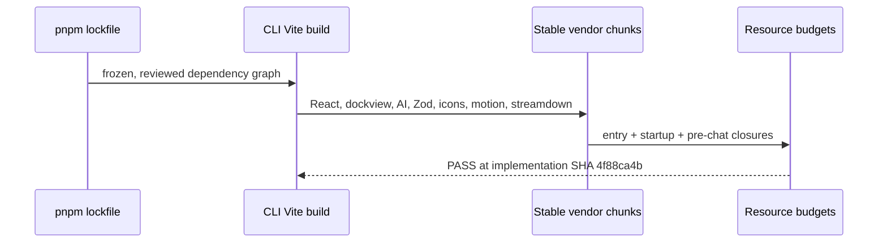

# [Production Deps Group] What changed, visually

## Package resolution

```diff
 production dependency group
 ├── ai 7.0.68 → 7.0.90                    # retained
 ├── motion 13.1.0 → 13.1.1               # retained
 ├── @vercel/sandbox 3.0.0 → 3.2.1         # retained
 ├── @earendil-works/pi-ai 0.84.3 → 0.84.4 # retained
 ├── Vite 8.2.1 → 8.2.2                    # retained; exact-head budgets pass
-├── TypeScript 7.0.2                       # blocked by tsup/dts incompatibility
-├── streamdown 2.6.0                       # excluded during budget isolation
-├── lucide-react 1.39.0                    # excluded during budget isolation
-└── Mermaid 11.17.2 direct bump            # excluded by CLI resource budget
+    └── streamdown 2.5.0 still resolves Mermaid 11.17.2 transitively
+        while Excalidraw and root/direct Mermaid resolve 11.16.1
```

## Build flow



## Review seam

```diff
 packages/cli/vite.config.ts
   manualChunks(id)
     vendor-react
     vendor-dockview
+    vendor-ai
+    vendor-zod
+    vendor-lucide
+    vendor-motion
+    vendor-streamdown
```

The production changes are dependency metadata plus one CLI build-only chunking rule. No runtime API, package export, authority, UI behavior, or design-system contract changes. GitHub Actions run 34372690024 passed lint, typecheck, changed unit tests, invariants, all three resource/bundle budgets, E2E, UI Review, and reference/remote-worker smoke at implementation SHA 4f88ca4b. Final metadata-only admission commits are separately bound in the PR Handover and presentation.