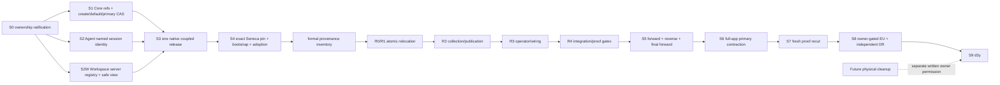

# Implementation Plan

## Goal

Replace the former full-app agent-host ownership model with: (1) a simple, complete, single-primary-agent `apps/full-app` with auth and persistent multi-user/multi-workspace data; (2) Core, Agent, and Workspace package capabilities sufficient to address several named agent runtimes in one authorized workspace; and (3) Seneca as the sole cloud agent-product, hostname, fleet, and operations authority—without destructive actions, dual writers, or controller relocation before the exact published release is pinned and adopted.

## Normative product scope and ownership

### Product definitions

- **Full-app** is the reference complete application: conceptually workspace-playground plus Core persistence/auth. It may serve many users and many workspaces, but its application behavior exposes exactly one configured agent named `primary`. It is not a fleet controller, agent marketplace, hidden multi-agent selector, or cooperating-agent product.
- **Core** owns immutable definition/deployment references, workspace-to-agent bindings, one durable default pointer per workspace, authorization-aware selection, explicit CAS changes, and auditable primary upgrades. It does not own runtime construction, a runtime registry, workspace composition snapshots, host revisions, hostname routing, host paths, fleet lifecycle, or an execution manager.
- **Agent** validates the selected immutable execution identity, constructs/executes the selected runtime, and persists that identity in Pi session provenance. It does not authorize workspace access, choose a durable binding, own a database, or infer identity from request/prompt/tool input.
- **Workspace** is DB-free and host-neutral. Its authoritative server/app seam can register several host-selected runtime targets keyed by `{workspaceId, agentId}` and project safe view information to the browser. It does not choose durable bindings, expose execution identity to the browser, own a hostname/root/runtime profile, compose a cloud host, or implement agent-to-agent cooperation.
- **Seneca** is the cloud version of the complete system: many agent products, workspaces, exact hostnames, and operational concerns. It authors products through Core’s public store, owns canonical agent-host composition and revisions, runs migrations/provisioning/publication/recovery, and becomes the sole production host writer.

### Ownership matrix

| Concern | Core | Agent | Workspace | full-app | Seneca |
|---|---|---|---|---|---|
| Immutable definition/deployment refs, workspace bindings/default | sole durable owner | consumes selected facts | no DB ownership | bootstrap/select/upgrade only `primary` through Core | writes through Core public store |
| Authorization | selection receives already-authorized `Workspace` | none | none | Core auth/membership first | Core auth/membership first |
| Runtime/session identity | supplies immutable binding facts | validates, constructs, persists Pi header | server/app registry holds host-selected identity; browser projection excludes it | threads only selected `primary` | threads each selected named target |
| Several agents in one workspace | stores several create-only named bindings and one CAS default | executes one selected runtime | server/app registry holds several keyed targets/views/sessions | package capability is present, app exposes one | uses capability; cooperating UX remains out of scope |
| Database/migrations | Core product schema plus frozen historical compatibility migrations | none | none | normal app migrations only | Seneca migration bootstrap/journal, host adoption, future host schema |
| Host/fleet/hostname/root/Compose/Caddy/runsc/billing | forbidden | forbidden | forbidden | forbidden | sole owner |

## Non-negotiable safety, sequencing, and release gates

1. **Pre-S4 work is required, not prohibited.** After S0 ratification, S1 Core, S2 Agent, S2W Workspace, and S3 release are explicitly allowed and required before S4. Normal implementation/review/release work for those slices proceeds on their approved graph.
2. **Only controller relocation is prohibited before S4.** Until S4 completes, do not copy controller source/tests into Seneca, create a controller relocation/integration branch, compile relocated controller code, change Seneca controller imports, or begin R0–R4. This prohibition does not block S1–S3.
3. **Formal provenance inventory is post-S4 only.** The formal relocation manifest/inventory begins strictly after completed S4. The baseline facts already recorded in this ratification plan are decision inputs, not authorization to start the inventory.
4. **No destructive action.** No database reset/drop/truncate, source/test/doc deletion, history rewrite, force push, automatic down migration, or destructive filesystem operation. Test cleanup is permitted only for uniquely prefixed ephemeral databases after `NODE_ENV=test` plus server/database identity assertions.
5. **One writer.** Migration and host authority handoff use deliberate quiesce/prove/transfer/start transitions. There is no dual writer, automatic failover, silent fallback, or blind retry.
6. **PR disposition.** Boring PR #789 and Seneca PR #10 are superseded, not revived. PR #787 is merged context, not replay work. Fresh branches/PRs preserve provenance and assume no force-push.
7. **Live proof remains distinct.** Unit, local, Compose, and structural runsc evidence do not count as EU runtime or independent DR proof. Live migration/authority handoff and EU/DR proof remain owner-gated.

## Tasks

1. **S0 — Ratify the ownership and dispatch contract.**
   - File: `docs/issues/391/runtime-refactor/AGENT-CLOUD-OWNERSHIP-RECUT.md` (this complete replacement), issue/bead tracker, fresh PR descriptions.
   - Changes: Record the scope above, the S1 → S2 → S2W → S3 → S4 release path, the controller-only pre-S4 prohibition, the strict post-S4 inventory dependency, PR #789/#10 supersession, non-destructive rules, and owner gates.
   - Acceptance: S0 is ratifiable only with every rule in this plan integrated. After owner ratification, S1/S2/S2W may start; R0–R4 and the formal inventory may not.

2. **S1 — Add the minimal Core durable-reference, create-only binding, default CAS, selection, and primary-upgrade contract.**
   - Files: `packages/core/drizzle/<actual-next>_workspace_agent_products.sql`; `packages/core/drizzle/meta/_journal.json`; Core Drizzle schema declarations at their current canonical location; `packages/core/src/server/agentProducts/types.ts`; `packages/core/src/server/agentProducts/store.ts`; `packages/core/src/server/agentProducts/selectWorkspaceAgent.ts`; `packages/core/src/server/agentProducts/primaryBinding.ts`; `packages/core/src/server/agentProducts/index.ts`; canonical Core stable error registry `packages/core/src/shared/errors.ts`; existing Core schema/store/real-Postgres tests discovered from current main.
   - Changes:
     - Preserve Core history exactly. At current-main baseline `6b662d27...`, existing host migrations are **`packages/core/drizzle/0018_d1_binding_admissions.sql` through `packages/core/drizzle/0022_agent_host_namespace.sql`**. Do not rewrite, move, renumber, or remove them. Determine the actual next journal number from synchronized implementation main; `0023_workspace_agent_products.sql` is an expectation only.
     - Add only the following conceptual schema, translated to exact existing PostgreSQL/Drizzle types and naming conventions. Every identity and FK component below is `NOT NULL`. Every digest column has a canonical SHA-256 check (the repository’s accepted `sha256:<64 lowercase hex>` or exact current canonical representation). Revision checks are DB-enforced.

       ```sql
       agent_definition_refs(
         definition_id          text NOT NULL,
         definition_version     text NOT NULL,
         definition_digest      text NOT NULL CHECK (definition_digest ~ '^sha256:[a-f0-9]{64}$'),
         created_at             timestamptz NOT NULL,
         PRIMARY KEY (definition_id, definition_version, definition_digest),
         UNIQUE (definition_id, definition_version)
       );

       agent_deployment_refs(
         deployment_id          text NOT NULL,
         deployment_version     text NOT NULL,
         deployment_digest      text NOT NULL CHECK (deployment_digest ~ '^sha256:[a-f0-9]{64}$'),
         agent_id               text NOT NULL,
         definition_id          text NOT NULL,
         definition_version     text NOT NULL,
         definition_digest      text NOT NULL CHECK (definition_digest ~ '^sha256:[a-f0-9]{64}$'),
         created_at             timestamptz NOT NULL,
         PRIMARY KEY (deployment_id, deployment_version, deployment_digest),
         UNIQUE (deployment_id, deployment_version),
         UNIQUE (deployment_id, deployment_version, deployment_digest, agent_id,
                 definition_id, definition_version, definition_digest),
         FOREIGN KEY (definition_id, definition_version, definition_digest)
           REFERENCES agent_definition_refs
             (definition_id, definition_version, definition_digest)
           ON DELETE RESTRICT
       );

       workspace_agent_bindings(
         workspace_id           <workspace-id-type> NOT NULL,
         agent_id               text NOT NULL,
         binding_revision       bigint NOT NULL DEFAULT 1 CHECK (binding_revision >= 1),
         deployment_id          text NOT NULL,
         deployment_version     text NOT NULL,
         deployment_digest      text NOT NULL CHECK (deployment_digest ~ '^sha256:[a-f0-9]{64}$'),
         definition_id          text NOT NULL,
         definition_version     text NOT NULL,
         definition_digest      text NOT NULL CHECK (definition_digest ~ '^sha256:[a-f0-9]{64}$'),
         created_by_ref         text NOT NULL,
         create_request_ref     text NOT NULL,
         bound_at               timestamptz NOT NULL,
         updated_at             timestamptz NOT NULL,
         PRIMARY KEY (workspace_id, agent_id),
         UNIQUE (workspace_id, agent_id, binding_revision),
         FOREIGN KEY (workspace_id) REFERENCES workspaces(id) ON DELETE NO ACTION,
         FOREIGN KEY (deployment_id, deployment_version, deployment_digest, agent_id,
                      definition_id, definition_version, definition_digest)
           REFERENCES agent_deployment_refs
             (deployment_id, deployment_version, deployment_digest, agent_id,
              definition_id, definition_version, definition_digest)
           ON DELETE RESTRICT
       );

       workspace_default_agents(
         workspace_id           <workspace-id-type> NOT NULL,
         agent_id               text NOT NULL,
         selection_revision     bigint NOT NULL DEFAULT 1 CHECK (selection_revision >= 1),
         selected_by_ref        text NOT NULL,
         selection_request_ref  text NOT NULL,
         selected_at            timestamptz NOT NULL,
         PRIMARY KEY (workspace_id),
         UNIQUE (workspace_id, agent_id, selection_revision),
         FOREIGN KEY (workspace_id, agent_id)
           REFERENCES workspace_agent_bindings(workspace_id, agent_id)
           ON DELETE RESTRICT
       );

       workspace_agent_binding_events(
         event_id                       uuid NOT NULL,
         workspace_id                   <workspace-id-type> NOT NULL,
         agent_id                       text NOT NULL CHECK (agent_id = 'primary'),
         event_kind                     text NOT NULL CHECK (event_kind = 'primary_upgraded'),
         previous_binding_revision       bigint NOT NULL CHECK (previous_binding_revision >= 1),
         next_binding_revision           bigint NOT NULL CHECK (next_binding_revision = previous_binding_revision + 1),
         previous_selection_revision     bigint NOT NULL CHECK (previous_selection_revision >= 1),
         next_selection_revision         bigint NOT NULL CHECK (next_selection_revision = previous_selection_revision + 1),
         previous_deployment_id          text NOT NULL,
         previous_deployment_version     text NOT NULL,
         previous_deployment_digest      text NOT NULL CHECK (previous_deployment_digest ~ '^sha256:[a-f0-9]{64}$'),
         previous_definition_id          text NOT NULL,
         previous_definition_version     text NOT NULL,
         previous_definition_digest      text NOT NULL CHECK (previous_definition_digest ~ '^sha256:[a-f0-9]{64}$'),
         next_deployment_id              text NOT NULL,
         next_deployment_version         text NOT NULL,
         next_deployment_digest          text NOT NULL CHECK (next_deployment_digest ~ '^sha256:[a-f0-9]{64}$'),
         next_definition_id              text NOT NULL,
         next_definition_version         text NOT NULL,
         next_definition_digest          text NOT NULL CHECK (next_definition_digest ~ '^sha256:[a-f0-9]{64}$'),
         actor_ref                       text NOT NULL,
         request_ref                     text NOT NULL,
         occurred_at                     timestamptz NOT NULL,
         PRIMARY KEY (event_id),
         UNIQUE (workspace_id, agent_id, next_binding_revision),
         UNIQUE (workspace_id, request_ref),
         FOREIGN KEY (workspace_id) REFERENCES workspaces(id) ON DELETE NO ACTION,
         FOREIGN KEY (previous_deployment_id, previous_deployment_version,
                      previous_deployment_digest, agent_id,
                      previous_definition_id, previous_definition_version,
                      previous_definition_digest)
           REFERENCES agent_deployment_refs
             (deployment_id, deployment_version, deployment_digest, agent_id,
              definition_id, definition_version, definition_digest)
           ON DELETE RESTRICT,
         FOREIGN KEY (next_deployment_id, next_deployment_version,
                      next_deployment_digest, agent_id,
                      next_definition_id, next_definition_version,
                      next_definition_digest)
           REFERENCES agent_deployment_refs
             (deployment_id, deployment_version, deployment_digest, agent_id,
              definition_id, definition_version, definition_digest)
           ON DELETE RESTRICT
       );
       ```

       The event table deliberately records only real primary transitions, so previous and next identities are both non-null and have exact deployment/definition FKs. Initial create provenance remains immutable on `workspace_agent_bindings` (`created_by_ref`, `create_request_ref`, `bound_at`) rather than fabricating a nonexistent “previous” deployment. The event store exports append/read only; add a DB trigger that rejects direct `UPDATE` or `DELETE` of event rows. Binding DB guards reject all binding deletion, changes to key/creation fields, updates to non-primary bindings, non-`+1` primary revisions, and digest/tuple mutation that does not satisfy the deployment FK. Store tests directly prove the event trigger.
     - The definition FK is explicitly `(definition_id, definition_version, definition_digest)`. Deployment and binding relations carry full immutable tuples, preventing a valid deployment id/version from being paired with a different valid definition or digest.
     - Export frozen types:

       ```ts
       export interface WorkspaceAgentBindingV1 {
         workspaceId: string;
         agentId: string;
         bindingRevision: number;
         definition: { id: string; version: string; digest: string };
         deployment: { id: string; version: string; digest: string };
       }

       export interface WorkspaceDefaultAgentV1 {
         workspaceId: string;
         agentId: string;
         selectionRevision: number;
       }

       export type WorkspaceAgentSelector = { agentId: string } | { default: true };

       export interface SelectedWorkspaceAgentV1 extends WorkspaceAgentBindingV1 {
         defaultSelectionRevision?: number;
       }
       ```

     - Add strict create-only named binding:

       ```ts
       createWorkspaceAgentBinding(
         workspace: Workspace,
         input: {
           agentId: string;
           identity: AgentProductIdentityV1;
           actorRef: string;
           requestRef: string;
         },
       ): Promise<WorkspaceAgentBindingV1>
       ```

       It locks the authorized workspace, inserts-or-byte-verifies immutable definition/deployment refs, and inserts revision `1`. Any existing `(workspaceId, agentId)`—even byte-identical—returns `WORKSPACE_AGENT_BINDING_ALREADY_EXISTS`; it never replaces or upgrades. Idempotent application behavior is implemented by an explicit read/compare branch in `bootstrapPrimaryAgent`, not by weakening create-only semantics.
     - Add expected-current default-pointer CAS:

       ```ts
       type ExpectedWorkspaceDefaultV1 =
         | { absent: true }
         | { agentId: string; selectionRevision: number };

       setWorkspaceDefaultAgent(
         workspace: Workspace,
         input: {
           expected: ExpectedWorkspaceDefaultV1;
           nextAgentId: string;
           actorRef: string;
           requestRef: string;
         },
       ): Promise<WorkspaceDefaultAgentV1>
       ```

       The absent branch performs a conditional insert at revision `1`; the present branch locks and updates only where agent id and selection revision equal `expected`, then increments selection revision. The next binding must already exist. A stale/missing/different pointer returns a coded CAS conflict with zero writes. There is no blind upsert. This generic Core operation enables an explicitly authorized host to atomically name one default; full-app never uses it to switch away from `primary`.
     - `selectWorkspaceAgent(authorizedWorkspace, selector)` accepts an already-authorized `Workspace`, never a raw request workspace id, and returns only frozen durable identity. It cannot select by hostname, host id, deployment id, or root path.
     - Implement `bootstrapPrimaryAgent` and stable UUID-order `backfillPrimaryAgent`. Per workspace, in one transaction: lock workspace; insert-or-byte-verify immutable product refs; if primary is missing, invoke the create-only revision-1 insertion; if primary exists with exact configured identity, continue; otherwise fail `PRIMARY_BINDING_TARGET_CONFLICT`; install the default only with expected `{absent:true}`; treat an already exact `primary` default as no-op; fail if the existing default is different. A transaction failure rolls back any just-created binding.
     - Implement primary upgrade with both binding and default expectations:

       ```ts
       interface UpgradePrimaryAgentInputV1 {
         workspace: Workspace;
         expectedBinding: Pick<WorkspaceAgentBindingV1,
           'bindingRevision' | 'definition' | 'deployment'>;
         expectedDefault: { agentId: 'primary'; selectionRevision: number };
         next: AgentProductIdentityV1;
         actorRef: string;
         requestRef: string;
       }
       ```

       Lock workspace → primary binding → default pointer in fixed order. Require exact expected binding tuple/revision and exact expected default pointer. Insert-or-byte-verify next immutable refs. CAS-update the primary binding with every expected tuple and revision in the `WHERE`, increment binding revision, CAS-touch the still-`primary` default pointer and increment selection revision, append exactly one immutable transition event with full previous/next FK tuples, then commit. A missing binding/default, stale revision/tuple, different default, duplicate request with different facts, or lost CAS fails closed. A replay reads state and deliberately classifies it; it never blind-upserts or appends a second event.
     - Keep **all non-primary replacement and all binding removal out of scope**. The create-only named operation is the only non-primary writer in this plan. Used-binding removal/replacement remains an owner product/data-policy gate.
     - Add the Core codes to canonical `packages/core/src/shared/errors.ts`, not raw strings: `WORKSPACE_AGENT_BINDING_ALREADY_EXISTS`, `WORKSPACE_AGENT_BINDING_NOT_FOUND`, `WORKSPACE_AGENT_BINDING_IDENTITY_CONFLICT`, `WORKSPACE_DEFAULT_AGENT_MISSING`, `WORKSPACE_DEFAULT_AGENT_STALE`, `WORKSPACE_DEFAULT_AGENT_CONFLICT`, `PRIMARY_BINDING_MISSING`, `PRIMARY_BINDING_STALE`, and `PRIMARY_BINDING_TARGET_CONFLICT`; update exhaustive status/serialization mappings and tests.
     - Existing sessions are never rewritten on upgrade. Their Pi header retains the old identity; a later operation either uses an identity-compatible runtime or Agent returns its stable session-identity mismatch requiring a new session.
   - Acceptance: migration tests prove all identity/FK columns non-null, all digest checks, revision initialization/checks, exact definition triple FK, full deployment/binding tuple FKs, pointer FK, previous/next event FKs, append-only event trigger, and non-primary update/delete denial. Store tests prove strict create-only behavior; default insert/update CAS; concurrent bootstrap; different-default zero-write; primary upgrade one winner/one event; restart/replay classification; authorization-first selection; and no Core host/fleet value imports.

3. **S2 — Make Agent resolution and Pi session attribution named and immutable.**
   - Files: `packages/agent/src/server/agentDefinition/resolveAgentDeployment.ts`; `packages/agent/src/shared/session.ts`; canonical Agent stable error registry `packages/agent/src/shared/error-codes.ts`; `packages/agent/src/core/piChatSessionService.ts`; `packages/agent/src/core/createAgent.ts`; `packages/agent/src/server/registerAgentRoutes.ts`; `packages/agent/src/server/harness/pi-coding-agent/createHarness.ts`; `packages/agent/src/server/harness/pi-coding-agent/sessions.ts`; `packages/agent/src/server/pi-chat/harnessPiChatService.ts`; `packages/agent/src/server/pi-chat/piSessionIdentity.ts`; corresponding existing tests.
   - Changes:
     - Define validated, frozen `AgentSessionExecutionIdentityV1`: workspace id, agent id, definition id/version/digest, deployment id/version/digest, Core binding revision, and resolved digest. It is supplied only by trusted host/runtime construction. Prompt, tool, query/body/header, browser projection, and public session-create input cannot set or override it.
     - Make resolver input named (`workspaceId`, `selectedAgentId`, selected Core binding, host-supplied composition digest). Retain the prior default-only form for one explicit compatibility window; it maps only to the old default semantics and preserves its golden digest. Named identity uses a versioned digest domain.
     - Include full identity in runtime binding/cache keys and harness/session initialization. Write `boringAgentExecution` once into the Pi JSONL `type:'session'` header before effects. Validate on load/restart before effects. Legacy header-less sessions are readable only on the explicit legacy-default path and are never silently rewritten.
     - Add `AGENT_EXECUTION_IDENTITY_INVALID`, `AGENT_RUNTIME_BINDING_IDENTITY_MISMATCH`, and `AGENT_SESSION_EXECUTION_IDENTITY_MISMATCH` to `packages/agent/src/shared/error-codes.ts`; update exhaustive HTTP/service mappings and public shared exports. Never serialize arbitrary strings as codes.
   - Acceptance: tests cover validation, legacy digest golden output, named resolution, binding-cache isolation, no client/browser override, header-before-effect persistence, restart, legacy path, mismatch rejection, and same-session id isolation across agent identities.

4. **S2W — Add authoritative Workspace server/app multi-agent registry and a separate non-authoritative browser projection.**
   - Files: likely `packages/workspace/src/app/server/agentRuntimeRegistry.ts`, `packages/workspace/src/app/server/createWorkspaceAgentServer.ts`, server export barrel/package export for `/app/server`; likely browser-safe `packages/workspace/src/app/front/agentRuntimeView.ts` and `packages/workspace/src/app/front/WorkspaceAgentFront.tsx`, front export barrel/package export for `/app/front`; current app server/front tsconfigs and build entrypoints; focused server and front tests. Confirm exact filenames against synchronized main before editing because this planning worktree is docs-only. Established seams are `createWorkspaceAgentServer`, `WorkspaceAgentFront`, and `WorkspaceProvider`.
   - Changes:
     - Define the **authoritative server/app-only** registry. Its modules compile only in the server/app target and are exported only from `@hachej/boring-workspace/app/server`:

       ```ts
       export interface WorkspaceAgentRuntimeKeyV1 {
         workspaceId: string;
         agentId: string;
       }

       export interface WorkspaceAgentRuntimeTargetV1<RuntimeHandle, DispatcherHandle> {
         key: WorkspaceAgentRuntimeKeyV1;
         executionIdentity: AgentSessionExecutionIdentityV1; // type-only Agent edge
         sessionNamespace: string;
         runtime: RuntimeHandle;
         dispatcher: DispatcherHandle;
         view: {
           apiBaseUrl: string;
           panel: { id: string; title: string; component: string };
         };
       }

       export interface WorkspaceAgentRuntimeRegistryV1<RuntimeHandle, DispatcherHandle> {
         register(target: WorkspaceAgentRuntimeTargetV1<RuntimeHandle, DispatcherHandle>): void;
         get(key: WorkspaceAgentRuntimeKeyV1):
           WorkspaceAgentRuntimeTargetV1<RuntimeHandle, DispatcherHandle> | undefined;
         list(workspaceId: string): readonly WorkspaceAgentRuntimeTargetV1<RuntimeHandle, DispatcherHandle>[];
         unregister(key: WorkspaceAgentRuntimeKeyV1): void;
         projectView(key: WorkspaceAgentRuntimeKeyV1): WorkspaceAgentRuntimeViewV1;
       }
       ```

       Runtime and dispatcher handles remain opaque host-injected server values. Registry lookup exact-matches both key fields; no cross-workspace, default, or first-item fallback exists. Session namespace is deterministically derived from workspace id + agent id + immutable execution identity, using the existing legal namespace alphabet. Duplicate registration rejects unless the caller explicitly requests idempotent registration and all authoritative fields are structurally identical.
     - Define a separate browser-safe projection, exported only from `/app/front` (or the current browser-safe app entry):

       ```ts
       export interface WorkspaceAgentRuntimeViewV1 {
         key: WorkspaceAgentRuntimeKeyV1;
         apiBaseUrl: string;
         panel: { id: string; title: string; component: string };
       }
       ```

       It contains no execution identity, definition/deployment digest, binding revision, namespace, runtime, dispatcher, host path, token, or authority handle. The server derives it with `projectView`; the browser cannot submit an identity or override the target identity. A rendered view key is display/routing metadata only: each request resolves through the already bound server target and the server rejects conflicting body/header/query identity. This task adds no agent chooser UI.
     - Keep server and browser exports/tsconfigs disjoint: front code cannot import the server registry or handles; server code may import the browser projection only as a type or produce a plain serialized value. Preserve zero value imports from `@hachej/boring-agent` in Workspace base `src/front/**` and `src/shared/**`; the server/app layer may use only the existing approved Agent composition seam, with execution identity type-only where possible. Continue `UiBridge.postCommand` as the sole UI dispatch source.
     - Do not add Core/database access, hostname routing, host composition, automatic default selection, agent discovery/list API, agent tabs, cooperating-agent orchestration, or cross-agent messaging. Core selects; Agent executes; Workspace stores host-selected target handles and projects safe views.
   - Acceptance: server tests prove `{A,primary}`/`{B,primary}` and `{A,primary}`/`{A,reviewer}` coexist; no cross-key lookup; namespace separation; duplicate/mismatch behavior; runtime/dispatcher exact retrieval; unregister isolation. Serialization tests prove the browser projection has exactly `{key,apiBaseUrl,panel}` and cannot accept/round-trip identity. Import/tsconfig/export-map audits prove browser bundles cannot resolve the server registry and Workspace base has no forbidden Agent value import. Existing single-agent composition remains compatible.

5. **S3 — Cut exactly one repository-native coupled release from clean synchronized main.**
   - Files: existing whole-cohort package manifests/publish lists, `pnpm-lock.yaml`, `scripts/version.mjs`, `scripts/cut-release.sh`, release staging/audit scripts, and release evidence output. Do not hand-edit release machinery unless a verified packaging defect requires a separately reviewed fix before release.
   - Changes:
     - Merge reviewed S1/S2/S2W, synchronize local `main` to the approved remote main commit, and require a clean working tree plus green full relevant gates. Determine the appropriate bump (`patch`, `minor`, or `major`) from the repository’s actual semver policy. `pnpm version:check` may be run because it is non-mutating.
     - Perform **one and only one mutating release command**: `pnpm release:<bump>`. Do not run `node scripts/version.mjs <bump>`, `pnpm version:<bump>`, or any other mutating version command first. The existing release command owns the whole repository cohort bump/publish behavior; do not invent a partial three-package release or tag convention.
     - Let the existing cohort release determine `COUPLED_RELEASE_VERSION`. Mandatory S3 evidence specifically records Core, Agent, and Workspace package name/version, packed `package.json` SHA-256, registry-fetched tarball SHA-256/integrity, export maps, and installed manifest version. Core evidence additionally records every packaged `drizzle/*.sql` hash and `drizzle/meta/_journal.json` hash/content maximum. Agent/Workspace evidence records their published entrypoint files and tarball hashes. Other cohort packages may also bump/publish under existing policy; this plan does not narrow the native cohort.
     - Build the **immediately preceding Boring release tag** in an isolated checkout/worktree using that tag’s full-app source and dependencies, then run that built previous full-app against the expanded S1 database: auth, workspace list/create, settings read/write, and legacy/default session create/read. Do not approximate this proof by compiling current full-app against old package versions.
   - Acceptance: the single release invocation succeeds from clean synchronized main; native cohort policy is unchanged; Core/Agent/Workspace all equal the actual `COUPLED_RELEASE_VERSION`; registry-fetched artifacts match recorded hashes; Core tarball contains complete migrations/journal; the prior-tag full-app smoke passes against the expanded schema.

6. **S4 — Pin the exact release in Seneca and adopt—never create—the Core-created host schema.**
   - Files in Seneca: `package.json`; `pnpm-lock.yaml`; release evidence such as `docs/release-evidence/boring-coupled-release.json`; new reviewed bootstrap SQL `drizzle/bootstrap/0000_seneca_migration_journal.sql`; explicit bootstrap runner/entry such as `src/server/migrations/bootstrapJournal.ts`; `src/server/migrations/core.ts`; `src/server/migrations/agentHost.ts`; `src/server/migrate.ts`; `src/server/agent-host/db/schema.ts`; `drizzle/agent-host/0000_adopt_core_0018_0022.sql`; `drizzle/agent-host/meta/_journal.json`; migration tests/proof wrapper; Docker/Compose migration assets.
   - Changes:
     - Pin `@hachej/boring-core`, `@hachej/boring-agent`, and `@hachej/boring-workspace` to literal exact equality with `COUPLED_RELEASE_VERSION` in Seneca `package.json`; commit the resolved `pnpm-lock.yaml`; verify installed package manifests and registry/tarball hashes against S3. No caret, tilde, workspace range, floating git source, or lock-only assertion is sufficient.
     - Record the exact superseded Seneca PR #10 baseline: HEAD **`66f46e0ae5678079dfed7db3bbaf354b57e58fec`**; current files **`src/server/d1Proof.ts`**, **`src/server/d1ProofRuntime.ts`**, and scripts/docs/Compose proof wrapper. It emulates/pins external authority and has no in-repo controller. Do not claim otherwise or treat it as controller ownership.
     - Make `postgres` and `drizzle-orm` direct runtime dependencies. If generation requires `drizzle-kit`, pin it exactly as a dev dependency. Prove all Seneca SQL/meta assets are in package/image output.
     - Provision the Seneca journal through a **separate reviewed bootstrap path before adoption**. `drizzle/bootstrap/0000_seneca_migration_journal.sql` runs only under an explicit operator/bootstrap entrypoint and creates, without `IF NOT EXISTS`, this exact owner-controlled object in a transaction:

       ```sql
       CREATE SCHEMA seneca_migrations;
       CREATE TABLE seneca_migrations.agent_host_migrations (
         migration_id                    text NOT NULL PRIMARY KEY,
         migration_hash                  text NOT NULL CHECK (migration_hash ~ '^sha256:[a-f0-9]{64}$'),
         core_package_version             text NOT NULL,
         core_journal_max_index           integer NOT NULL CHECK (core_journal_max_index >= 0),
         core_journal_max_tag             text NOT NULL,
         core_journal_chain_hash          text NOT NULL CHECK (core_journal_chain_hash ~ '^sha256:[a-f0-9]{64}$'),
         host_provenance_first_index      integer NOT NULL CHECK (host_provenance_first_index = 18),
         host_provenance_last_index       integer NOT NULL CHECK (host_provenance_last_index = 22),
         host_provenance_chain_hash       text NOT NULL CHECK (host_provenance_chain_hash ~ '^sha256:[a-f0-9]{64}$'),
         adopted_shape_digest             text NOT NULL CHECK (adopted_shape_digest ~ '^sha256:[a-f0-9]{64}$'),
         adopted_at                       timestamptz NOT NULL,
         UNIQUE (migration_hash),
         UNIQUE (core_package_version, core_journal_chain_hash,
                 host_provenance_chain_hash, adopted_shape_digest)
       );
       ```

       The bootstrap job has its own reviewed operator capability, image/SQL hash, completion evidence, and state. It is not called implicitly by the adoption runner. Unexpected pre-existing schema/table causes bootstrap failure and investigation; rerun behavior is handled by verified bootstrap completion evidence, not `IF NOT EXISTS`.
     - `core.ts` runs the exact S3-pinned Core migration bytes. It validates the **complete pinned Core journal**, from its first entry through the actual S1 selected-product migration: exact ordered indices/tags, SQL hashes, journal maximum index/tag, and a canonical whole-chain hash from S3 evidence. Missing, reordered, changed, unknown-ahead, or partially applied entries fail closed.
     - Separately validate historical host-object provenance: migrations 0018–0022 are exactly `0018_d1_binding_admissions.sql` through `0022_agent_host_namespace.sql`; their expected first/last index is 18/22; their five SQL hashes and combined provenance-chain hash come from the published S3 Core artifact; their expected final tables/columns/types/nullability/defaults/PKs/unique/FKs/indexes are checked against a checked-in shape manifest. The complete Core journal maximum is the actual selected-product migration, not incorrectly reported as 0022.
     - `agentHost.ts` assumes the bootstrap table already exists and first validates its exact schema. Adoption is forbidden to execute `CREATE`, `CREATE ... IF NOT EXISTS`, `ALTER`, `RENAME`, repair, copy, truncate, or data rewrite for operational objects or the journal. Under locks and one transaction it validates: exact installed S3 package/version/hashes; complete Core journal/DB application through the S1 migration; separate 0018–0022 provenance chain; exact historical host object shape; and unchanged canonical host-row digest. It then inserts one row into `seneca_migrations.agent_host_migrations`. Exact duplicate adoption is verify-only; any different recorded field fails closed.
     - Future active host declarations live at `src/server/agent-host/db/schema.ts`; remaining Core host declarations are frozen compatibility history and unused by Core runtime. Future host migrations are Seneca-only. `migrate.ts` composes Core validation/application and adoption only after separate bootstrap completion; it cannot invoke journal bootstrap.
     - Fixed lock order: (1) deployment/operator host lock; (2) Seneca composition PG advisory lock `1936027237`; (3) Core lock `1651470949`; (4) Seneca host-migration lock `1634234227`. Release in reverse order on every outcome. A one-shot exact-image migration job runs after verified backup and before app/controller/ingress; failure leaves mutation and ingress disabled.
     - PostgreSQL 16/17/18 matrix: separate bootstrap → fresh Core through selected-product migration → adoption; 0018–0020 fixture → pinned remaining Core journal → adoption; 0018–0022 fixture → selected-product migration → adoption; historical nonempty admissions and prepared/terminal journal rows → upgrade/adopt with row digest unchanged; restored production-like DB; lock races; previous/new release read/write. Missing bootstrap journal, wrong bootstrap shape, missing/drifted Core object, wrong complete journal max/hash, wrong 0018–0022 provenance hash, and unknown-ahead journal all fail with zero operational-object creation.
   - Acceptance: package equality/hash checks pass; separate bootstrap and adoption identities are independently evidenced; adoption runner has a static/SQL gate proving no journal/object creation path; complete pinned Core journal and separate host-provenance assertions pass; PG matrices pass; only exact pre-existing Core shape records one journal row.

7. **Post-S4 formal provenance inventory — build the relocation manifest only after S4 completes.**
   - Files: fresh Seneca relocation provenance manifest and PR documentation.
   - Changes: After completed S4, inventory every merged controller file/history and PR #789’s exactly three later authority/security commits. Record source repository/commit, source and destination SHA-256, license/provenance, destination owner, and clean-reuse versus byte-copy. Byte-copy commits carry `Source-Repo:` and `Source-Commit:` trailers. Reuse a commit only when it cleanly applies to the correct owner.
   - Acceptance: inventory timestamps/dependencies prove it began after S4; reviewers can regenerate every hash. No controller source is moved by the inventory task itself.

8. **R0/R1 — Activate one atomic, compile-complete Seneca foundations/contracts/artifact/revision/DB-fencing cluster.**
   - Files: Seneca `src/server/agent-host/agentHostPlan.ts`; new `agentHostContracts.ts`; `agentHostRuntimeInputs.ts`; `agentHostBindingEnv.ts`; `workspaceComposition.ts`; `agentHostAuthority.ts`; `agentHostIngressArtifacts.ts`; `edgeNetworkPreflight.ts`; `agentHostCommandCliProtocol.ts`; `agentHostCommandLockPolicy.ts`; `agentHostFileRuntimeInputsProvider.ts`; `agentHostAgentArtifactSnapshot.ts`; `agentHostRevisionCodec.ts`; `hostRevisionStore.ts`; `activeCollectionReader.ts`; `destructivePublicationJournal.ts`; `admissionLedger.ts`; `fencedDestructivePublication.ts`; `agentHostSecretMaterializer.ts`; `agentHostRootDesiredResolver.ts`; `agentHostCommand.ts`; `src/server/agent-host/db/schema.ts`; corresponding tests.
   - Changes: R0 and R1 are one activation/review unit; no partial compile claim is valid. A preliminary byte-copy commit is permitted only after S4/inventory and only while excluded from TypeScript/runtime. In the one activation move—not duplicate—`AgentHostCollectionLimits`/`AGENT_HOST_V1_COLLECTION_LIMITS` from `bootCollection.ts`; desired/apply/runtime-inspection/mutation-guard interfaces from `agentHostCommand.ts`; root-publication client from `agentHostPublicationControl.ts`; fenced-publication interface; and secret-provider/inspection/result interfaces from `agentHostSecretMaterializer.ts` into `agentHostContracts.ts`. Contracts may type-import in-cluster DTOs but cannot value-import later behavior.
   - Acceptance: all listed modules and focused artifact/revision/store/reader/provider/ledger/journal/fencing/real-PG tests compile/pass together; no R2–R4 implementation import or duplicate contract; no command exposure, production socket, ingress, or mutation.

9. **R2 — Relocate collection and publication runtime as one closed cluster.**
   - Files: Seneca `agentHostUserNeutralPreloader.ts`; `agentHostAgentRuntimeRecipe.ts`; `bootCollection.ts`; `agentHostPublicationControl.ts`; `agentHostProductionAuthority.ts`; `agentHostLanding.ts`; `hostSurface.ts`; `agentHostReadiness.ts`; corresponding tests.
   - Changes: Wire only R0/R1 contracts. Move preload, recipe, boot collection, publication, authority, landing/surface/readiness, and crash/lost-signal/lost-ack coverage together. Keep mutation disabled.
   - Acceptance: typecheck/build/focused tests pass; no R3/R4 dependency; production defaults cannot mutate or publish.

10. **R3 — Relocate operator entry/wiring/Compose and dormant attestation as one closed cluster.**
   - Files: Seneca `composeAdapter.ts`; `agentHostCommandEntry.ts`; `agentHostCommandWrapper.ts`; `agentHostServerWiring.ts`; `agentHostCaddyfileAuthority.ts`; `agentHostCoreEnvAuthority.ts`; `approvedHostRelease.ts`; `approvedHostReleaseFile.ts`; `approvedHostArtifactEvidence.ts`; `hostSecurityConfig.ts`; `approvedHostReleaseCapability.ts`; corresponding tests.
   - Changes: Move the closed operator/server/Compose/Caddy/approved-release graph. Build wrapper binaries only for tests; do not expose a production package command, image entrypoint, socket, service, volume, or ingress.
   - Acceptance: command/lock, Docker boundary, wiring, Caddy/core-env, release/evidence/capability, and host-security tests pass; static gates prove no active production reachability.

11. **R4 — Integrate proof-gated Seneca controller activation.**
   - Files: Seneca `agentHostCoreProof.ts`; `agentHostDrProof.ts`; `agentHostAuthorityEntryHarness.ts`; `agentHostAuthorityFixture.ts`; `agentHostAuthorityIntegrationSupport.ts`; authority/namespace/migration/live/Docker/ingress tests; `src/server/main.ts` adapter; `src/server/migrate.ts` final wiring; operator scripts; Compose/Caddy assets; proof entrypoints.
   - Changes: Connect Core authorized selection, Agent named/session identity, Workspace authoritative registry/safe projection, and Seneca-owned `workspaceComposition.ts`. Add migration-ready checks and local control socket. Mutation requires both `SENECA_AGENT_HOST_MUTATION_ENABLED=1` and a valid transferred authority capability; ingress stays gated until handoff acceptance. Isolated authorities exist only in tests.
   - Acceptance: complete controller builds/tests; default production start is mutation/ingress-denied; reachability tests prove both gates; full-app runtime remains unchanged in this slice.

12. **S5 — Execute and fully close the reversible single-writer handoff rehearsal.**
   - Files: operator runbook; handoff/reverse/repeated-forward proof evidence; Seneca/full-app authority descriptors. No destructive migration script.
   - Changes/state transitions:
     1. `ACTIVE_OLD` → gate new ingress/mutation and drain accepted work.
     2. Acquire host and DB composition locks; prove `pendingOperation=null`, served equals durable, no unterminated prepared event, and no migration lock.
     3. Stop/quiesce old full-app socket/process while retaining all source/assets. Prove connection refusal and stale old command inability to acquire authority or change revision/DB digests.
     4. Transfer the reviewed root-owned descriptor/capability/FD; record only descriptor, host, revision, migration, and lock digests.
     5. Start Seneca `READ_ONLY`, reproduce current state, validate descriptor/migration identity, enable mutation, run no-op then approved additive tracer, and resume ingress only after served acknowledgement/health. Reach `ACTIVE_SENECA`; old remains fenced.
     6. Rehearse reverse: gate/drain Seneca; prove clean state; disable/stop it; transfer capability back; validate old controller read-only; enable old writer only if preceding-release schema smoke remains valid; run reversible no-op tracer. Reach temporary `ACTIVE_OLD_REHEARSAL` with Seneca fenced. If incompatible, use isolated restore plus explicit promotion—never concurrent failover.
     7. **Repeat the full forward handoff**: gate/drain the old rehearsal writer; prove clean state; stop/fence it; transfer capability to Seneca; start Seneca read-only; validate; enable; run no-op/additive tracer; resume ingress. Final recorded state must be `ACTIVE_SENECA`, with old authority disabled, unreachable, and unable to acquire the writer lock.
   - Acceptance: no overlapping writer interval; stale-writer fencing before mutation in both directions; reverse rehearsal passes without down SQL; repeated forward handoff passes; final state is `ACTIVE_SENECA` and is a hard S6 prerequisite.

13. **S6 — Contract full-app non-destructively to a single primary-agent application.**
   - Files: `apps/full-app/src/server/primaryAgent.ts`; `apps/full-app/src/server/main.ts`; `apps/full-app/src/server/migrate.ts`; `apps/full-app/package.json`; `apps/full-app/tsconfig.json`; actual build/test tsconfigs referenced by scripts; active Docker/Compose/image/workflow entrypoints; new static reachability test/script. Retained dormant roots include `apps/full-app/src/server/deployment/**`, controller tests, proof scripts, `apps/full-app/deploy/agent-host/**`, and associated historical assets/docs; confirm any additional current dormant paths before defining the manifest.
   - Changes:
     - Implement the exact narrow adapter:

       ```ts
       export interface PrimaryAgentConfigV1 {
         next: AgentProductIdentityV1;
         expectedCurrent?: Pick<WorkspaceAgentBindingV1,
           'bindingRevision' | 'definition' | 'deployment'> & {
             defaultSelectionRevision: number;
           };
         actorRef: string;
         requestRef: string;
       }

       export interface PrimaryAgentServiceV1 {
         provisionWorkspace(workspace: Workspace): Promise<void>;
         resolveForAuthorizedWorkspace(workspace: Workspace): Promise<{
           selected: SelectedWorkspaceAgentV1;
           target: WorkspaceAgentRuntimeTargetV1<unknown, unknown>;
           executionIdentity: AgentSessionExecutionIdentityV1;
           view: WorkspaceAgentRuntimeViewV1;
         }>;
       }
       ```

     - `provisionWorkspace` performs this restart/concurrency-safe classification while holding/using Core transactions, never a blind upsert:
       1. **Primary missing:** bootstrap `next` at binding revision `1` and default revision `1`; a different existing default conflicts and rolls back creation.
       2. **Primary/default already exactly `next`:** byte-verify complete definition/deployment digests, binding identity, `agentId:'primary'`, and default pointer; return no-op without event or revision change.
       3. **Current primary/default exactly equal configured `expectedCurrent`:** invoke the S1 primary CAS exactly once, advancing both revisions and appending exactly one event.
       4. **Any other state:** return coded `PRIMARY_BINDING_TARGET_CONFLICT`, `PRIMARY_BINDING_STALE`, or `WORKSPACE_DEFAULT_AGENT_CONFLICT`; do not mutate/retry blindly.

       Concurrent processes with the same expected state produce one CAS winner and one event. A loser rereads: if the winner installed exactly `next`, it follows branch 2 no-op; otherwise it follows branch 4 conflict. Restart after commit follows branch 2. This proves one event/one winner across retries and crashes.
     - `resolveForAuthorizedWorkspace` calls Core `selectWorkspaceAgent(workspace,{agentId:'primary'})`, requires the durable default to be `primary`, exact-looks up `{workspace.id,'primary'}` in the Workspace **server/app** registry, compares all Core/Agent identity fields, and gives only the derived `{key,apiBaseUrl,panel}` view to front composition. Browser input never selects/overrides identity. There is no request agent selector, default fallback, or public registry list.
     - Replace active full-app server/migration composition so it imports no controller, opens no publication socket, accepts no host authority, writes no operational host table, and executes no Compose/Caddy/runsc command. Standalone local/Docker/Fly-style full-app start requires no Seneca.
     - **Retain dormant artifacts physically:** retain `apps/full-app/src/server/deployment/**` source, its tests, all controller proof scripts, `apps/full-app/deploy/agent-host/**`, and related historical Docker/Compose/Caddy/workflow/docs/assets. Do not delete, rename, or rewrite these merely to satisfy contraction.
     - Remove only **active reachability**: active package scripts, CI/workflow jobs, production Docker image copy/build steps, Compose services/commands, server/migration entrypoints, route registrations, sockets, and build/test include graphs must no longer invoke/import/package dormant controller artifacts. Add explicit narrow tsconfig build/typecheck exclusions and test-glob exclusions for the declared dormant manifest while continuing to compile active `main.ts`/`migrate.ts`.
     - Add a static launch-graph gate seeded from active package scripts, active workflows, production image/Compose entrypoints, active tsconfig entry roots, `main.ts`, and `migrate.ts`. It follows imports, aliases/barrels, script invocations, copied production assets, service commands, and route registrations. It **ignores references whose source and destination are both inside the declared dormant artifact manifest**, including historical docs/tests/proof assets, but fails any edge from the active launch graph into a dormant controller path. Add restricted-import/auto-import lint protection for active source; do not lint historical dormant source as if active.
   - Acceptance: two users/two workspaces receive the same immutable primary; nonmembers reject; Pi headers match; all four restart/CAS branches pass; concurrent rollout has one winner/one event; no browser identity override or non-primary request selection; final S5 state is verified `ACTIVE_SENECA`; dormant source/tests/proofs/`deploy/agent-host/**`/historical assets remain byte-present; active build/typecheck/test/image/workflow/entrypoint graphs have zero dormant controller reachability; standalone app starts without Seneca.

14. **S7–S9 — Recut proof, run owner-gated EU/DR evidence, and close only after live proof.**
   - Files: fresh proof harnesses/runbooks/evidence; issue/bead state.
   - Changes: Run the real Seneca controller proof (not PR #10 emulator), full-app standalone proof, release artifacts, migration/adoption matrix, complete handoff/reverse/repeated-forward tracer, relocation checks, and dormant reachability gate. Then, with owner approval, run EU multi-binding and independent restore proof. Keep `d3y` after that evidence.
   - Acceptance: evidence names real versions/artifact digests and real Seneca controller; covers three definitions/deployments/workspaces/hostnames, membership/selector denials, N+1 additive behavior, unused rollback/admitted-removal denial, secret canary, HTTPS/app/Caddy/DB/served-durable health, real EU filesystem/process/network isolation, and independent database/workspace/session/host-control restore. Local/Compose evidence is never represented as live EU proof.

## Migration, journal, handoff, and rollback protocol

- SQL is expand-only and forward-only. Core 0018–0022 remain immutable compatibility history; S1 is additive; Seneca bootstrap creates only Seneca’s own journal through a separate operator path; adoption validates then journals; future active host migrations are Seneca-only.
- Before live migration: verified backup, independent restore rehearsal, exact image/package/SQL hashes, bootstrap evidence, disabled app/controller/ingress mutation, and lock-order proof.
- Bootstrap state: `ABSENT` → explicit operator `BOOTSTRAP_LOCKED` → exact Seneca schema/table `BOOTSTRAPPED`; unexpected objects → `BOOTSTRAP_FAILED`. Adoption cannot perform this transition.
- Adoption state: `UNADOPTED` → `LOCKED` → `COMPLETE_CORE_JOURNAL_VERIFIED` → `HOST_0018_0022_PROVENANCE_VERIFIED` → `EXACT_SHAPE_VERIFIED` → `JOURNAL_RECORDED` → `ADOPTED`; any mismatch → `FAILED_CLOSED`. Exact duplicate is verify-only.
- Authority state ends: `ACTIVE_OLD` → `QUIESCING` → `OLD_FENCED` → `TRANSFERRED` → `SENECA_READ_ONLY` → `ACTIVE_SENECA` → reverse rehearsal → `ACTIVE_OLD_REHEARSAL` → repeated forward → final `ACTIVE_SENECA`. S6 cannot start from the temporary reverse state.
- Database rollback is isolated restore plus explicit promotion, never down SQL. Code rollback requires preceding-release read/write proof. Host rollback is a new complete revision. Candidate stays dark until ready; ingress is last.

## Validation and operator proof matrix

| Area | Required proof |
|---|---|
| Core schema/store | all identity/FK NOT NULL; digest checks; revision defaults/checks; exact definition/deployment/binding/default/event FKs; create-only named binding; expected-current default CAS; append-only events; non-primary replacement/removal denial; primary CAS one event/one winner |
| Agent | legacy digest golden; named resolution; cache isolation; immutable header before effects; restart/mismatch; no request/browser override; canonical errors |
| Workspace | authoritative server handles separated from exact safe browser projection; two workspaces/same agent and one workspace/two agents; no cross-key namespace/lookup; export/tsconfig/import boundaries |
| Release | clean synchronized main; one `pnpm release:<bump>`; native cohort behavior; mandatory Core/Agent/Workspace manifest/tarball evidence; previous-tag full-app smoke |
| Seneca adoption | separate bootstrap; exact journal table; adoption cannot create; complete S3 Core journal through selected-product migration; separate 0018–0022 max/hash/shape; PG 16/17/18 matrices |
| Relocation | strict post-S4 inventory; provenance hashes; each compile-complete cluster; R4 default mutation/ingress denial |
| Handoff | forward, reverse, repeated forward; no dual writer; final `ACTIVE_SENECA`; old fenced |
| Full-app | four rollout branches; one winner/event; only primary visible; no browser identity override; dormant files retained; active launch graph clean; standalone smoke |
| Live/DR | real EU isolation/health and independent restore into isolated network before separate publication |

## Dependency graph



S1, S2, S2W, and S3 are explicitly pre-S4 work. Only controller relocation waits. Workspace multi-agent capability is on the release critical path but delivers no agent cooperation or selector UX.

## Bead edge table

| Bead/slice | Depends on | Blocks | Dispatch boundary |
|---|---|---|---|
| S0 ownership | none | S1, S2, S2W | owner ratification |
| S1 Core | S0 | S3, S6 | no host/controller code |
| S2 Agent | S0 | S3, R4, S6 | identity/execution only |
| S2W Workspace | S0 | S3, R4, S6 | server registry + safe projection only |
| S3 release | S1 + S2 + S2W | S4 | one native release command from clean main |
| S4 Seneca pin/bootstrap/adoption | S3 | formal inventory and all relocation | validate/adopt; no controller relocation |
| Formal inventory | completed S4 | R0/R1 | strictly post-S4 |
| R0/R1 atomic | inventory | R2 | one compile-complete activation |
| R2 | R0/R1 | R3 | mutation disabled |
| R3 | R2 | R4 | no production exposure |
| R4 | R3 | S5 | default mutation/ingress denied |
| S5 handoff | R4 + live owner approval | S6 | must finish final `ACTIVE_SENECA` |
| S6 contraction | final S5 | S7 | non-destructive active-reachability removal |
| S7 proof recut | S6 | S8 | actual Seneca controller |
| S8 EU/DR | S7 + owner approval | S9 | live evidence only |
| S9 `d3y` | S8 | none | closeout |
| Future cleanup | separate written permission | none | never implicit |

## Compile-complete relocation clusters

- **R0/R1 atomic:** foundations, contracts, runtime inputs/env, composition, authority/artifacts/preflight, CLI/lock, file provider/artifact snapshot/revision/store/active reader, destructive journal/admission/fencing, secrets/root resolver/command, Seneca DB schema. It is one activation, not independently compiling R0 and R1.
- **R2 closed:** neutral preloader, runtime recipe, boot collection, publication control, production authority, landing, host surface, readiness, and crash/signal/ack tests.
- **R3 closed:** Compose adapter, command entry/wrapper, server wiring, Caddy/core-env authority, approved release/file/evidence/capability, host security, and their tests. Wrapper remains test-only.
- **R4 integration:** Core/DR proofs, integration fixtures/support, namespace/migration/live/Docker/ingress proof, main/migrate adapter, operator scripts/assets. Mutation/ingress remain capability-gated until S5.

## Operator proof and recovery

- Verify exact release command evidence, registry artifacts, package/lock equality, Core full-journal chain, 0018–0022 provenance chain, Seneca bootstrap SQL/image, and adoption record.
- Prove backup and independent restore before migration; migration/adoption under fixed locks; controller disabled on failure.
- Prove three definitions/deployments/workspaces/hostnames; landing/auth/membership/selected identity; in-flight N+1; unused rollback; admitted-removal denial; real EU runsc filesystem/process/network isolation; secret canary; HTTPS/app/Caddy/DB/served-durable health; alerts.
- Independently recover database, workspace root, host-owned `BORING_AGENT_SESSION_ROOT`, and host revision/control state. Restore in isolated network, compare cross-component digests, read sessions/history, prove authorization denials, then publish separately.

## Files to Modify

- `packages/core/drizzle/<actual-next>_workspace_agent_products.sql`, Core journal/schema, `packages/core/src/server/agentProducts/*`, and `packages/core/src/shared/errors.ts` — complete minimal durable contract.
- Agent resolver/session/core/routes/harness/Pi modules and `packages/agent/src/shared/error-codes.ts` — named immutable execution identity.
- Workspace `/app/server` registry and `/app/front` projection/export/tsconfig seams — multi-target server capability without browser authority.
- Existing cohort release evidence/output — one repository-native release.
- Seneca package/lock/bootstrap/core/adoption/migration/schema/proof modules, then R0–R4 files only after S4/inventory.
- Full-app primary/main/migrate, active package/build/test/workflow/image/entrypoint configs only after final S5.

## New Files

- Core selected-product migration, `primaryBinding.ts`, and schema/store/real-PG tests.
- Workspace authoritative server registry, browser-safe projection, and boundary tests (exact paths confirmed on implementation main).
- Seneca bootstrap journal SQL/runner, adoption SQL/journal/evidence, contracts module, and relocation files after their gates.
- Full-app `primaryAgent.ts` and active launch-graph/restricted-import tests after S5.

## Dependencies

S0 gates S1/S2/S2W. Those three are allowed pre-S4 and all gate S3. S3 uses one native release invocation and gates S4. Formal inventory depends strictly on completed S4. R0/R1 → R2 → R3 → R4 are serial. S5 must finish its reverse rehearsal and repeated forward handoff at final `ACTIVE_SENECA`; only then S6 may remove active reachability. S7 → owner-gated S8 → S9 follow. Physical cleanup is not a dependency.

## Risks and controls

- **Nullable/weak identity accidentally enters schema:** every identity/FK component is `NOT NULL`; digest/revision checks and composite FK failure tests are mandatory.
- **Create silently becomes replacement:** named binding writer is create-only; non-primary replacement/removal is explicitly absent.
- **Default/primary race:** both binding and default pointer use expected-current revisions; one transaction/event, one winner.
- **Browser becomes identity authority:** authoritative target stays server-only; browser projection has exactly three safe fields and cannot reach server registry exports.
- **Release is double-bumped:** only `pnpm release:<bump>` mutates versions; prior commands are non-mutating checks.
- **Adoption creates/repairs objects:** bootstrap is separate; adoption statically forbids creation and fails closed on journal/Core/object mismatch.
- **Core max is misreported as 0022:** complete journal max/hash runs through actual S1 migration; 0018–0022 is separately recorded host provenance.
- **Reverse rehearsal leaves old writer active:** S5 repeats forward and requires final `ACTIVE_SENECA` before S6.
- **Dormant files re-enter production or static scan produces historical false positives:** declared dormant-to-dormant references are ignored; every active launch-graph edge into dormant paths fails.
- **Published/image contents differ from checkout:** registry tarball, manifest, SQL/journal, lock, and image inclusion hashes remain mandatory.
- **Operational proof is mislabeled live:** EU and independent restore remain separate owner-gated evidence.

## Non-goals / anti-complexity budget

No Core execution manager/composition service/fleet abstraction; no Workspace database/hostname/root/host composition; no browser identity selection; no cooperating-agent UX/messaging/orchestration; no public agent list/selector; no Kubernetes/Terraform/autoscaling/multi-region; no broker/queue/reconciler/cache; no per-agent containers; no wildcard/runtime tenant control API; no new host package; no compatibility emulator; no dual writer/automatic failover; no destructive migration/reset; no force push; no physical source/test/proof/deploy/history cleanup.

## Open owner gates

1. S0 ratification before implementation dispatch.
2. The actual semver bump follows current repository policy after API assessment; no version/tag is fabricated here.
3. Live backup, migration, authority handoff, reverse rehearsal, and repeated forward execution require owner approval after dry proof.
4. EU runtime profile and independent DR acceptance require live owner review.
5. Physical deletion/archival of full-app dormant source/tests/proofs/`deploy/agent-host/**`/historical assets requires separate written owner permission.
6. Replacement/removal of any non-primary binding, and removal of a used primary binding, require a future product/data-policy decision.

## Multi-model and arbiter review disposition appendix

| Finding | Disposition | Rationale/result |
|---|---|---|
| Gemini: explicit `(definition_id, definition_version, definition_digest)` FK | **Accepted** | Definition tuple is an exact PK/FK and is carried through deployments/bindings/events. |
| Gemini: auditable immutable primary upgrade | **Accepted and strengthened** | Binding + default expected-current CAS, append-only previous/next FK event, session attribution preservation, and four-way restart classification. |
| Gemini: adoption `CREATE ... IF NOT EXISTS` | **Rejected** | Separate explicit Seneca bootstrap creates only Seneca journal; adoption cannot create/repair anything and fails closed. |
| Gemini: exclude dormant controller and prevent auto-import | **Accepted and refined** | Active tsconfig/test/launch graph excludes controller; static gate ignores declared dormant-to-dormant history; physical assets remain. |
| Grok: precise Workspace multi-agent boundary | **Accepted and refined** | Server/app owns authoritative keyed identity/namespace/runtime/dispatcher; browser sees only safe derived view. No cooperation UX. |
| Grok: mechanical exact release pin | **Accepted and corrected** | One native `pnpm release:<bump>` from clean synchronized main; no prior mutating version command; exact Core/Agent/Workspace evidence/pins. |
| Grok: machine-readable graph and bead edges | **Accepted** | Mermaid graph and explicit edge table are included. |
| Grok false negative: Seneca PR #10 | **Corrected** | HEAD `66f46e0ae5678079dfed7db3bbaf354b57e58fec`; `d1Proof.ts`, `d1ProofRuntime.ts`, scripts/docs/Compose wrapper; external authority emulator/pin, no controller. |
| Grok false negative: Core migration paths | **Corrected** | `packages/core/drizzle/0018_d1_binding_admissions.sql` through `0022_agent_host_namespace.sql` on `6b662d27...`. |
| Sol: pre-S4 wording | **Accepted** | S1/S2/S2W/S3 explicitly proceed; only relocation is prohibited; formal inventory strictly depends on S4. |
| Sol: complete S1 constraints/writers/errors | **Accepted** | Non-null identity/FKs, checks/revisions/events/FKs, create-only writer, default CAS, scoped replacement policy, canonical Core/Agent error homes. |
| Sol: S4 journal precision | **Accepted** | Exact Seneca table/bootstrap path, adoption prohibition, complete Core chain and separate 0018–0022 provenance. |
| Sol: S5/S6 terminal behavior | **Accepted** | Repeated forward ends `ACTIVE_SENECA`; S6 has exact missing/no-op/CAS/conflict branches and one event/winner. |

**State: S0-ratifiable. After ratification, dispatch only non-destructive slices along this graph; S1/S2/S2W/S3 are required pre-S4, formal inventory and all controller relocation are post-S4, and S6 requires final `ACTIVE_SENECA`.**
