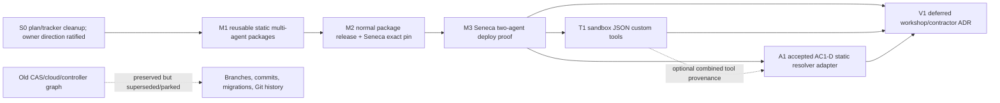

# Implementation Plan — Reusable Static Multi-Agent Packages, Seneca First

## Status and Owner Override

**Owner-ratified direction.** The owner message that requested this revision overrides the earlier Seneca-local-composer recommendation and ratifies the recut direction:

- Priority 1 is a small reusable, deployment-static multi-agent capability in Boring Core, Workspace, and Agent packages.
- Seneca is the first real multi-agent consumer and first deployment proof.
- Full-app remains the single-primary backwards-compatibility proof.
- Core DB agent stores, CAS, dynamic default upgrades, marketplaces, runtime uploads, cloud controller relocation, and Seneca Cloud are not on the critical path.
- Historical CAS/cloud work remains preserved in branches, commits, migrations, documents, and Git history; no source/branch/file deletion is authorized.

This complete replacement plan requires one focused final consistency review against current package APIs before M1 implementation dispatch. S0 tracker cleanup may proceed after that review; it does not reopen product decisions already settled by the owner.

## Problem Statement

The previous ownership plan over-coupled the immediate product to:

- Core definition/deployment/binding/default tables;
- expected-current CAS and primary upgrade events;
- coupled cloud migration adoption;
- host controller relocation and writer handoff;
- full-app contraction;
- live EU/DR cloud proof.

The immediate product is simpler:

> A Boring host supplies an immutable catalog of prebuilt agent declarations at boot. After Core authorizes a user’s workspace, that workspace can address one or more named agents. Workspace composes those named agent targets over the exact same prepared workspace sandbox. Agent supplies route, session, tool-catalog, and immutable provenance seams. Full-app supplies one `primary`; Seneca supplies several compiled `agents/<name>/` entries.

The capability must be reusable without creating a global mutable registry, database binding store, install API, marketplace, or cloud lifecycle.

## Goal

Deliver the smallest reusable package capability and prove it in this order:

1. **M1 — Boring static multi-agent tracer:** Core + Workspace + Agent accept immutable host declarations; two named targets share one workspace substrate; full-app remains byte-compatible in its single-primary behavior.
2. **M2 — Normal package release:** publish the reviewed package cohort through the repository-native release process and pin exact artifacts in Seneca.
3. **M3 — Seneca deployment proof:** compile `agents/<name>/`, pass declarations through the package seam, show a safe selector, and run at least two agents in one authorized workspace on one Vercel persistent sandbox.
4. **T1 — Sandboxed JSON custom tools:** immutable provider-visible tool artifacts, generic trusted adapter, Vercel sandbox subprocess execution, direct-mode denial.
5. **A1 — Native AC1-D:** use the accepted dispatcher contract and durable stores, replacing only its P6-R target-resolution assumption with the static declaration resolver.
6. **V1 — Deferred workshop/contractor ADR:** preserve `/reload` preview/promotion and per-contract ephemeral sandbox/governance vision after evidence from M3/T1/A1.

## Product and Package Ownership

| Layer | Owns now | Explicitly does not own |
|---|---|---|
| **Host app** | Immutable deployment-static declarations supplied at boot/build; static display/order/route policy; compiled bundles/tool artifacts | Dynamic install/update API, marketplace, runtime upload, mutable global registry |
| **Core app/server** | Existing auth/users/workspaces/membership; authorization before logical agent selection; acceptance and validation of host-supplied static declarations; membership-gated safe catalog projection | Agent DB/store, CAS, default pointer, deployment lifecycle, hostname, sandbox construction |
| **Workspace app/server** | Composition of N named server targets for an authorized workspace; one shared prepared Workspace+Sandbox provider binding per workspace; separate named wrappers; safe server-issued front views | Core auth, DB, global mutable registry, cloud host lifecycle, browser-controlled identity |
| **Workspace front** | Safe agent selector/list using server-issued `{id,label,routeBase}` views; single-agent compatibility behavior | Runtime handles, digests, roots, session namespaces, sandbox IDs; value imports from Agent in forbidden front/shared layers |
| **Agent** | Static identity contract; route-prefix/generated-path seam; per-agent prompt/tool/session namespace; immutable session header and effectful reopen validation; history metadata; canonical AC1-D | Core membership, host catalog storage, cloud deployment, user custom-tool host imports |
| **Full-app** | One host-configured `primary` declaration; unchanged single-agent UI/routes/session behavior | CAS config, DB agent records, selector UX, cloud/controller work |
| **Seneca** | First multi-agent host: compile `agents/<name>/`, build immutable declarations/tool artifacts, render selector, normal image deploy | Seneca Cloud, fleet/controller, per-agent hostname, dynamic catalog |
| **Seneca Cloud** | Parked future account-instance hosting/fleet concerns | Any current bead |

## Hard Architectural Invariants

1. Core authorizes workspace membership **before** accepting logical agent selection.
2. The host supplies one deeply immutable declaration array at boot/build; packages do not mutate or globally register catalog entries at runtime.
3. No Core migration, store, agent binding, default pointer, CAS, audit-event table, install API, or dynamic agent update API is added.
4. Workspace + Sandbox remain one provider pair and swap together.
5. All internal named agents in one workspace resolve the exact same underlying prepared workspace filesystem/sandbox; wrappers, prompts, catalogs, sessions, and identities remain separate.
6. Routes/tools receive authorized `Workspace`, never raw host paths.
7. Path validation remains in adapters.
8. Workspace base front/shared code keeps zero Agent value imports.
9. `UiBridge.postCommand` remains the only UI dispatch source.
10. Every new error has a stable code.
11. Pi file/shell tools continue through Pi factories and Operations adapters.
12. Browser input may select only a server-listed logical ID; it cannot supply trusted identity, digest, root, runtime handle, sandbox, or namespace.
13. Read-only historical transcript access remains available when executable artifacts disappear; effectful continuation fails closed.
14. No user custom-tool implementation is imported into Core, Workspace, Agent, full-app, or Seneca host processes.

## Reusable Static Declaration and Behavior Contracts

The package seam has two deliberately separate inputs.

### Methodless descriptor

Core and the browser-safe Workspace view consume only immutable metadata:

```ts
interface StaticAgentDescriptorV1 {
  readonly id: string
  readonly label: string
  /** API mount prefix prepended before existing Agent paths; empty means current paths. */
  readonly routeBase: string
  readonly definition: {
    readonly id: string
    readonly version: string
    readonly digest: `sha256:${string}`
  }
  readonly toolCatalogDigest: `sha256:${string}`
  readonly resolvedDigest: `sha256:${string}`
  readonly compatibility?: 'legacy-primary'
}
```

It contains no instructions content, executable callback, Agent value, workspace ID, root, sandbox/handle, raw provider configuration, hostname, secret, mutable pointer, or database identity.

### Server-only trusted behavior binding

Workspace app/server receives an immutable host-created binding keyed by descriptor ID:

```ts
interface StaticAgentBehaviorBindingV1 {
  readonly descriptorId: string
  readonly compiledBundle: CompiledAgentBundle
  readonly instructions: string
  readonly pi?: Readonly<TrustedPiCompositionOptions>
  readonly resolveTrustedTools: (ctx: WorkspaceAgentDispatcherContext) =>
    Promise<readonly AgentTool[]> | readonly AgentTool[]
}
```

The exact existing Agent/Workspace server types are reused during M1 rather than duplicated. These callbacks are trusted host composition only. They must never import user custom-tool modules; T1 later contributes only the reviewed generic sandbox-subprocess adapter as an `AgentTool`.

The host compiler generates descriptor plus binding together and owns canonical bundle/tool/resolved digest computation. The package seam:

- freezes/copies descriptors and binding maps at boot;
- rejects duplicate/unsafe IDs and route prefixes;
- validates digest syntax, descriptor/binding ID correspondence, and that every descriptor has exactly one binding;
- does not claim to hash executable functions or recompute a host build digest from callbacks;
- exposes no mutation methods;
- never watches a DB/catalog for updates;
- changes only on normal app restart/deployment.

### Core authorization and selection

Core receives descriptors only:

```ts
createCoreWorkspaceAgentServer({
  staticAgents: readonly StaticAgentDescriptorV1[],
  // existing options...
})
```

After the existing request authentication and workspace membership check, Core exact-matches the logical `agentId` and emits a package-neutral trusted context using the existing shape:

```ts
interface WorkspaceAgentDispatcherContext {
  readonly workspaceId: string
  readonly userId: string
}
```

Core does not pass a Core-owned `AuthorizedWorkspace` type into Workspace and does not expose raw paths. It cannot select by digest, hostname, route path, sandbox ID, workspace root, or request-supplied descriptor.

Core returns a safe front projection only after membership:

```ts
interface StaticAgentViewV1 {
  readonly id: string
  readonly label: string
  /** Agent API mount prefix, not a complete Agent route. */
  readonly routeBase: string
}
```

There is no Core persistence or default pointer. “Default” is host UI/config policy; full-app’s one entry is `primary` and Seneca’s initial selected entry is a static presentation choice.

### Workspace server/app composition

Workspace adds the smallest server/app host seam for N immutable targets. It is not a process-global mutable registry. It is a host-created composer scoped to the app/server instance and immutable declaration set.

Conceptually:

```ts
interface StaticWorkspaceAgentComposer {
  readonly views: readonly StaticAgentViewV1[]
  resolveAuthorizedTarget(input: {
    /** Supplied only after Core membership authorization. */
    context: WorkspaceAgentDispatcherContext
    descriptor: StaticAgentDescriptorV1
    behavior: StaticAgentBehaviorBindingV1
    request?: FastifyRequest
  }): Promise<StaticWorkspaceAgentTarget>
}
```

A resolved target contains server-only handles:

```ts
interface StaticWorkspaceAgentTarget {
  readonly workspaceId: string
  readonly agentId: string
  readonly executionIdentity: AgentSessionExecutionIdentityV1
  readonly sessionNamespace: string
  readonly agent: AgentRuntimeWrapper
  readonly dispatcher: WorkspaceAgentDispatcher
}
```

The host/composer prepares the workspace substrate once per trusted workspace/provider identity and constructs separate named Agent wrappers on top of it.

```text
trusted workspace W
  └── prepared Workspace+Sandbox provider binding
      ├── primary wrapper/catalog/session identity
      ├── reviewer wrapper/catalog/session identity
      └── researcher wrapper/catalog/session identity
```

The plan does not require those wrappers to be the same `RuntimeBundle` object. It requires their underlying workspace/sandbox provider handle and filesystem to be identical for W. A second workspace must resolve a different handle.

The composer has no `register`, `unregister`, `replace`, `setDefault`, or `upgrade` method.

### Workspace front safe selector

Workspace front exposes an app-composable selector/view based only on server-issued `StaticAgentViewV1[]`.

`routeBase` has one meaning: it is the API mount prefix placed **before** the Agent package's existing complete paths. Existing front code continues to request `/api/v1/agent/...`; named-agent selection supplies an `agentApiBaseUrl` such as `/agents/reviewer`, producing `/agents/reviewer/api/v1/agent/...`. The legacy primary uses `routeBase: ''` and therefore preserves `/api/v1/agent/...` exactly.

Rules:

- one entry may render no selector to preserve full-app behavior;
- multiple entries render selector/list UX;
- the browser uses the exact server-issued `routeBase` as the selected Agent API base;
- it never constructs route authority by concatenating an agent ID;
- selected `agentApiBaseUrl` is threaded separately from the shared Workspace/Core API base, so switching agents does not redirect file APIs, Workspace routes, plugin routes, or `UiBridge` commands;
- it receives no digest, identity, namespace, handle, root, artifact location, or authority token;
- changing selected UI entry changes the Agent route view for new/current UI interaction but does not mutate any durable “default” record.

### Agent route/session/provenance seam

Agent owns:

- optional mount-prefix support;
- generated path/attachment URL support under that prefix;
- agent-qualified namespaces for named agents;
- immutable execution identity in Pi session headers;
- effectful reopen validation;
- read-only historical metadata independent from current executable catalog.

Prefer Fastify registration `prefix` plus the existing front `apiBaseUrl` behavior. Add a package path-generation helper only for places—especially attachment URLs—that are hardcoded and bypass the prefix.

When the mount prefix is empty and no identity option is supplied, existing route paths remain byte-compatible.

## Session Continuity

A normal package/app deployment changes identities for new sessions. It never rewrites old sessions.

### Immutable header

Named sessions store:

```ts
interface AgentSessionExecutionIdentityV1 {
  readonly schemaVersion: 1
  readonly workspaceId: string
  readonly agentId: string
  readonly agentLabelAtCreation: string
  readonly definitionId: string
  readonly definitionVersion: string
  readonly definitionDigest: `sha256:${string}`
  readonly resolvedDigest: `sha256:${string}`
  readonly toolCatalogDigest: `sha256:${string}`
}
```

It is host-derived, frozen, written before the first effect, and cannot be set by the browser, prompt, tool, body, query, or header.

### Historical read behavior

Authorized session listing, metadata, transcript rendering, and bounded historical attachments use the durable header/transcript index and do not require the artifact to exist in the current catalog. Removed agents remain visible with creation-time label/identity and an “unavailable for continuation” state.

### Effectful behavior

Prompt, follow-up, `/reload`, tool execution, live state/reconnect that instantiates the harness, interrupt, stop/control, and A2A response/resume require exact pinned identity and artifact availability. Missing/mismatch fails with stable identity errors and zero effect.

If current `/state` instantiates a runtime, it remains effect-gated. Historical UI uses a separate read-only transcript/history path.

### Full-app compatibility exception

Full-app passes exactly one immutable declaration:

```text
id = primary
compatibility = legacy-primary
routeBase = ''
```

Compatibility mode preserves:

- current single-agent routes;
- no selector UI;
- existing default session namespace;
- existing historical session discovery;
- existing browser API behavior;
- no CAS config or migration.

Any additive provenance header must be demonstrated not to make existing legacy sessions unreadable. If byte-identical header behavior is required by current tests, legacy primary keeps the old header while named/multi-agent targets use the new identity header; do not silently rewrite history.

## Initial Production Workspace/Sandbox

Seneca production already requires `BORING_AGENT_MODE=vercel-sandbox` absent an explicit unsafe override. M3 therefore proves the reusable package seam with the existing Vercel persistent sandbox keyed only by trusted `workspaceId`.

```text
workspaceId W
→ one deterministic/persisted Vercel sandbox name
→ one current provider handle
→ one remote filesystem
```

Agent ID, route base, user hash, prompt digest, tool catalog, and session identity do not enter provider sandbox naming. They remain in separate wrapper/session/provenance composition above the provider; no new cache abstraction is required.

Required proof:

- two named agents in W produce one provider acquisition/name/handle;
- A writes a random sentinel and B reads it;
- W2 produces a different name/handle and cannot read W;
- prompts, catalogs, sessions, and provenance remain separate;
- tests do not falsely assert one identical wrapper/runtime object.

The existing workspace-keyed bwrap worker remains a local/Docker alternative and future conformance target. It is not an M1 or M3 production prerequisite.

## Custom Tool JSON Subprocess Contract

T1 reuses the package Workspace+Sandbox seam but does not import user code into the host.

### Authoring/build

```text
agents/reviewer/
├── agent.json
├── instructions.md
├── seneca.tools.json
└── tools/run-project-tests.ts
```

`seneca.tools.json` is a strict host-build manifest mapping A1 tool references to contained build entries and input/output schemas. The authoritative artifact is generated by the normal reviewed Seneca build. Evidence records source, manifest, lockfile, recipe, runner, artifact, and aggregate bundle digests.

### Provider-visible runtime

A runner present only in the Seneca web image is insufficient.

For initial Vercel production, build a content-addressed Vercel template/snapshot:

```text
seneca-tool-runtime/<bundle-digest>/
├── runner
├── artifacts/<artifact-digest>/...
└── manifest.json
```

Use existing Vercel template/bake/snapshot/provisioning seams. Existing persistent sandboxes reconcile missing content-addressed bundles additively and verify digests. No different bytes may occupy the same digest.

Do not grant `untrusted-tool-exec` globally to generic `/exec`, Vercel, bwrap, or worker providers. A host/scoped adapter advertises it only after provider bundle, runner, artifact, workspace handle, cancellation, environment, network, and resource proofs pass.

A local/Docker worker can later use a worker-image/read-only bind with equivalent digest proof. Current bwrap does not automatically expose a web-image `/opt` runner.

### Call files and same-workspace trust

```text
<workspace>/.seneca/tool-calls/<call-id>/input.json
<workspace>/.seneca/tool-calls/<call-id>/output.json
```

- `call-id` is a CSPRNG opaque token with at least 128 bits of entropy and safe fixed encoding.
- Calls serialize one-at-a-time per workspace in V1.
- Runner receives only the validated call ID.
- No model data is interpolated into a command/path/module/environment.
- After exit, adapter validates protocol, call ID, agent identity, resolved digest, artifact digest, output schema, size, uniqueness, and exit classification.
- Call files are removed after durable result/audit classification.

All agents/tools have full workspace-sandbox access by owner policy. Another background process in the same sandbox could observe/tamper with call files. Serialization prevents concurrent V1 call races but does not claim hostile-code isolation. Identity validation detects ordinary substitution. If stronger isolation becomes required, use a per-call child sandbox/private channel.

Stable errors include:

```text
CUSTOM_TOOL_ISOLATION_UNAVAILABLE
CUSTOM_TOOL_RUNTIME_BUNDLE_MISMATCH
CUSTOM_TOOL_ARTIFACT_MISMATCH
CUSTOM_TOOL_INPUT_INVALID
CUSTOM_TOOL_OUTPUT_INVALID
CUSTOM_TOOL_OUTPUT_MISSING
CUSTOM_TOOL_PROTOCOL_MISMATCH
CUSTOM_TOOL_TIMEOUT
CUSTOM_TOOL_CANCELED
CUSTOM_TOOL_EXEC_FAILED
```

## Native A2A

`docs/issues/391/runtime-refactor/work/AC1-agent-consumption-contract/AC1-D-SPEC.md` is accepted and dispatchable, owner-ratified 2026-07-14.

A1 preserves exactly:

- canonical AgentTask v2;
- native in-process binding;
- distinct callee Pi session;
- 1:1 task/session mapping;
- durable narrow task record in existing `agent.db`;
- T1 durable event stream;
- restart recovery;
- `maxDepth=3`;
- `inputRequiredTimeoutMs=24h`;
- full ancestry cycle detection;
- originating human/workspace principal;
- callee actor provenance;
- accepted result/error behavior.

### Static resolver compatibility adapter

AC1-D assumes P6-R resolution. Do not change P6-R behavior or create a parallel dispatcher. Add a narrow injected resolver interface:

```ts
interface SubagentTargetResolver {
  resolve(input: {
    principal: PrincipalRef
    target: AgentRef
  }): Promise<ResolvedSubagentTarget>
}
```

Existing P6-R consumers use a P6-R adapter. Static hosts use Core-authorized immutable declarations and Workspace target composition. Seneca’s adapter:

1. verifies the caller principal/workspace;
2. resolves the immutable static target;
3. pins its execution identity;
4. creates a distinct child session wrapper;
5. uses the same workspace provider handle;
6. returns no browser-controlled root/handle/digest.

Before A1 implementation, verify synchronized main exposes AC1-D’s required `agent.db` and T1 seams. If absent, A1 blocks; do not substitute memory, JSON files, a Seneca task DB, or a second event store.

## Future Workshop and Contractor Vision

This is a proposed future direction, not an already amended Decision 22.

### Agent workshop

```text
draft files
→ validate
→ sandboxed build
→ immutable preview
→ user/admin promotion
```

Agents may draft self/peer changes but cannot self-promote, widen grants, load host code, gain secrets/network authority, or mutate an in-flight pinned revision. Current `/reload` remains Pi/plugin reload until this lifecycle is separately implemented.

### Contracted agents

Proposed contracted mode decorates the same AC1-D pipeline with:

```text
fresh execution identity + fresh sandbox
├── immutable contractor bundle/tools
├── governed whitelisted readonly caller projection
├── fresh writable scratch
└── fresh writable deliverables
```

No mutable input/scratch/output crosses users/contracts. Output is copied out as validated artifacts. Additional context requires `input-required` and a new approved projection. Persistent continuity requires a separate customer-scoped engagement decision.

V1 requires explicit owner approval before editing Decision 22 or dispatching contractor implementation.

# Bead and Slice Plan

## S0 — Plan/tracker cleanup

**Status:** product direction ratified by the owner; implementation awaits focused final consistency review.

**Delivers:** removes stale CAS/cloud dependencies from the active graph while preserving all historical work.

**Files:**

- this plan document;
- `.beads/issues.jsonl` after final consistency review.

**Actions:**

1. Mark stale Core CAS/default-upgrade and Seneca Cloud/controller beads superseded by this recut.
2. Close/supersede stale beads only; do not delete them.
3. Preserve PR #789’s branch and commit provenance and Seneca PR #10 history.
4. Preserve prior documents through Git history; do not delete branches/files.
5. Remove only active tracker dependencies that incorrectly block M1 on CAS/cloud work.
6. Audit active implementation branches/import graphs so new work does not import paused CAS/controller code.
7. Do not delete historical dormant controller/CAS source, tests, migrations, proofs, or docs without separate written permission.

**Acceptance:** tracker has no cycle; M1 is the first ready implementation bead; old Cloud/CAS work is clearly parked; no source/branch/PR deletion or destructive operation occurs.

**Proof:** `git diff --check`, bead lint, dependency cycle check, branch/commit provenance references recorded.

---

## M1 — Boring reusable static multi-agent package tracer

**Delivers:** reusable Core+Workspace+Agent capability with a two-agent package-level integration tracer and full-app single-primary compatibility proof.

**Blocked by:** S0 final consistency review and tracker cleanup.

### Likely package files

Exact names must be confirmed against synchronized main.

**Agent:**

- shared static declaration/execution identity types and validation;
- `packages/agent/src/server/registerAgentRoutes.ts`;
- generated path/attachment URL modules;
- Pi session identity/header/load modules;
- stable error registries and tests.

**Workspace app/server/front:**

- immutable static target composer under `packages/workspace/src/app/server/`;
- safe view/selector support under `packages/workspace/src/app/front/` or existing composition seam;
- export-map/tsconfig/import-boundary tests;
- no global singleton/mutable registry.

**Core app/server/front:**

- `packages/core/src/app/server/createCoreWorkspaceAgentServer.ts` composition option;
- membership-gated static catalog/selection route;
- Core front threading of safe selector views only;
- no Drizzle/migration/store changes.

**Full-app:**

- `apps/full-app/src/server/{main,dev}.ts` or current config seam supplies one immutable `primary` declaration;
- front passes one view and hides selector;
- compatibility tests only; no CAS config/code/migration.

### Implementation rules

1. Host passes frozen methodless descriptors plus exactly one trusted server behavior binding per descriptor at boot.
2. Host compiler owns canonical bundle/tool/resolved digest computation; package validation checks format, uniqueness, descriptor/binding correspondence, and binding presence rather than pretending to hash executable callbacks.
3. Core authorizes workspace before logical selection and passes only `WorkspaceAgentDispatcherContext`, never a Core-owned type or raw path, into Workspace composition.
4. Workspace composes N wrappers over one prepared workspace provider binding and resolves each descriptor's trusted prompt/Pi/tool behavior.
5. Agent route/session/provenance is keyed by named identity.
6. Browser receives only `{id,label,routeBase}`; `routeBase` is an API mount prefix, and the selected Agent API base remains separate from shared Workspace/Core APIs.
7. No mutation APIs or DB writes.
8. Full-app primary uses `routeBase: ''` and preserves current route/namespace/UI behavior.
9. Historical transcript reads survive removed artifacts; effects fail closed.

### Acceptance

- package integration tracer composes `{W,primary}` and `{W,reviewer}`;
- both share one fake/provider workspace handle and filesystem;
- W2 receives a different handle;
- prompts, tools, readiness, namespaces, and headers remain isolated;
- same public session ID cannot cross agent identity;
- nonmember/foreign workspace/logical-ID negatives fail before target resolution;
- catalog projection is exactly safe views;
- route prefix covers attachment/state/reload/command/session URLs;
- removed-agent history remains visible/readable while effects reject;
- full-app has exactly one `primary`, existing routes/UI/session behavior, no selector, and no CAS code/migration;
- import audits preserve package invariants.

### Proof

Run focused Agent/Workspace/Core/full-app tests, package builds/typechecks, import audits, and one package-level two-agent integration harness.

**Review budget:** high package/API review; this is the reusable abstraction boundary.

---

## M2 — Normal Boring package release and Seneca exact pin

**Delivers:** reviewed package artifacts consumed by Seneca exactly.

**Blocked by:** M1 merged and green.

**Actions:**

1. Synchronize clean Boring main.
2. Run repository quality gates and package tarball/export-map checks.
3. Determine policy-correct semver bump.
4. Invoke the repository-native mutating release command exactly once; do not invent a partial release process.
5. Record package names/versions/tarball integrity and relevant generated assets.
6. Pin exact released versions in Seneca `package.json` and lockfile; no caret/tilde/floating source.
7. Run full-app compatibility smoke against the released cohort before Seneca deploy work.

**Acceptance:** registry-fetched packages match evidence; installed Seneca manifests match exact versions; full-app single-primary smoke remains green.

---

## M3 — Seneca static catalog, selector, and two-agent deployment proof

**Delivers:** Seneca as first production-like multi-agent consumer using normal image deployment.

**Blocked by:** M2.

### Likely Seneca files

```text
agents/reviewer/*
scripts/compile-agents.mts
scripts/build-agent-catalog.mts
scripts/build-app.mts
Dockerfile
src/server/agents/catalog.ts
src/server/agents/declarations.ts
src/server/main.ts
src/server/dev.ts
src/front/SenecaAgentSelector.tsx
src/front/main.tsx
src/server/__tests__/agents/*
e2e/*
```

Seneca compiles every `agents/<name>/`, generates immutable declarations, and passes them to the package seam. It does not implement a private parallel composer.

### Acceptance

1. Build compiles at least `dummy` and `reviewer`, rejects duplicates/invalid bundles, and includes deterministic catalog evidence.
2. Authorized members receive server-issued views; nonmembers cannot list/use them.
3. UI selector uses returned route bases.
4. Two agents in W resolve one Vercel persistent sandbox name/handle/root.
5. A writes a sentinel and B reads it.
6. W2 gets a different handle and cannot read W.
7. Agent prompts/catalogs/sessions/provenance remain distinct.
8. Historical session continues to render after catalog removal/mismatch; effects reject.
9. Normal Seneca image deployment changes new-session identity only.
10. No hostname-per-agent, Core DB, CAS, controller, or Cloud work is introduced.

**Proof:** Seneca typecheck/test/e2e, normal image build, authenticated two-agent smoke, Vercel provider handle instrumentation, foreign/nonmember negatives.

---

## T1 — Sandbox JSON custom tools

**Delivers:** provider-visible immutable runner/artifacts and JSON subprocess tool execution.

**Blocked by:** M3.

### Acceptance

- Vercel template/snapshot makes runner/artifact available and proves digests;
- scoped capability is absent in direct/generic exec modes;
- CSPRNG IDs and one-call-per-workspace serialization work;
- post-exit identity/protocol/schema validation rejects tamper;
- timeout/abort/output/artifact/path injection failures are stable;
- no tool source is host-imported;
- same-workspace tamper visibility is documented, not falsely isolated;
- cross-workspace/host/secret boundaries remain enforced.

---

## A1 — Native AC1-D static-target adapter

**Delivers:** accepted native subagent dispatcher over static package declarations.

**Blocked by:** M3 and verified AC1-D durable `agent.db`/T1 seams. T1 is optional unless combined tool provenance is part of proof.

### Acceptance

- A delegates to B in one workspace;
- B gets distinct pinned session but same workspace provider handle;
- accepted durable task/recovery/input-required behavior works;
- max depth 3, cycle, timeout, idempotency, cancellation, resolution/B failure match AC1-D;
- no parallel contract/store/queue;
- foreign/nonmember target fails before task/session creation.

---

## V1 — Deferred workshop/contractor ADR

**Delivers:** design only after observed M3/T1/A1 use.

**Depends on:** observed evidence from M3, T1, and A1 plus explicit owner trigger.

**Actions:** specify agent draft/build/preview/promotion and proposed fresh-per-contract sandbox/governed multi-filesystem model. Obtain explicit owner approval before changing Decision 22.

## Dependency Graph



## Short Cleanup Plan

1. Run focused final consistency review of this plan against synchronized package APIs.
2. Update tracker to the seven-bead graph above.
3. Close/supersede stale CAS/default-upgrade/cloud/controller beads with references to this recut.
4. Preserve PR #789 branch/commit SHA and Seneca PR #10 provenance in tracker notes.
5. Do not delete branches, commits, old documents, migrations, controller source, tests, proof assets, or dormant CAS material.
6. Remove only active dependency edges that make M1 wait for CAS/cloud work.
7. Ensure new M1/M3 code has no imports from paused branch-only CAS/controller modules.
8. Keep full-app and prior migrations green; do not “clean up” historical source during feature implementation.

## Test and Proof Matrix

| Concern | Highest seam |
|---|---|
| Declaration validation | deterministic immutable host declaration tests |
| Core authorization | membership-gated selection/list and foreign negatives |
| Workspace composition | N wrappers over one provider handle, W2 separation |
| Front boundary | exact `{id,label,routeBase}` and no authority fields |
| Agent identity | per-agent prompt/tool/namespace/header and cross-session negatives |
| History continuity | removed artifact still lists/renders; effects reject |
| Full-app compatibility | one primary, legacy routes/UI/session behavior |
| Package release | registry artifact integrity + exact Seneca pin |
| Seneca proof | normal build/deploy, two agents, one Vercel workspace handle |
| Tool security | provider-visible bundle, scoped capability, JSON protocol, limits |
| A2A | AC1-D conformance and static resolver adapter only |

## Risks and Controls

| Risk | Control |
|---|---|
| Reusable seam becomes mutable registry | Immutable boot array; no mutation API/singleton/store |
| Core becomes agent deployment DB | No schema/migration/store; host declaration only |
| Workspace front imports Agent values | Safe view types and existing import audits |
| Full-app behavior changes | Explicit legacy-primary mode and compatibility suite |
| Agent wrapper creates separate sandboxes | Provider key is workspace only; one-handle proof |
| Removed catalog hides history | Separate history/read identity from effects |
| Fastify prefix misses attachment URL | Central generated-path audit/helper |
| Package release drifts | Dedicated M2 evidence and exact Seneca pin |
| Generic exec becomes user-code permission | Scoped capability only after provider proof |
| Shared call files imply isolation | Explicit same-trust policy; per-workspace serialization |
| AC1-D gets forked | Accepted store/task/recovery retained; resolver adapter only |
| Cleanup deletes historical work | No deletion; tracker/dependency cleanup only |
| Scope returns to Cloud/CAS | Explicit parked graph and owner gate |

## Non-Goals

- No Core agent DB, binding/default/CAS/event migration.
- No dynamic catalog/install/update API.
- No global mutable registry.
- No marketplace/runtime upload.
- No per-agent hostname/fleet/controller/Seneca Cloud.
- No controller relocation, authority handoff, schema adoption, EU/DR cloud proof.
- No source/branch/file deletion.
- No host-loaded custom tool code.
- No claim that current `/reload` builds/promotes agents.
- No contracted mode/external A2A implementation in M1–A1.

## Owner and Review Gates

1. Owner direction is ratified by the message requesting this plan.
2. One focused final consistency review is required before S0 tracker cleanup/M1 dispatch.
3. M2 release follows normal semver/release owner policy.
4. T1 scoped tool capability requires hostile-tool/provider proof.
5. A1 blocks if durable AC1-D seams are absent.
6. V1 requires explicit owner approval before editing Decision 22.
7. Cloud/dynamic catalog work requires a separate future decision.

## Review Disposition

| Finding | Disposition |
|---|---|
| **Owner override: reusable package capability is Priority 1** | Accepted and normative; replaces Seneca-local composer recommendation. |
| Grok previous review | Direction retained; focused final consistency review required for new package boundary. |
| Gemini session continuity | Retained: history readable, effects fail closed. |
| Gemini Vercel substrate | Retained for Seneca M3/T1 production proof. |
| Gemini P6-R ownership | Retained: no `resolveAgentDeployment()` changes. |
| Gemini safe route views | Retained and moved into reusable Core/Workspace seam. |
| Gemini/Sol tool artifact and same-trust policy | Retained. |
| Sol AC1-D authority | Retained: accepted contract, resolver adapter only. |
| Sol proposed contractor wording | Retained; V1 requires owner approval. |
| Prior “no generic Workspace registry” recommendation | Superseded by owner. Replaced with immutable host-created reusable composer, still no global mutable registry. |

## State

**ready-for-review.** The owner has ratified the direction. After one focused final consistency review and S0 tracker cleanup, **M1 is ready-for-agent** as the first independently dispatchable implementation bead.
