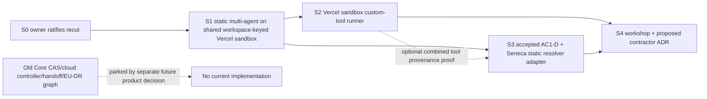

# Implementation Plan — Seneca App Multi-Agent Recut

## Problem Statement

The previous ownership recut treated Seneca as a cloud host controller and front-loaded Core definition/deployment records, workspace binding CAS, host-schema adoption, controller relocation, authority handoff, and EU/DR proof. That is not the immediate product.

**Seneca is a regular single-account application deployment**: one account may have many users and workspaces, and each authorized workspace must quickly run several prebuilt filesystem-authored agents from one normal Seneca image deployment. The workspace is the control room for an internal agent team. Internal agents share that workspace's sandbox and complete filesystem; custom executable tools run only as subprocesses inside that sandbox. Seneca Cloud, account-instance hosting, fleet control, and dynamic agent publication are explicitly deferred.

The current plan also overstates several landed seams. Seneca compiles `agents/dummy` but discards the result; the active runtime does not load it. Core and the P6-R `resolveAgentDeployment()` path are default-deployment-specific. Current plugin tools execute host-side. Current `/reload` refreshes Pi/plugin resources, not static server tools. The Decision-22 task contract and accepted AC1-D dispatcher micro-spec exist, but the synchronized implementation branch must still prove its required durable `agent.db` and T1 seams before dispatcher work proceeds.

## Goal

Ship the smallest safe vertical path to several deployment-static agents in Seneca:

1. **Static multi-agent first:** two or more immutable `agents/<name>/` bundles selected inside one authorized workspace, with separate prompts, catalogs, sessions, and provenance, while resolving one workspace-keyed Vercel persistent sandbox and filesystem.
2. **Sandboxed custom tools second:** immutable image-built tool artifacts invoked through a Seneca-scoped JSON subprocess adapter inside that same workspace sandbox; never imported into the Seneca/Agent host.
3. **Native internal A2A third:** conform to the already accepted AC1-D contract, substituting only Seneca's authorized static-catalog resolver for AC1-D's P6-R resolver assumption.
4. **Persist the longer vision:** file-first Pi editing and preview/promotion, internal full-shared-sandbox agents, and future contracted agents with one fresh sandbox and governed multi-filesystem projection per contract execution.

## Product Definitions and Ownership

| Product / layer | Owns now | Does not own now |
|---|---|---|
| **Seneca app** | Single-account app composition; deployment-static agent catalog; named-agent membership-gated routes/UI; static bundle identity; Seneca-scoped custom-tool build/runtime adapter; app-local A2A resolver adapter | Seneca Cloud, instance fleet, per-agent hostname, marketplace, arbitrary runtime uploads, generic dynamic deployment control plane |
| **Core** | Existing users, authentication, workspaces, membership, authorized workspace resolution and persistence | Agent catalog/deployment/binding/default/CAS tables; agent runtime registry; fleet/cloud authority |
| **Agent package** | Generic agent/session/routes; optional route-prefix/path generation seam if required; trusted immutable session-header identity seam if required; canonical Decision-22 task types and AC1-D implementation | Seneca static catalog, workspace availability DB, user tool module loading, cloud lifecycle |
| **Workspace / boring-bash / sandbox** | Existing paired `Workspace + Sandbox`; workspace filesystem/exec substrate; Vercel persistent sandbox provider; future governed filesystem projection primitives | Agent catalog ownership, browser authority, dynamic agent deployment lifecycle |
| **Full-app** | Standalone single-primary reference application | Seneca prerequisite, multi-agent product target, Cloud controller migration target |
| **Seneca Cloud (parked)** | If separately approved later: account-instance hosting, Caddy/runsc/fleet/domain/billing/backups | Any current slice in this plan |

## Immediate Product Decisions

### Deployment-static catalog

The first Seneca catalog is generated during the normal reviewed app/image build:

```text
Seneca image/release inputs
└── agents/<agentId>/
    ├── agent.json
    ├── instructions.md
    └── optional Seneca custom-tool manifest/source

Generated deployment catalog
├── compiled A1 bundle and digest
├── Seneca-local resolved identity digest
├── presentation { id, label, routeBase }
└── tool schemas/artifact digests when present
```

All built-in catalog entries are initially available to each authorized Seneca workspace, subject to a static Seneca server allowlist. There is:

- no Core schema change;
- no workspace-agent binding/default/CAS store;
- no workspace installation API;
- no dynamic marketplace/control plane;
- no agent hostname routing;
- no runtime upload.

A normal Seneca deployment changes the catalog available to **new** sessions. Existing effectful sessions/tasks remain pinned to their immutable identity. There is no silent substitution.

### Transcript continuity versus executable continuity

Historical conversation data must never disappear merely because its executable artifact is no longer deployed.

- **Read-only history works without a current catalog match:** authorized listing, metadata lookup, transcript loading/rendering, and bounded historical attachments use the identity stored in the durable session header/index. They do not construct a runtime, load the current prompt/tool catalog, or require the referenced artifact to remain active.
- **Effects fail closed without the pinned artifact:** prompt/follow-up, `/reload`, tool execution, live state/subscription paths that instantiate or resume the harness, interrupt/stop/control, and A2A response/resume first resolve and verify the exact pinned identity. Missing or mismatched artifact returns a stable identity-unavailable/mismatch error.
- If the current `state` route necessarily creates/reconnects a live harness, it rejects on missing identity. Historical rendering uses a distinct read-only transcript/history seam rather than weakening the effectful state route.
- The UI can still display the historical agent label/ID and transcript from stored metadata; it marks the session unavailable for continuation instead of hiding it.

This separation is mandatory in S1 tests.

## Current-State Evidence

| Area | Current evidence | Planning consequence |
|---|---|---|
| Seneca source format | `agents/dummy/agent.json`, `instructions.md`, `tools/getServerTime.ts`; `scripts/compile-agents.mts` calls published `compileAgentDirectory()` for every `agents/<name>`. | Reuse filesystem-first authoring and A1 compilation. |
| Bundle use | `compile-agents.mts` prints the bundle and exits; `src/server/main.ts` / `dev.ts` call `createCoreWorkspaceAgentServer()` but do not load the compiled bundle. | Add a generated Seneca catalog and actual app composition. |
| Default resolver | `packages/agent/src/server/agentDefinition/resolveAgentDeployment.ts` validates `defaultDeploymentId` and rejects non-`default` agent IDs. | **Leave it unchanged.** It is P6-R/default-deployment-specific. Build a Seneca-local static bundle resolver/digest. |
| Core composition | `createCoreWorkspaceAgentServer` and Core request scope are default-agent-oriented. | Core remains auth/membership owner; Seneca composes named routes after authorization. |
| Fixed Agent routes | `registerAgentRoutes.ts` and child route modules use `/api/v1/agent/...`; attachment URL generation is also hardcoded. | Prefer Fastify registration prefix + existing front `apiBaseUrl`; add a package path-generation seam only where generated absolute URLs bypass the prefix. |
| Runtime composition seam | Each separately mounted Agent route wrapper owns its prepared prompt/tool/session composition; `getSessionNamespace` is host-supplied. `getRuntimeScopeContribution.identity` exists only if a shared package cache actually needs disambiguation. | Do not build a new cache abstraction. Use the existing separate wrapper closures first; add `agentId` to an existing shared cache key only if a failing two-agent test proves that cache is shared. Never put `agentId` into the underlying workspace sandbox handle. |
| Production provider | Seneca `assertProductionAgentModeIsSafe()` rejects production modes other than `vercel-sandbox` unless explicitly overridden. | S1 production substrate is the existing Vercel persistent sandbox. The bwrap worker is not an S1 dependency. |
| Persistent Vercel identity | `resolveSandboxHandle.ts` derives/cache/persists a sandbox from trusted `workspaceId`; the Vercel runtime defaults persistent mode on. | Every named agent in one workspace must resolve the same provider name/handle/filesystem keyed only by trusted workspace ID. |
| Existing bwrap worker | Seneca worker caches `WorkerRuntime` by `workspaceId` and exposes fs/exec through an internal token. | Keep as local/Docker alternative/future proof; do not force it into first production delivery. |
| Sandbox command API | `Sandbox.exec(cmd, opts)` has cwd/env/abort/timeout/output cap but no stdin. Bwrap has detached process-group TERM→KILL; Vercel maps abort to remote command signal. | V1 custom tools use call files plus fixed command/arguments and provider-specific cancellation proof. |
| Provider artifact visibility | A binary in the Seneca web image is not automatically visible inside Vercel; current bwrap mounts also do not make `/opt/seneca/tool-runner` available. | S2 must build a provider-visible runner/artifact bundle: Vercel snapshot/template first, read-only worker bind/image later. |
| Plugin trust | `packages/agent/docs/PLUGINS.md`: plugin `execute()` runs in host Node; Vercel mode disables automatic plugin loading. | User custom tools never use plugins, host `extraTools` implementations, or dynamic host imports. |
| Reload | Existing `/api/v1/agent/reload` reloads Pi/harness/plugin resources, not boot-composed routes/tools. | Future agent draft/build/preview is a separate design; do not overclaim current reload. |
| A2A | `agent-consumption.ts` types are landed. On the planning branch, `AC1-D-SPEC.md` is **Accepted and dispatchable**, owner-ratified 2026-07-14. | S3 conforms to AC1-D, including durable `agent.db`, T1 event store, `maxDepth=3`, 24h input timeout, and its exact task/session semantics. |
| Governance projections | Existing boring-governance/boring-bash readonly projection operations and architecture 09 are prior art. | Use only in the future contracted-agent decorator; do not gate S1–S3 on generic attachments. |

## Simplification and Parking Table

| Previous commitment | Disposition | Reason |
|---|---|---|
| Core `agent_definition_refs`, `agent_deployment_refs`, workspace bindings/defaults/CAS/events | **Remove from current plan; create no migration.** | Static image catalog and normal deploy satisfy the immediate use case. |
| Changes to `resolveAgentDeployment()` | **Forbidden in this recut.** | It is the P6-R/default deployment resolver. Seneca owns its static resolver. |
| Generic Workspace server multi-agent registry/export | **Do not build now.** | Seneca is the only consumer. Extract only after a second real app proves the interface. |
| Coupled Core/Agent/Workspace release as prerequisite | **Remove.** | Release only packages actually changed using the native repository release process. |
| Core 0018–0022 adoption, Seneca journal, controller R0–R4, single-writer handoff, EU/DR controller proof | **Park as historical/future Seneca Cloud work.** | Seneca Cloud is explicitly excluded. |
| Full-app contraction/controller cleanup | **Park.** | Full-app stays an independent single-primary reference and leaves Seneca's critical path. |
| Hostname per agent | **Remove from immediate product.** | One authorized workspace UI lists/selects agents. |
| Dynamic agent marketplace, DB install/upgrade API, runtime uploads | **Defer.** | Prebuilt image agents ship first. |
| PR #789 and Seneca PR #10 | **Remain architecture-paused/superseded; no merge, close, force-push, or revival action.** | Preserve provenance and avoid consuming current scope. |

The previous document remains in Git history. No source, tests, migrations, proof assets, databases, branches, or PR history are deleted by this recut.

## Target Architecture

### Request and runtime flow

```text
normal Seneca build
  agents/<name>/ → deterministic static catalog
                            │
                            ▼
authorized GET agent catalog
  server returns [{ id, label, routeBase }]
                            │
                            ▼
browser uses the exact server-issued routeBase
                            │
                            ▼
Fastify prefix + Agent route plugin wrapper
  ├── Core-authenticated workspace membership
  ├── Seneca-local static bundle resolution
  ├── per-agent prompt/catalog/session identity
  └── shared provider resolution keyed only by trusted workspaceId
                            │
                            ▼
Vercel persistent sandbox for workspace W
  ├── primary wrapper
  ├── reviewer wrapper
  └── researcher wrapper
```

The wrappers may be distinct Agent route/runtime-binding objects because prompts, catalogs, sessions, and identities differ. The required shared property is the underlying Vercel sandbox name/handle and filesystem for trusted `workspaceId=W`. The plan does **not** claim the wrappers are the same `RuntimeBundle` object.

### Seneca-local static identity

Do not route through `resolveAgentDeployment()`. Seneca verifies the compiled A1 bundle and derives a frozen identity in a Seneca-specific digest domain:

```ts
interface SenecaStaticAgentIdentityV1 {
  workspaceId: string                  // trusted authorized workspace
  agentId: string                      // safe deployment-static catalog key
  definitionId: string
  definitionVersion: string
  definitionDigest: `sha256:${string}`
  resolvedDigest: `sha256:${string}`   // canonical bundle + Seneca catalog/tool policy
  toolCatalogDigest: `sha256:${string}`
}
```

The static resolver:

1. exact-looks up a server-owned catalog key;
2. recomputes/verifies the A1 bundle digest;
3. validates the catalog ID/definition mapping and tool references;
4. incorporates the app catalog schema/version and tool-catalog digest into `resolvedDigest`;
5. freezes the result;
6. never consumes a Core binding, hostname, browser digest, workspace path, or sandbox handle.

This identity is included in the agent-qualified session namespace and written once into the Pi session header before the first effect. Separately mounted wrappers already isolate ordinary in-memory composition; no new cache identity or cache service is part of S1.

### Server-issued route bases

The safe catalog response is exactly bounded presentation/routing data:

```ts
interface SenecaAgentCatalogViewV1 {
  id: string
  label: string
  routeBase: string // server-issued, same-origin, e.g. /api/v1/agents/reviewer
}
```

Rules:

- membership is checked before returning the catalog;
- `routeBase` is generated by the server's route registry, not concatenated by the browser;
- the browser passes no digest, root, namespace, provider handle, or trusted identity;
- prefer Fastify plugin prefix and the existing front `apiBaseUrl` property;
- audit every generated Agent URL, especially Pi attachment URLs, reload URLs, commands, state, events, models, catalog, skills, and session-change URLs; any hardcoded `/api/v1/agent` that bypasses Fastify prefix must be generated through one optional path/base helper;
- when no prefix/base is supplied, existing public paths and attachment URLs remain byte-compatible.

Historical session metadata contains the stored logical `agentId`. A membership-gated server history response supplies the historical `routeBase` (or a dedicated read-only history endpoint) even when the agent is no longer active. The browser never reconstructs route authority from an ID.

### Session namespace and history

Named Seneca sessions use an agent-qualified namespace, for example:

```text
<workspace-safe-id>_user_<subject-hash>_agent_<agentId>_<identity-short-hash>
```

The legacy default-only namespace remains unchanged for full-app and existing consumers. A raw public session ID is never an authorization boundary.

The durable header stores enough identity/presentation metadata to list/render history without the current catalog:

```ts
{
  schemaVersion: 1,
  workspaceId,
  agentId,
  agentLabelAtCreation,
  definitionId,
  definitionVersion,
  definitionDigest,
  resolvedDigest,
  toolCatalogDigest
}
```

The header is immutable. Label changes affect new sessions only; history may show the creation-time label.

### Initial production Workspace+Sandbox substrate

S1 uses the existing Vercel persistent sandbox mode because Seneca production already fails closed unless `BORING_AGENT_MODE=vercel-sandbox` (absent explicit unsafe override).

For every authorized workspace:

```text
trusted workspaceId W
  → existing Vercel persistent sandbox resolution
  → one deterministic/persisted sandbox name and current handle
  → one remote workspace filesystem
```

Every named agent wrapper for W passes the same trusted `workspaceId` into that resolver. `agentId`, route prefix, subject hash, session identity, prompt, and tool catalog must **not** participate in provider sandbox naming. Agent identity belongs in session/provenance keys. It is added to an existing runtime cache key only if implementation evidence proves multiple agents share that cache; S1 creates no new cache layer.

Required S1 proof:

- instrument/fake the Vercel provider resolver and show two named agents in W cause one provider acquisition/name and observe the same handle/remote root;
- agent A writes a sentinel and agent B reads it;
- a second workspace W2 resolves a different sandbox name/handle and cannot read W's sentinel;
- separate prompts/catalogs/session namespaces remain isolated despite shared provider handle;
- no assertion claims both agents share an identical wrapper/runtime bundle object.

The existing workspace-keyed bwrap worker remains a supported local/Docker alternative and useful future conformance subject. It is not an S1 production prerequisite and does not replace the Vercel choice in this plan.

## Security and Trust Model

### Same-workspace trust boundary

The owner explicitly accepts that all internal agents and their custom tools have full access to the workspace sandbox. Therefore:

```text
same authorized workspace = same filesystem/tool execution trust boundary
```

Agents still have separate behavior/provenance/session identities, but this plan does not promise hostile-code isolation between agents or tool calls inside one workspace. A tool may observe or alter other files visible in that sandbox. The product/UI must disclose this.

The security promises remain:

- no host-process code loading;
- no other workspace filesystem/handle;
- no Seneca/Core DB credential, host socket, host root, or control-plane secret;
- no browser-selected trusted identity;
- provider resource/time/output/network policy remains outside tool code.

### Browser/server boundary

The browser may choose only one server-listed logical agent view. Every named session/effect route independently checks membership and resolves the server catalog and stored session identity. Browser-controlled body/query/header/prompt/tool content cannot set `workspaceId`, digest, artifact location, sandbox name/handle, runtime root, session namespace, or execution identity.

### Effect boundary versus history boundary

- History reads authorize user/workspace/session ownership but do not require active runtime identity.
- Effects require exact active artifact identity and provider readiness.
- A stale session cannot be continued through another agent's route.
- A missing catalog entry never removes the history row.

## Custom Tool Subprocess V1

### Authoring

A Seneca agent remains A1-compatible:

```text
agents/reviewer/
  agent.json
  instructions.md
  seneca.tools.json
  tools/
    run-project-tests.ts
```

`agent.json.toolRefs` remains opaque A1 data. A strict Seneca-local `seneca.tools.json` maps declared references to contained build entries and input/output schemas. It is not added to the A1 schema and is not a new plugin package format.

- Local development may build a preview locally.
- The authoritative deployed tool artifact is generated by the normal reviewed Seneca build from committed source and the lockfile.
- Generated catalog evidence records source, manifest, lockfile, build recipe, runner, artifact and aggregate bundle digests.
- No generated output makes the user implementation importable by the Seneca/Agent host.

### Provider-available immutable runner/artifacts

A path in the web image is insufficient. S2 must deliberately place the runner and artifacts into the selected provider:

#### Initial production: Vercel sandbox

Build a versioned, content-addressed Vercel sandbox template/snapshot containing:

```text
<provider-runtime-root>/seneca-tool-runtime/<bundle-digest>/
  runner
  artifacts/<artifact-digest>/...
  manifest.json
```

Use existing Vercel template/snapshot provisioning seams (`runtime/modes/vercel-sandbox.ts`, `sandbox/vercel-sandbox/packageTemplate.ts`, bake/deployment snapshot/provisioning helpers) rather than assuming `/opt/seneca` exists remotely. New workspace sandboxes start/resume with the approved template. Existing persistent sandboxes reconcile missing content-addressed bundles additively, verify every file/aggregate digest, and never overwrite a different artifact at the same digest. Old content-addressed bundles needed by retained sessions stay available according to an explicit retention policy; otherwise those sessions remain readable but effectfully unavailable.

The Seneca-scoped Vercel adapter advertises `untrusted-tool-exec` only after it verifies:

- expected template/runtime bundle digest;
- runner and selected artifact digest;
- correct workspace-keyed sandbox handle;
- process timeout/cancel semantics;
- environment/network/resource policy.

Do not add this capability globally to generic `createVercelSandboxExec()` merely because it has `/exec`.

#### Local/Docker alternative

A future/local worker image may contain the same runner/artifact bundle and expose it through an explicit read-only bwrap bind plus digest proof. Current bwrap does not automatically expose `/opt/seneca/tool-runner`; its mount plan must be reviewed before capability is granted. The generic bwrap provider also does not receive `untrusted-tool-exec` globally.

### Call protocol and concurrency

`Sandbox.exec` has no stdin. V1 uses short-lived server-created call files in the workspace sandbox:

```text
<workspace>/.seneca/tool-calls/<call-id>/input.json
<workspace>/.seneca/tool-calls/<call-id>/output.json
```

`call-id` is a CSPRNG opaque token with at least 128 bits of entropy, encoded in a fixed safe alphabet. It is not sequential, user-controlled, or derived from session/tool input.

V1 serializes custom-tool invocations **per workspace** using a server-owned one-at-a-time queue/lock. This avoids live call-file races while preserving the accepted same-workspace trust model. The fixed runner command receives only the validated call ID and resolves runner/artifact paths from the verified provider bundle:

```text
<verified-runner> --call <safe-csprng-call-id>
```

No model-controlled string is interpolated into a shell command. The runner cannot accept an arbitrary command, source/module path, environment map, root, or artifact path.

Input:

```json
{
  "protocol": "seneca.custom-tool/v1",
  "callId": "opaque-csprng-token",
  "workspaceIdHash": "sha256:...",
  "agent": {
    "id": "reviewer",
    "resolvedDigest": "sha256:...",
    "toolArtifactDigest": "sha256:..."
  },
  "tool": "run-project-tests",
  "input": { "scope": "unit" }
}
```

Output:

```json
{
  "protocol": "seneca.custom-tool/v1",
  "callId": "opaque-csprng-token",
  "agentId": "reviewer",
  "resolvedDigest": "sha256:...",
  "toolArtifactDigest": "sha256:...",
  "ok": true,
  "result": { "passed": 12, "failed": 0 }
}
```

After process exit, the trusted adapter immediately reads and validates protocol, call ID, agent identity, resolved digest, tool artifact digest, output schema, size, uniqueness and exit classification before returning data. Call files are retained only long enough to complete durable audit/classification and are then removed through the bounded call-lifecycle implementation.

Because arbitrary tools share full workspace access, another tool/agent could in principle observe or tamper with call files. Per-workspace serialization prevents concurrent V1 calls but does not create a hostile-code boundary against a background process already running in that workspace. This is an explicit accepted same-trust-boundary risk. Identity validation detects ordinary/stale substitution but is not described as cryptographic isolation from all code in the same sandbox. If that risk becomes unacceptable, the follow-up is a per-call child sandbox/private I/O channel, not increasingly elaborate shared-directory ACL claims.

### Trusted adapter validation and stable errors

The adapter validates published input schema before launch and output schema after launch. It rejects malformed JSON, unexpected fields, protocol/call/agent/artifact mismatch, missing/duplicate output, over-limit data, nonzero launch failure, timeout, cancellation, truncation, artifact/template mismatch and provider capability absence.

Stable errors include:

```text
CUSTOM_TOOL_ISOLATION_UNAVAILABLE
CUSTOM_TOOL_RUNTIME_BUNDLE_MISMATCH
CUSTOM_TOOL_ARTIFACT_MISMATCH
CUSTOM_TOOL_INPUT_INVALID
CUSTOM_TOOL_OUTPUT_INVALID
CUSTOM_TOOL_OUTPUT_MISSING
CUSTOM_TOOL_PROTOCOL_MISMATCH
CUSTOM_TOOL_TIMEOUT
CUSTOM_TOOL_CANCELED
CUSTOM_TOOL_EXEC_FAILED
```

The environment is an explicit minimal allowlist. No Seneca/Core DB credential, global secret collection, host control token or unrelated workspace secret is forwarded. Network is denied by default; any allowlist is provider/host policy, not agent code authority.

## Internal A2A Fit

### Authoritative contract

The planning branch's `docs/issues/391/runtime-refactor/work/AC1-agent-consumption-contract/AC1-D-SPEC.md` is **Accepted and dispatchable**, owner-ratified 2026-07-14. S3 must conform; it must not invent a parallel task contract, task state store, transcript store, timeout policy or dispatcher API.

Settled AC1-D behavior retained exactly:

- canonical `AgentTask` v2 consumption contract;
- native in-process subagent binding, no MCP loopback/wire serialization;
- callee gets a distinct fresh Pi session in the caller's workspace;
- 1:1 task-to-session mapping;
- durable narrow `SubagentTaskRecord` in the existing `agent.db`;
- conversation events in the existing T1 durable event store;
- restart scan and deadline re-arm/cancel behavior;
- `maxDepth = 3`;
- `inputRequiredTimeoutMs = 24h`;
- full-ancestry cycle detection;
- original human/workspace principal and callee actor provenance;
- structured failed/canceled results and the accepted stable errors;
- AC1-D file targets and proof matrix.

### Seneca compatibility addendum only

AC1-D currently assumes P6-R `resolveAgentDeployment()` resolves B. Seneca must not change that resolver. Add one narrow compatibility addendum and injected resolver adapter:

```ts
interface SubagentTargetResolver {
  resolve(input: {
    principal: PrincipalRef
    target: AgentRef
  }): Promise<ResolvedSubagentTarget>
}
```

The canonical AC1-D dispatcher consumes this seam. Existing P6-R consumers receive the original P6-R adapter. Seneca supplies an authorized static-catalog adapter that:

1. requires the caller principal's exact workspace;
2. verifies current membership/host admission;
3. resolves the target from the deployment-static Seneca catalog;
4. pins `SenecaStaticAgentIdentityV1`;
5. binds B's new session wrapper to the caller workspace's same underlying Vercel sandbox handle;
6. returns no browser-controlled root/handle/digest.

The addendum changes only target resolution. It does not re-ratify AC1-D, change its durable store, add another queue/task schema, or alter Decision 22.

Before S3 implementation, synchronize implementation main and prove that the accepted spec's required `agent.db` task-store integration point and T1 durable event-store APIs actually exist. If either is absent, S3 is **blocked** and reports the missing prerequisite; it does not substitute an in-memory map, a new Seneca database, JSON files, or a second event store.

### Same-workspace execution

```text
originating user + workspace W
  primary@A task/session wrapper
       │ native AC1-D task
       ▼
  reviewer@B distinct child session wrapper
       └── same underlying workspace-keyed Vercel sandbox handle/filesystem
```

The audit chain is:

```text
user/workspace principal → caller revision → callee revision → optional custom-tool artifact
```

Seneca may apply existing metering/concurrency admission around AC1-D, but must not fork AC1-D semantics. Children cannot receive more authority than the originating workspace admission. Shared writes remain possible by the accepted workspace trust boundary; AC1-D's artifact/stale-write safeguards and explicit task intent govern automated application.

## Future Contracted-Agent Vision — Proposed Decision 22 Amendment

This section records a **proposed** Decision 22 amendment. Decision 22 has not been amended by this plan. S4 must obtain explicit owner approval before editing the decision registry or dispatching contractor implementation.

The same AC1-D pipeline is decorated for contracted mode, but its environment resolver creates a fresh per-contract execution boundary:

```text
originating user + caller workspace
  └── approved source paths
      └── governed immutable readonly projection
           │
           ▼
contract execution identity + fresh sandbox
  /agent          immutable contractor bundle/tools (ro)
  /input          caller whitelist projection (real ro)
  /work           fresh scratch (rw)
  /deliverables   fresh result area (rw)
```

Proposed rules:

- one fresh machine/execution identity and sandbox per contract execution;
- immutable contractor bundle and custom-tool artifacts may be reused, but no mutable customer input/scratch/output state crosses executions;
- the agent has full access to its contract sandbox, not the caller's full workspace;
- caller input is a physically readonly, path-whitelisted, governance-produced snapshot/projection with manifest/digest;
- no live cross-workspace ACL, raw caller mount, browser-provided root, or synthetic human user;
- `input-required` adds a newly approved projection version and resumes only the same execution identity/snapshot;
- output is copied out as bounded validated artifacts/patches; contractor never writes caller files directly;
- terminal state revokes credentials/stops the sandbox; retention/deletion is explicit;
- persistent continuity is a separately approved customer-scoped engagement, never an implicit global contractor memory;
- external A2A remains a future adapter and maps `auth-required` onto the same internal task contract.

The proposed amendment supersedes only Decision 22's suggestion that a contractor workspace accumulates mutable learning/tooling across unrelated customer engagements. Its one-pipeline, native-internal, governed-projection and external-edge-binding decisions remain intact.

## `/reload` and Agent Workshop Vision

The future Seneca workspace is a file-first Pi agent workshop:

```text
.agents/reviewer/
  agent.json
  instructions.md
  skills/
  tools/
```

Future `/reload reviewer` semantics are:

```text
draft snapshot → validate → sandboxed build → immutable preview
```

Promotion is separate:

```text
preview → user/admin review → promote for new sessions
```

An agent may edit its own or another agent's draft but cannot:

- self-promote;
- widen its grants;
- inject host code;
- obtain secrets/network/filesystem authority by editing a manifest;
- replace an in-flight pinned revision.

Every draft/build/preview/promotion records source session/actor, approver, diffs and digests. Current `/reload` continues to mean Pi/plugin resource reload until this new lifecycle is explicitly implemented.

## Short-Term Vertical Slices

### S0 — Ratify this recut and replace the obsolete dispatch graph

**Delivers:** one accepted Seneca-app-first scope and a parked historical Cloud/CAS path.

**Files:**

- `docs/issues/391/runtime-refactor/AGENT-CLOUD-OWNERSHIP-RECUT.md`
- `.beads/issues.jsonl` only after owner ratification

**Changes:** replace the previous ownership plan with this complete plan; after ratification, map old beads to superseded/parked and create only the new graph below. Do not edit Decision 22 yet.

**Acceptance:** owner explicitly ratifies static multi-agent Seneca as the immediate product. No Core migration, controller copy/relocation, host schema adoption, authority handoff, Cloud action, EU/DR proof, branch deletion, or PR merge/close action is dispatched.

**Proof:** `git diff --check`; tracker lint/cycle check after approved tracker update.

**Review budget:** small documentation/tracker review; owner decision required.

---

### S1 — Static named-agent catalog, shared Vercel workspace, secure sessions and selector

**Delivers:** the fastest useful product: at least two prebuilt agents in one authorized workspace, selected from one Seneca UI and shipped by one normal Seneca deployment. Agents have distinct prompts/tool catalogs/session namespaces/headers but one underlying workspace-keyed Vercel persistent sandbox/filesystem. No custom executable tool and no A2A yet.

**Blocked by:** S0.

#### Boring package changes — minimal and conditional

Do **not** change `resolveAgentDeployment.ts` or its P6-R tests.

First attempt composition with:

- Fastify registration prefix;
- existing `apiBaseUrl` front seam;
- `getRuntimeScopeContribution.identity`;
- `getSessionNamespace`;
- existing Vercel workspace-keyed provider resolution.

Change `@hachej/boring-agent` only where Seneca cannot safely compose externally:

- `packages/agent/src/server/registerAgentRoutes.ts` and affected route/path-generation modules — optional route path/base helper only if Fastify prefix does not cover generated URLs;
- `packages/agent/src/server/pi-chat/harnessPiChatService.ts` and attachment URL generation — use supplied route base rather than hardcoded `/api/v1/agent`;
- Pi session header/load modules, likely `packages/agent/src/server/pi-chat/piSessionIdentity.ts`, harness sessions and shared session metadata — trusted immutable execution identity, read-only historical metadata and effectful mismatch handling;
- focused route-prefix/session-history/identity tests.

Existing default route behavior must be byte-compatible when no base/identity is supplied. If the package change expands beyond bounded route generation and session-header identity, stop for design review rather than duplicating/forking the Agent route stack in Seneca.

#### Seneca files

Likely targets:

- `scripts/compile-agents.mts`
- new `scripts/build-agent-catalog.mts`
- `scripts/build-app.mts`, `Dockerfile`, `.dockerignore`, build output config
- new `src/server/agents/{catalog,staticResolver,identity,compose,routes,sessionNamespace,history}.ts`
- `src/server/{main,dev}.ts`
- new `src/front/{SenecaAgentSelector,SenecaAgentChatPane}.tsx` or an equivalent focused app plugin/panel; `src/front/main.tsx`
- new `agents/reviewer/{agent.json,instructions.md}`; retain existing sources unless separately authorized
- focused `src/server/__tests__/agents/*`, front tests and `e2e/*`

#### Implementation rules

1. Build a deterministic static catalog from all `agents/<name>/`; reject invalid/duplicate/unsafe IDs and bundle digest mismatch.
2. Use a Seneca-local digest resolver; never call or modify `resolveAgentDeployment()` for named static agents.
3. Register each named Agent route plugin with a server-owned prefix/base; return `{id,label,routeBase}` only after membership.
4. Browser uses the returned `routeBase`; it never constructs route authority or sends trusted identity.
5. Historical session index/metadata returns a server-issued historical route base/read endpoint; removed agents remain visible/readable.
6. Write immutable identity before effects. History read bypasses current catalog execution resolution; all effectful routes require the exact pinned artifact.
7. Separately mounted wrappers preserve distinct prompts/tools; if an existing shared runtime cache is encountered, its key includes agent identity. Provider handle lookup remains keyed only by trusted workspace ID.
8. Vercel persistent sandbox is the production substrate. The bwrap worker stays an optional local/Docker alternative.
9. Do not expose hostname-per-agent behavior.

#### Acceptance and proof

1. **Build:** image/catalog build compiles `dummy` and `reviewer`, includes deterministic generated catalog and fails on invalid/duplicate/missing bundles.
2. **Auth:** two authorized members see the same `{id,label,routeBase}` list; nonmember/foreign workspace cannot list or route.
3. **Browser boundary:** forged digest/root/handle/namespace/route base is rejected or ignored; arbitrary agent ID has no route.
4. **Distinct behavior:** agents have different instructions and tool catalog views; no prompt/catalog/session namespace bleed.
5. **One Vercel provider handle:** a provider spy/integration test proves A and B in W resolve one deterministic Vercel sandbox name/handle and one remote root; `agentId` is absent from provider key.
6. **Shared filesystem:** A writes a random sentinel in W; B reads it.
7. **Cross-workspace isolation:** W2 resolves a distinct Vercel name/handle and cannot read W's sentinel.
8. **Sessions:** same public session ID under two agent namespaces cannot collide/cross-load; headers carry exact immutable identity.
9. **History continuity:** after deploying a catalog that omits/changes reviewer, authorized list/history/transcript rendering still shows reviewer sessions and creation-time metadata. Prompt/follow-up/reload/live state/control/A2A resume reject with stable identity-unavailable/mismatch and perform no effect.
10. **New deployment behavior:** new sessions use the new deployment catalog; no existing session silently changes identity.
11. **UI:** one workspace selector switches between server-issued route bases; no hostname-based selection.

#### Release/deploy

If Agent package changes are needed, merge/review on Boring main, run relevant gates, use exactly the repository-native release procedure once with the policy-correct bump, and pin the actual version/lockfile in Seneca. If no package changes are required, do not release packages. Then run the normal reviewed Seneca build/deploy; no controller, migration-adoption, or special agent deployment service is introduced.

**Proof commands:** focused Agent package tests; Seneca `pnpm agents:compile`, `pnpm typecheck`, `pnpm test`, focused Playwright/API tests, normal image build, and authenticated two-agent smoke against Vercel sandbox fixtures/live dev credentials as separately approved.

**Review budget:** medium/high because routing and session identity cross package/app boundaries.

---

### S2 — Seneca-scoped Vercel custom-tool subprocess runner

**Delivers:** one deployment-built custom tool invoked as validated JSON subprocess data inside the existing workspace Vercel persistent sandbox. No host-side user module load.

**Blocked by:** S1.

#### Package/provider approach

Do not grant a global `untrusted-tool-exec` capability to generic `Sandbox.exec`, Vercel, bwrap or remote-worker adapters.

Prefer a Seneca-scoped wrapper/adaptor that exposes the capability only after selected-provider verification. Generic shared typing may add the capability string/documentation if necessary, but current providers do not advertise it by default.

Initial production is Vercel:

- create a content-addressed runner+artifact template/snapshot;
- provision/reconcile it through existing Vercel package-template/bake/snapshot seams;
- verify provider bundle/runner/artifact digest before launch;
- retain old immutable digests needed for effectful session continuation or fail closed while preserving history.

The bwrap worker proof is optional/local and may follow through a worker image/read-only bind. It does not gate S2 production.

#### Seneca files

Likely targets:

- `agents/<name>/seneca.tools.json`, `agents/<name>/tools/*`
- new `scripts/build-agent-tools.mts` and generated catalog integration
- new `src/server/customTools/{manifest,artifactRegistry,vercelProvisioning,adapter,callFiles,workspaceQueue,errors,audit}.ts`
- provider-visible runner source/build output, e.g. `src/tool-runner/*`, without assuming a web-image `/opt` path
- relevant Vercel template/snapshot configuration and build evidence
- focused server, provider and e2e tests

#### Implementation rules

1. The only host-loaded tool implementation is the generic trusted adapter.
2. Custom tool call ID is CSPRNG, opaque, fixed alphabet and at least 128-bit entropy.
3. Serialize calls one-at-a-time per workspace.
4. Write bounded strict input file; invoke fixed verified provider runner with only call ID.
5. Immediately validate post-exit protocol/call/agent/resolved/artifact identity and output schema.
6. Keep call files short-lived after durable classification.
7. Treat cross-tool call-file visibility/tamper as accepted same-workspace trust risk; do not claim per-tool isolation. Detect mismatches and fail closed. A per-call child sandbox is future if product requirements change.
8. Direct mode and any unverified provider return `CUSTOM_TOOL_ISOLATION_UNAVAILABLE` before files/code execute.
9. No dynamic import/require of agent tool source in Seneca/Agent/plugin code.

#### Acceptance and proof

- reviewer calls an image-built fixture tool and receives schema-valid JSON;
- live Vercel sandbox proves verified template/runtime bundle, runner and artifact digests;
- existing persistent sandbox reconciliation is additive/content-addressed and detects tamper;
- direct mode fails before call-file creation/user code;
- a second workspace cannot use/read the first workspace's call directory or handle;
- concurrent requested calls are serialized per workspace; stale/tampered output identity fails;
- timeout/abort produces one stable outcome and provider proof shows command termination semantics;
- output caps, malformed protocol, artifact mismatch, missing output and command/path injection fail closed;
- static import audit proves no agent `tools/` module is host-loaded;
- image presence alone is not accepted as remote provider artifact proof.

**Proof:** focused manifest/runner/adapter/queue tests; Vercel template/snapshot digest test; hostile tool suite; normal Seneca image build and authenticated invocation.

**Review budget:** high security review before enabling the scoped capability.

---

### S3 — AC1-D native same-workspace A2A with Seneca static resolver adapter

**Delivers:** primary delegates to reviewer through the accepted native AC1-D pipeline; callee gets a distinct session wrapper pinned to its identity and the same workspace-keyed Vercel sandbox handle/filesystem.

**Blocked by:** S1 and by presence of AC1-D's required durable `agent.db` + T1 implementation seams on synchronized implementation main. S2 is optional for plain A2A; depend on S2 only for a combined delegated-custom-tool proof.

#### Authoritative inputs

- `docs/issues/391/runtime-refactor/work/AC1-agent-consumption-contract/AC1-D-SPEC.md`
- canonical `packages/agent/src/shared/agent-consumption.ts`
- accepted AC1-D target files/store/recovery/errors/proof matrix

Do not create a Seneca task schema/store/queue or re-ratify AC1-D.

#### Compatibility work

Add a narrow AC1-D compatibility addendum documenting resolver injection. Likely package targets are AC1-D's already settled:

- `packages/agent/src/server/consumption/{subagentDispatcher,subagentTaskStore,subagentRecovery}.ts`
- accepted `delegateToSubagent` tool factory location
- existing scoped error registry/tests
- a resolver interface/adapter point supporting both P6-R and Seneca static catalog

Seneca supplies only:

- `src/server/agents/subagentTargetResolver.ts`
- app composition/admission/audit/metering wiring
- focused integration tests/UI projection if needed

#### Required behavior

- AC1-D `SubagentDispatcher.invoke/respond` and `SubagentTurnResult` unchanged;
- durable task record in existing `agent.db`, T1 transcript/event stream, recovery scan and timer re-arm unchanged;
- `maxDepth=3`, 24h input-required timeout, cycle detection and accepted errors unchanged;
- principal is originating human/workspace; actors identify caller/callee; optional tool artifact augments provenance;
- callee gets its own fresh Pi session but its wrapper resolves the caller workspace's same Vercel provider handle;
- no MCP loopback, external A2A transport, parallel task store or in-memory substitute;
- if durable prerequisites are absent, report blocked and stop.

#### Acceptance and proof

- A delegates to B in the same workspace; B sees A's sentinel via the same provider handle;
- B has a distinct pinned session/header/namespace;
- `input-required → respond → working → completed` follows AC1-D and survives restart using `agent.db`/T1;
- depth 4, A→B→A cycle, duplicate/conflicting idempotency, timeout, cancellation, resolution failure and B failure match accepted codes/results;
- nonmember, foreign workspace and forged target identity fail before task/session creation;
- provider spy proves same W handle and no W2 crossover;
- optional S2 proof records `user → A → B → custom tool artifact` without changing task schema.

**Review budget:** high, but review is conformance to accepted AC1-D plus one resolver adapter—not a new architecture review.

---

### S4 — Agent workshop and proposed contractor amendment ADR

**Delivers:** design only, after evidence from S1–S3. No production contractor or Cloud feature.

**Blocked by:** real consumer/owner trigger, then explicit owner approval.

**Files:**

- new `docs/issues/391/runtime-refactor/SENECA-AGENT-WORKSHOP-AND-CONTRACTOR-ADR.md`
- `docs/DECISIONS.md` only after separate owner approval
- future tickets only after decision update

**Changes:** specify draft→sandbox build→preview→promote, self-edit authority ceiling, artifact/session retention, and contracted per-execution sandbox + governed readonly multi-filesystem projection + scratch/deliverables/copy-out. Phrase contractor changes as proposed until approved.

**Acceptance:** owner explicitly approves the amendment before Decision 22 is edited or contractor implementation becomes ready.

**Review budget:** owner/security architecture review.

## Dependency Graph



S1 is independently useful and is the first implementation slice. S2 and S3 do not block S1. Plain A2A does not require S2.

## Bead Migration

Do not modify the tracker before S0 ratification. After approval create:

| New logical bead | Scope | Depends on |
|---|---|---|
| `seneca-app-s0-recut` | ratification/tracker replacement | none |
| `seneca-app-s1-static-multi-agent` | static catalog, route/session/history identity, Vercel shared-handle selector tracer | S0 |
| `seneca-app-s2-sandbox-tools` | Seneca-scoped Vercel runner/artifact/JSON protocol | S1 |
| `seneca-app-s3-ac1d-static-resolver` | AC1-D conformance plus Seneca static resolver adapter | S1 + durable prerequisite verification |
| `seneca-app-s4-workshop-contractor-adr` | future workshop and proposed Decision-22 amendment | S2 + S3 + owner trigger |

Map old `cs9`, `5r6`, `3rg`, `ahf`, `1yu`, `xdx`, `x2u`, `is9`, `cst`, `zrd`, `kr1`, `inz`, `a0f`, `bow`, `3vt`, `6xi`, `d3y`, and `p63` to superseded/parked by this recut. Preserve historic issues/PRs/artifacts. Existing AC1-D accepted beads/spec remain authoritative and are adapted, not replaced.

## Test and Proof Matrix

| Concern | Highest proof seam |
|---|---|
| Static catalog | deterministic generated catalog; duplicate/unsafe ID, bundle mismatch, missing image asset fail build |
| Authorization/catalog view | membership-gated `{id,label,routeBase}`; nonmember/foreign workspace negatives |
| Route authority | browser uses exact server-issued base; path-generation/attachment conformance under prefix; no client digest/root/handle |
| Shared provider | two named wrappers → one workspace-keyed Vercel name/handle/root; W2 gets different handle |
| Agent separation | distinct prompts/catalogs/namespaces/headers; same public session ID cannot cross-load |
| Historical continuity | current artifact absent: list/metadata/transcript/attachments remain readable; effectful endpoints reject |
| Deploy pinning | new sessions use new catalog; old effects require exact retained artifact or fail closed |
| Tool provider availability | Vercel template/snapshot/reconciled runtime bundle digest, not web-image path assertion |
| Tool invocation | CSPRNG call IDs, workspace serialization, fixed runner, post-exit identity/schema validation, short-lived files |
| Tool threat model | no host import/direct mode; same-workspace tamper risk explicit; cross-workspace/host/secret/network/resource boundaries proven |
| A2A | accepted AC1-D store/T1/recovery/depth/timeout/cycle/idempotency semantics plus static resolver compatibility |
| Normal deployment | standard Seneca image build/deploy and authenticated two-agent smoke; no Cloud/controller claim |

Local/unit/Compose/Vercel development evidence is not represented as Seneca Cloud EU or disaster-recovery evidence.

## Risks and Controls

| Risk | Control |
|---|---|
| A removed agent makes history disappear | Separate read-only transcript metadata from executable resolution; history tests with removed catalog entry. |
| Wrapper keys accidentally create separate workspace sandboxes | Provider resolver receives trusted workspace ID only; exact one-handle proof. |
| Agent route prefix misses hardcoded attachment/state URL | Prefer Fastify prefix/apiBaseUrl; central generated-path helper and route-prefix conformance audit. |
| Seneca forks P6-R/default resolver | Explicitly forbid changes; Seneca-local static resolver/digest. |
| Browser constructs route authority | Server returns `{id,label,routeBase}`; historical route/read mapping server-issued. |
| Prompt/tool/session bleed | separate wrapper composition plus agent-qualified session namespace/header; only patch an existing shared cache key if a failing test proves it necessary; provider key remains workspace-only. |
| Generic `/exec` becomes arbitrary-code approval | No global capability; Seneca-scoped adapter only after Vercel bundle/provider proof. |
| Runner exists only in web image | Vercel template/snapshot/reconciliation plus digest verification. |
| Shared call files imply false tool isolation | Serialize per workspace, validate identity post-exit, document accepted same-trust risk; per-call sandbox only if future requirement changes. |
| Canceled tool leaves descendants | Provider-specific abort/process termination proof required before scoped capability. |
| AC1-D gets reimplemented in Seneca | Canonical task/store/recovery implementation retained; only injected resolver adapter/addendum. |
| Durable AC1-D prerequisites are missing | S3 blocks and reports; no substitute store or in-memory downgrade. |
| Contractor leaks data across customers | Proposed future default: fresh identity/sandbox/scratch/projection per contract, no cross-use mutable state. |
| Proposed Decision wording treated as accepted | S4 explicitly requires owner approval before editing Decision 22. |
| Scope drifts back to Cloud/CAS | Parking table, bead mapping, and separate owner gate. |

## Non-Goals / Anti-Complexity Budget

- No Core agent definition/deployment/binding/default/CAS/event migration.
- No changes to P6-R `resolveAgentDeployment()`.
- No mutable workspace agent installation DB/API in the initial product.
- No generic Workspace multi-agent registry without a second consumer.
- No marketplace, arbitrary uploads, per-agent hostnames, tenant fleet, controller, billing queue, broker/reconciler, Kubernetes/Terraform/autoscaling, or Seneca Cloud.
- No controller relocation, host migration adoption, authority handoff, EU proof, DR proof, or full-app cleanup.
- No user tool implementation in host plugins/extensions/`extraTools`/dynamic imports.
- No claim that current `/reload` builds/promotes agents.
- No contracted mode or external A2A protocol implementation in S1–S3.
- No deletion, database reset/drop/truncate/down migration, destructive filesystem operation, history rewrite, force push, or physical cleanup without explicit written owner permission.

## Owner Gates

1. Ratify S0 before implementation or tracker recut.
2. Approve package semver/release only if a publishable package actually changes; use the repository-native release process once.
3. Approve the Seneca-scoped `untrusted-tool-exec` capability only after Vercel template/runtime/artifact and hostile-tool proof.
4. Before S2 dispatch, explicitly approve bounded deletion of only Seneca-created `.seneca/tool-calls/<call-id>` files after durable classification; user-authored files and unrelated runtime state remain outside that permission.
5. Approve the normal Seneca app deployment after S1/S2 gates; this is not a Cloud migration/handoff authorization.
6. Verify AC1-D durable `agent.db` and T1 prerequisites on synchronized main before S3; missing seams block S3.
7. Approve the proposed contractor amendment explicitly before editing Decision 22 or dispatching S4 implementation follow-ups.
8. Treat dynamic catalogs/uploads, per-workspace persistence, external A2A and Seneca Cloud as separate future product decisions.

## Review Disposition

| Reviewer finding | Disposition |
|---|---|
| **Grok** | **APPROVED.** Its independent review found the recut direction coherent and sufficiently simplified. |
| **Gemini: historical session continuity** | Accepted: read-only history survives missing active artifacts; only effectful continuation fails closed. |
| **Gemini: server-issued UI route authority** | Accepted: `{id,label,routeBase}` and server-issued historical mappings. |
| **Gemini: tool call tamper/concurrency** | Accepted: CSPRNG call IDs, per-workspace serialization, post-exit identity checks, short-lived files, and explicit same-trust-boundary limitation. |
| **Sol: shared runtime precision** | Accepted: separate named wrappers may exist; proof concerns one underlying Vercel handle/filesystem, not one identical `RuntimeBundle`. |
| **Sol: resolver ownership** | Accepted: no `resolveAgentDeployment()` modification. |
| **Sol: artifact capability** | Accepted: Seneca-scoped verified capability only, never generic `/exec` or global provider grant. |
| **Sol: A2A authority** | Accepted: AC1-D is already owner-ratified/dispatchable; S3 adds only static resolver compatibility and blocks if durable seams are absent. |
| **Sol: future decision wording** | Accepted: contractor behavior is a proposed Decision 22 amendment until explicit owner approval. |
| **Sol: production provider choice** | Accepted with Vercel rather than forcing the worker, because current Seneca production policy already requires Vercel sandbox. |
| **Sol: same-workspace tool policy** | Accepted: full workspace access and possible call-file visibility are explicit same-trust-boundary risks, not falsely claimed isolation. |

## State

**ready-for-human — S0 ratification required.**

After ratification, S1 is ready for one implementation agent. It is independently demoable and intentionally narrow: normal Seneca deploy, two static agents, one authorized workspace, one underlying Vercel persistent sandbox, server-issued routes, separate prompts/sessions/provenance, shared file visibility, and preserved read-only history. S1 does not wait for custom tools, A2A, Core CAS, controller relocation, or Seneca Cloud.
