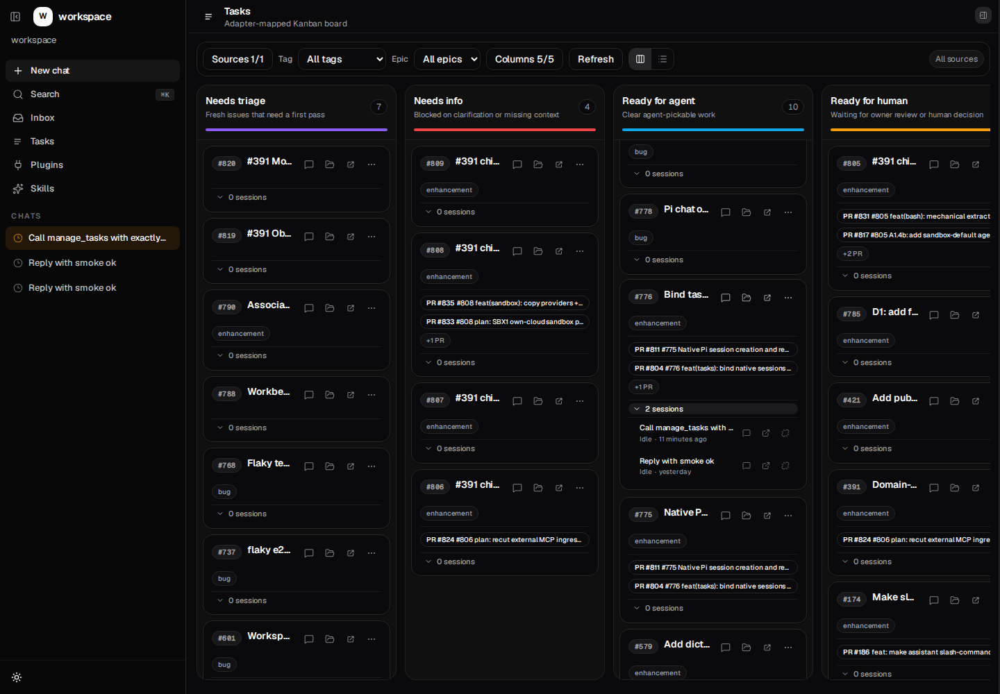

# Issue #776 core proof

Date: 2026-07-19
Branch: `issue/776-task-session-binding`
PR: #804

This record contains identifiers and aggregate results only. It intentionally omits transcript bodies, credentials, and tokens.

## Live playground

Fresh browser profile: `http://127.0.0.1:5380/?fresh=1`
Trusted workspace root: `apps/workspace-playground/e2e/fixtures/workspace`

- Adapter/task tuple: `github:workspace` / `776`.
- A real Gemini 2.5 Pro native Pi turn invoked `manage_tasks.bind_session` with `session: "current"`.
- Authoritative native session ID: `019f7973-17e6-7a1d-8841-aeaa39dea37e`.
- Persisted link ID: `d9f7de18-dd7b-4965-a687-5af08d1bdf04`.
- `.pi/tasks/session-links.json` contains exactly that adapter/task/session tuple.
- Repeating `bind_session: "current"` in the same native session left the tuple count at one.
- After a playground restart, the same two #776 links loaded and activity authorization returned the exact native ID.
- Mixed activity lookup returned one authorized summary and placed `nonexistent-private-id` only in `omittedSessionIds`; no denied metadata was returned.
- TaskCard popover and full-chat actions each requested state/events for the exact native ID. Native session count remained `3 -> 3` for both actions.
- The missing artifact path resolved to `docs/issues/776`. Dismissing confirmation left `exists: false`; accepting created it once and subsequent status returned `exists: true`.
- Native Pi found the exact session in its project session directory and exported it successfully (`exit=0`), proving the linked ID remains a native-resumable Pi session.

Visual evidence:

## Automated gates

- Tasks: typecheck passed; 71 tests passed; build passed; package invariants passed.
- Agent: typecheck passed; 108 focused route/composition/native-session tests passed; package invariants passed.
- Workspace: typecheck passed; 5 focused shell-capability tests passed.
- CLI: typecheck passed; 12 folder/workspaces/native-first-send integration tests passed.
- Independent implementation reviews: final Gemini 3.1 Pro PASS and final xAI Grok 4.20 PASS after exact-file rereview; earlier Opus 4.8, Gemini, and xAI slice reviews also passed. A final Opus rerun was unavailable because the provider quota was exhausted.

The repository-wide workspace invariant command still reports unrelated pre-existing violations outside the #776 diff. No #776-owned workspace invariant violation was introduced.

## Deferred follow-ons

Human-approved agent delete and #786 Inbox provenance remain in the separately owned deferred epic `wt-391-forward-task-approval-provenance-followons-vze`. They are not part of #776 core acceptance and no unsafe model-confirmed delete path was enabled.
