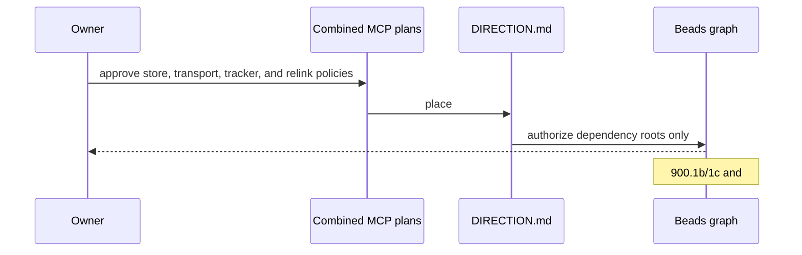

# [MCP Program] What changed, visually

**Gate 2 · planning-only delivery**  
Reviewed planning SHA: `6d07621fce20ee8e103b6a63abe952639519e5df`  
Target: `origin/main@3a594dceb`  
Demo: waived by the owner request because this epic changes planning documents and tracker metadata only.

## Changed shape

```diff
 .beads/issues.jsonl
+├── MCP Program planning graph and accepted handoffs
+├── #806 Slice 0 root — open, direction-placed
+└── #900.1a protocol-custody root — open, direction-placed
 docs/direction/DIRECTION.md
+└── first post-premises MCP wave
 docs/issues/806/
+├── external-workspace-mcp-plan.md   # canonical inbound MCP Access plan
~├── plan.md                          # historical pointer
~└── runtime-refactor/README.md       # historical pointer
 docs/issues/807/plan.md
~└── tombstone to current authority
 docs/issues/900/
~├── plan.md                          # approved outbound Connector decisions
+├── plan-review.html                 # independently reviewed plan visual
+├── show-me-plan.md                  # Gate 1 visual
+└── show-me-6d07621.md               # Gate 2 visual
```

## Shipped planning flow



## Final state

```diff
 MCP authority
- draft PR #1415 is the only combined planning artifact
- no post-premises placement exists for the first slices
- all implementation trackers are deferred
+ combined inbound/outbound plans are on epic/mcp-program
+ DIRECTION.md places removal-only #806 Slice 0 and discovery-only #900.1
+ approved host-store, shared-hardening, Steward-tracker, and explicit-relink policies are durable
+ dependency roots #806 Slice 0 and #900.1a are open and unclaimed

 Guardrails retained
+ PR #1309 remains closed quarry only
+ 900.1b depends on 900.1a; 900.1c depends on 900.1b
+ #806 feature Slice 1 remains absent/unplaced behind Slice 0 and P-1
+ no MCP product code, user data, credentials, or runtime behavior changed
```

## Proof

- `br ready --label epic:mcp-program` returns exactly the two dependency roots.
- `br dep cycles` reports no cycles.
- `bv --robot-insights` reports `Cycles: null`.
- `pnpm lint:invariants` and `scripts/check-strategy-docs.sh` passed at the roadmap SHA.
- Root-only repair passed exact-SHA sandbox proof and independent adversarial review at `6d07621f`.
- Git merge-tree against `origin/main@3a594dceb` is conflict-free.
