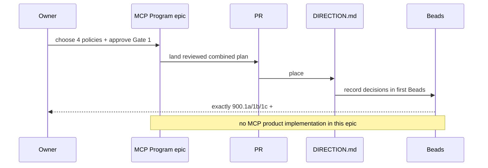

# \[MCP Program\] Plan, visually

**Gate 1 · planning-only epic · 2026-09-04**
Source: draft PR #1415 at `08ecf78671fb58ae84a06d17e05b2984114f371b`
Epic Bead: `wt-391-forward-fz5p`

The program first lands the independently reviewed MCP plans, then gives their first safe implementation slices explicit roadmap authority, then makes exactly those slices ready. It does not implement MCP.

## Structure — what this epic touches

```text
MCP Program
├── .beads/issues.jsonl
│   ├── planning epic + 3 serial planning Beads
│   └── later: exactly 900.1a/1b/1c + #806 Slice 1 become ready
├── docs/direction/DIRECTION.md
│   └── explicit wave placement for #806 Slice 0 + #900.1 discovery
├── docs/issues/806/
│   └── inbound MCP Access plan + pointer migration
└── docs/issues/900/
    └── outbound MCP Connector plan + reviewed visual
```

## Behavior — approval to dispatchable graph



## Diff-shaped outcome

```diff
 MCP planning authority
-  PR #1415 remains draft and unlanded
-  #806 Slice 0 has no dispatch-queue placement
-  #900.1 discovery has no dispatch-queue placement
-  first implementation Beads remain deferred
+  reviewed combined plan is present on the epic branch
+  DIRECTION.md names #806 Slice 0 and #900.1 discovery in a wave
+  approved store, transport, tracker, and relink policies are recorded
+  exactly 900.1a / 900.1b / 900.1c / #806 Slice 1 are ready

 Never changed by this epic
   product source code
   closed PR #1309 (quarry only)
   later MCP implementation Beads (remain deferred)
```

## Owner decisions and recommended defaults


| Decision                            | Recommended default                                                                                                 | Why                                                                                               |
| ----------------------------------- | ------------------------------------------------------------------------------------------------------------------- | ------------------------------------------------------------------------------------------------- |
| Durable cleanup + secret resolution | Host durable control-plane store with versioned opaque secret handles and provider-backed create-gap reconciliation | Startup can drain safely; no raw key, user-settings authority, or plugin-local JSON               |
| Composio transport                  | Harden curated and catalog consumers together                                                                       | Reject arbitrary origins before forwarding credentials while preserving curated product semantics |
| C2 predecessor tracking             | Architecture Steward owns exact frozen-DAG Bead/PR mapping; #900 creates no substitutes                             | Preserves C3→C5→C6→C1→C2, C7, A7/A8, and exact completion receipts                                |
| Account subject migration           | Inventory + quarantine + explicit account re-link                                                                   | Safest; no silent authority migration or cross-subject conflict                                   |


## Proof and risk

- `br dep cycles` must remain cycle-free.
- `bv --robot-insights` validates dependency shape before dispatch.
- `pnpm lint:invariants` proves the roadmap amendment.
- Final proof: `br ready --label epic:mcp-program` identifies exactly the four intended follow-on implementation Beads.
- Rollback: revert each planning commit in reverse order; no product code or user data changes.
