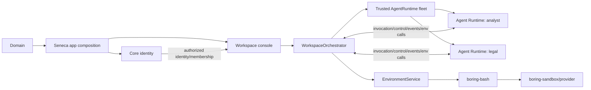

# gh-905 Agent hosting and Workspace console rewrite

## Vision alignment

Owner direction on 2026-07-22 is the north star:

```text
Seneca — SaaS/product composition
  ├─ Core — user identity, auth, membership, account boundary
  └─ Workspace — Vercel-like console
       projects/workspaces, sessions, artifacts, review, status, orchestration
         ├─ Agent Runtime A — independently hosted Agent
         ├─ Agent Runtime B — independently hosted Agent
         └─ Environment service — Workspace-authorized files/execution
```

**One Agent = one runtime** means one independently deployable runtime per
`agentTypeId`, capable of serving that Agent's authorized sessions and
invocations. It does not mean one provider/container/process per chat turn.
Workspace orchestrates runtimes; it does not host Agent behavior. Agent owns the
Agent hosting product and Pi mechanics. Core remains identity-only. Seneca (or
another app) composes Core + Workspace, maps trusted domains/products, and
provides the trusted Agent fleet.

The destination must be a platform step forward, not a module shuffle:

```text
new Agent
→ build/version one Agent Runtime
→ deploy it locally or remotely
→ add one server-trusted fleet descriptor
→ map a Seneca product/domain/workspace default to that fleet member
→ no Workspace, Core, or CLI implementation change
```

A self-hoster may deploy a compatible Agent Runtime and explicitly configure it
in their own trusted app composition. No browser request, tenant input, plugin,
or arbitrary URL can register or expand the trusted fleet.

## Status and authority

This is a high-risk architecture and migration proposal. It does **not**
authorize implementation.

The owner vision above materially advances the current Decision 28 assumption of
locally composed `AgentApplication` instances. Therefore:

1. [#391](https://github.com/hachej/boring-ui/issues/391) remains product/release authority.
2. [#805](https://github.com/hachej/boring-ui/issues/805), Decision 28, and the existing Bead graph remain the sole implementation authority. F0a closure activates F0b; it does not expire #805 authority.
3. [PR #904](https://github.com/hachej/boring-ui/pull/904) remains reviewed input but is not sufficient authority for the one-Agent/one-runtime deployment topology.
4. Approval of this plan must first produce one atomic authority amendment across Decisions 27 and 28, #391, #805's normative plan, #820 remote credential topology, the generic artifact ownership in #806, the durable-stream spine in #807, all affected Beads, `AGENTS.md` hard rule 9, `docs/kanzen/procedures/coding-invariants.md` invariant 5, and `docs/WORKSPACE_CONTRACT.md` endpoint/package ownership. This file defines no independently dispatchable competing DAG. Decision 27's BYOK-first and explicit instance-key fallback remain; pooled platform billing stays deferred to #809/#819.
5. The amendment preserves the external Bash/Sandbox dependency ordering and human gates but explicitly reopens the prior “no remote Agent wire” decision. It must add named Agent/Workspace remote-protocol nodes and blockers; this is not presented as a pure F3+ remap. It also retains/adapts or retires the current #807 `SqliteEventStreamStore`, NDJSON/replay path, `AgentTask` admission/idempotency, and recovery ownership so two canonical journals cannot remain dispatchable.
6. No implementation Beads are created from #905 before that amendment is approved and passes `br dep cycles` and `bv --robot-insights`.

PR #845 remains a security/behavior oracle only; its typed-Workspace graph is not
the destination. No change is made in the #904 lane from this issue lane.

### Adversarial review record

Six sequential code-ground rounds were run and accepted findings were revised
before the next round:

| Round | Reviewer | Result | Material revisions |
| --- | --- | --- | --- |
| R1 | Codex xhigh | NOT READY | authority/DAG, exact controlled invocation, cleanup fence, rollback/default/session root, delegation/member operations, CLI independence |
| R2 | Claude Opus high | NOT READY | named Seneca remote consumer, Environment streaming/latency, static app fleet, revision/session writer safety, artifact authorship, invocation idempotency |
| R3 | Codex xhigh | NOT READY | #806/#807 authority, physical transcript migration, protocol planes, globally unique runtime binding, DS decision, review-size split |
| R4 | Claude Opus high | NOT READY | standing invariant amendments, remote BYOK mechanism, copy-mode rollback |
| R5 | Codex xhigh | NOT READY | two-phase sole terminal, atomic Pi fencing, separated human/release gates, durable effect receipts, artifact revisions, CLI root graph |
| R6 | Claude Opus high | **READY** | verified all prior P0/P1 corrections; no remaining P0/P1 against the fixed vision |

A Gemini CLI attempt was unavailable because this host has no `GEMINI_API_KEY`;
it was not counted as a review round. Raw local review outputs are retained under
`/tmp/905-review-r*-*.md` for this planning session; this plan records the durable
accepted decisions.

### Required authority replacements

| Current authority | Amendment required |
| --- | --- |
| Workspace directly hosts in-process `AgentApplication` instances | Workspace consumes local or remote `AgentRuntimeConnector`; local remains a conforming adapter, Seneca proves remote |
| Agent semantic package owns no HTTP deployment | Keep `application/**` server-neutral, but make `@hachej/boring-agent` explicitly own an outer deployable Runtime host/protocol surface |
| Remote Agent wire is deferred/forbidden | Reopen for the named Seneca consumer and freeze only control, Durable Streams events, Environment-operation, and Seneca-custodied BYOK model planes |
| AgentHost/controller/reconciler is forbidden | Preserve the ban: fleet is immutable app config; Runtime deployment is external; Workspace has no mutable registry/publication journal/rollout controller |
| F2c removes old local/remote Agent branches | Remove old runtime-mode/provider branches but retain the new protocol-level local/remote connectors |
| Workspace value-imports Agent application API | Workspace value-imports Agent runtime protocol/client only; the local connector adapts the application internally |
| Host app owns durable Pi session root | The independently deployed Agent Runtime host owns the durable non-Environment session volume/store; Workspace owns only binding metadata |
| #807 owns SQLite/NDJSON replay/admission | Atomically map T1 Durable Streams/admission/recovery into Agent Runtime or retire it; one journal/producer/recovery actor only |
| #806 owns generic artifacts with MCP/share | Move generic canonical artifact provenance/review foundation to Workspace; retain MCP ingress/share transport in #806 |
| Decision 27 / #820 model keys | Preserve BYOK-first and explicit instance-key fallback; extend opaque issuance to remote Runtime model plane; keep pooled platform billing deferred to #809/#819 |
| #844/#845 migration/security evidence | Preserve additive migration, hostname/auth/origin/cookie/CSRF tests, but do not restore typed-product architecture |
| AGENTS hard rule 9 | Redirect durable transcript ownership from the former deployed Core app host to the independently deployed Agent Runtime host, still never an Environment/Workspace sandbox root |
| Coding invariant 5 | Replace Workspace+Sandbox `RuntimeModeAdapter` pairing with outer EnvironmentService+backend/provider pairing; generic Workspace receives the service |
| `WORKSPACE_CONTRACT.md` endpoint ownership | Replace standalone Agent file/session endpoint ownership with Workspace product-session/member-operation APIs plus Agent Runtime transcript/event/control APIs |

The amendment must remove or redirect every contradictory normative sentence and
Bead, not merely add this table as another source.

## Product ownership

| Product/package | Owns | Must not own |
| --- | --- | --- |
| **Seneca/app composition** | SaaS behavior, domain/product map, branding, trusted fleet declaration, provider/connector selection, deployment configuration | generic identity internals, Workspace orchestration internals, Agent behavior |
| **Core** | identity, authentication, membership/account authority, identity-facing persistence and adapters | Agent fleet, Agent selection, Pi, Environment/provider logic, domain-to-Agent behavior |
| **Workspace** | Vercel-like console, projects/workspaces, session authority and acting-Agent attribution, runtime orchestration, status, artifacts/review, governance, Environment lifetime | Agent model loop, Pi transcript mechanics, provider implementation, identity re-authentication |
| **Agent** | independently hosted Agent Runtime, authored behavior, Pi session/model-loop mechanics, runtime protocol implementation | Workspace authorization, raw roots, Sandbox/provider admin, domain routing, Core identity |
| **boring-bash / Environment service** | canonical named Environment operations and enforcement adapter | user membership, Agent selection, UI |
| **boring-sandbox/providers** | physical isolation/backend mechanics | Agent/Workspace/Core contracts and policy decisions |
| **CLI** | separate trusted-local Workspace consumer and local app composition | Core emulation, Seneca emulation, second Workspace/Agent implementation |

Domain routing belongs to the SaaS/app composition. Core authenticates the user;
it does not decide which Agent behavior a hostname selects. A domain may choose a
new Workspace's initial trusted default through a Seneca-owned creation policy,
but it never rewrites an existing Workspace or authorizes access by itself.

## Problem

The current packages cannot deliver this topology cleanly.

### Agent evidence

`@hachej/boring-agent` has about 231 production TS/TSX files and 40,574
production LOC. Construction is split across core, two Fastify composition
roots, Pi chat service, Pi harness, runtime modes, providers, and route bindings.
It owns duplicate replay/session/lifecycle state and `RuntimeBundle`/Sandbox
concerns, while authored Agent definitions are not the runtime construction
authority. `src/shared/harness.ts` leaks Pi SDK types.

This is an embedded all-in-one server, not an independently deployable,
conformance-tested Agent host.

### Workspace evidence

`@hachej/boring-workspace` has about 384 TS/TSX files and 36,929 production LOC.
It already contains valuable console/UI/plugin/bridge behavior, but no production
static runtime fleet, persisted default, server-side acting-Agent attribution,
governance compiler, runtime connector directory, invocation supervisor,
Environment lifetime owner, or first-class artifact review provenance.

Current composition is concentrated in
`createWorkspaceAgentServer.ts` (1,027 LOC), `WorkspaceAgentFront.tsx` (1,952
LOC), and `WorkspaceProvider.tsx` (692 LOC), with concrete Sandbox imports,
process/browser globals, hidden Fastify state, and a filesystem plugin value
import from Agent front.

### Consumer evidence

Core/web and CLI are not yet clean independent Workspace consumers. CLI build
configuration currently imports/builds Core and uses sibling-source aliases. A
monorepo-only proof can therefore pass while the independently deployable CLI or
Agent host is not real.

## Solution

Keep existing package identities and build permanent greenfield cores:

```text
packages/agent/src/application/                 # semantic Agent behavior
packages/agent/src/server/agent-runtime/        # deployable runtime host/adapters
packages/workspace/src/server/workspace/        # console/orchestration bounded context
```

Do not create `v2`, `next`, `new`, `agent-host-v2`, or replacement packages.
The package's published surfaces may add explicit `application` and
`runtime-protocol` subpaths, but the product remains `@hachej/boring-agent`.

Build two conforming runtime transports:

1. **local connector** for CLI/dev/tests, using the same semantic contract without serialization or remote reconnect machinery;
2. **remote connector** for a separately deployed Agent Runtime.

The named first-release remote consumer is **Seneca production**: at least its
`primary` Agent runs as a separate Agent Runtime deployment and Seneca's
Workspace console invokes it over the authenticated connector. The release does
not qualify on a synthetic server alone. Self-hosted compatible runtimes reuse
that proven contract afterward.

Workspace consumes only `AgentRuntimeConnector`. It never imports a concrete
Agent application or Pi SDK. A Workspace deployment may orchestrate several
runtime descriptors, while each descriptor identifies one Agent type/runtime.

Directional package disposition remains:

| Package scope | Retain | Rewrite | Move/delete | Decision |
| --- | ---: | ---: | ---: | --- |
| Agent, whole package | ~55% | ~25% | ~20% | application + hosting-core rewrite |
| Agent core/server-runtime slice | ~25% | ~45% | ~30% | replace embedded composition boundary |
| Workspace, whole package | ~55% | ~35% | ~10% | console/orchestration bounded-context rewrite |

Old code is a behavior oracle, protocol corpus, and migration input—not the new
architecture to copy.

## Non-negotiable decisions

1. One `agentTypeId` maps to one independently deployable Agent Runtime definition for one fleet generation. A runtime may serve concurrent actor-neutral invocations; it never captures the first actor/session/model/Environment.
2. Workspace owns runtime selection and orchestration. Agent runtime owns behavior and Pi mechanics.
3. Core stays identity-only. Seneca/app composition owns domain/product/fleet mapping.
4. Core/web and CLI consume the same Workspace use cases independently; neither imports the other's adapter/build chain.
5. Fleet membership is static, server-trusted, validated/frozen for one app generation, and changed by deployment/restart—not tenant mutation.
6. Local and remote connectors implement one versioned runtime protocol and pass the same conformance suite.
7. Agent receives only a Pi session runtime, opaque model client, and named Environment operation clients. It receives no Workspace authority, raw roots, provider handles, or reusable credentials.
8. Every retained file/exec-dependent tool (`read`, `write`, `edit`, `find`, `grep`, `ls`, `bash`, upload/download/watch equivalents) names exactly one Environment; omission and unknown names fail closed.
9. Delegation is Workspace-internal orchestration with fresh authorization, derived lineage, cycle/depth/fan-out/timeout/cascade guards, and attenuated canonical Environment access.
10. Workspace member file/tree/search/watch/upload/download operations use a discriminated member-operation Environment authorization; they never fabricate Agent/session/task identity or bypass EnvironmentService.
11. One outward terminal result is fenced until child drain and Environment close confirm or durable quarantine is recorded. Cleanup failure turns would-be success into `ENV_CLEANUP_FAILED`.
12. Pi transcripts are host-runtime durable data, never stored in an Environment/canonical working root. Hosted runtime composition injects a durable session root/store.
13. No production dual-write, shadow invocation, runtime mode flag, or permanent dual implementation.
14. No file/export/data deletion occurs without the existing H2c owner approval and release ordering.

## Deployment topology



A fleet descriptor contains only trusted deployment metadata:

```ts
type AgentRuntimeDefinition =
  | {
      readonly kind: 'local'
      readonly agentTypeId: AgentTypeId
      readonly source: AuthoredAgentSourceV1
      readonly pluginIds: readonly string[]
      readonly runtime: LocalRuntimeFactory
    }
  | {
      readonly kind: 'remote'
      readonly agentTypeId: AgentTypeId
      readonly runtime: RemoteRuntimeEndpoint
      readonly protocolRange: RuntimeProtocolRange
      readonly expectedDeploymentRevision: string
      readonly attestedBehaviorDigest: string
      readonly trust: HostConfiguredRuntimeTrust
    }
```

App composition builds local behavior from trusted source/plugins. A remote
runtime is already built behavior: its descriptor carries only endpoint/trust,
expected immutable revision, and an attested behavior digest. Workspace verifies
that the runtime's self-description matches `agentTypeId` and digest; Seneca does
not become a second remote Agent composer.

`RemoteRuntimeEndpoint` and trust material are app/server configuration, never a
caller-provided URL. Secret/certificate values are referenced through host
custody and never embedded in fleet diagnostics, prompts, or browser payloads.

### Deployment workflow

A first-party or self-hosting operator can:

1. validate/materialize one authored Agent;
2. build a reproducible Agent Runtime artifact/container from the existing Agent package;
3. run runtime self-check and protocol conformance;
4. deploy with a durable Pi session volume/store and outbound policy;
5. register its endpoint/revision/trust pin in Seneca or another app's static fleet;
6. map a new product/domain's **creation default** to its `agentTypeId`;
7. deploy the app configuration and observe health before admitting invocations.

Existing Workspaces and typed sessions are not rewritten when a domain or app
default changes. Runtime revision rollout drains old connectors and never mixes
runtime generations inside one invocation.

## Agent runtime contracts

### Semantic application contract

Lives under the permanent `packages/agent/src/application/` island and contains
no transport, Fastify, Workspace, Core, CLI, or provider implementation.

```ts
interface AgentApplication {
  readonly agentTypeId: AgentTypeId
  start(
    input: AgentInvocationInput,
    context: AgentExecutionContext,
  ): Promise<AgentApplicationInvocation>
  dispose?(): Promise<void>
}

interface AgentExecutionContext {
  readonly session: AgentSessionRuntime
  readonly model: ModelClient
  readonly environments: ReadonlyMap<EnvironmentName, EnvironmentClient>
}

interface AgentApplicationInvocation {
  readonly events: AsyncIterable<AgentApplicationEvent>
  readonly candidateResult: Promise<AgentCandidateResult> // nonterminal result-ready
  send(input: AgentFollowUpInput): Promise<void>
  interrupt(): Promise<void>
  stop(): Promise<void>
}
```

Workspace identity, actor, membership, lineage, governance, cancellation
registry, and telemetry authority do not enter `AgentExecutionContext`. The
runtime receives opaque invocation/session correlation needed for protocol
routing, but cannot use it to authorize Workspace access.

### Versioned runtime protocol

The hosting surface is protocol-first and transport-neutral:

```ts
interface AgentRuntimeConnector {
  describe(): Promise<AgentRuntimeDescription>
  health(): Promise<AgentRuntimeHealth>
  start(input: AuthorizedRuntimeStart): Promise<AgentRuntimeInvocation>
  drain(): Promise<void>
  close(): Promise<void>
}

interface AgentRuntimeInvocation {
  readonly eventStream: DurableEventStreamRef
  readonly resultReady: Promise<AgentCandidateResult>
  send(input: IdempotentFollowUpCommand): Promise<void>
  interrupt(input: IdempotentControlCommand): Promise<void>
  stop(input: IdempotentControlCommand): Promise<void>
  finalize(input: IdempotentFinalizationCommand): Promise<TerminalOffset>
}

interface WorkspaceInvocation {
  readonly events: AsyncIterable<WorkspaceInvocationEvent>
  readonly result: Promise<WorkspaceInvocationResult> // sole user-visible final fence
  send(input: AgentFollowUpInput): Promise<void>
  interrupt(): Promise<void>
  stop(): Promise<void>
}
```

The remote transport freezes only bounded DTOs needed for:

- protocol negotiation and stable runtime identity/expected immutable deployment revision;
- start and terminal result;
- monotonic invocation events and reconnect cursor;
- follow-up, interrupt, stop, cancellation, and drain;
- invocation-scoped model authorization and the deployment-class-specific model plane defined below;
- a separately authenticated Environment-operation plane bound to the invocation;
- health/readiness and sanitized diagnostics.

The Environment frame payload is owned by the qualified canonical
`boring-bash/shared` operation schema, not reinvented here. #905 adds only the
Agent↔Workspace transport envelope. `exec` is a long-running bidirectional
stream (`stdout`, `stderr`, exit, timeout, cancel, backpressure); file/watch and
large byte operations have bounded chunking/streaming and cancellation. Every
frame carries `invocationId`, operation ID, exactly one Environment name,
deadline, monotonic sequence, and no root/backend identity. Workspace rechecks
the invocation-bound access before dispatch.

Canonical files/execution remain Workspace-side Environment authority. Remote
Agent tool calls intentionally make one network hop; no working copy or provider
is co-located in the Runtime. Seneca qualification measures same-region p50/p95
operation overhead, streaming time-to-first-byte, throughput, and cancellation;
regression budgets are fixed from the baseline before cutover. Mutate through
remote Agent then read through Workspace console proves coherence.

It does not serialize local Workspace, Environment backend, model credentials,
Fastify request, or provider object. Payload/stream limits, sequence numbers,
replay windows, invocation-bound operation IDs, deadlines, cancellation,
idempotency, and stable protocol errors are mandatory for the remote connector.
The local connector must preserve ordering/terminal/cancellation semantics but
need not implement reconnect cursors or wire replay windows. Unknown remote
versions and capabilities fail closed.

The protocol has four explicit planes:

1. **control** — idempotent start/follow-up/interrupt/stop/drain and signed start receipt;
2. **events** — Durable Streams HTTP catch-up/live-tail, with Agent Runtime as sole producer;
3. **Environment operations** — invocation-bound bidirectional operation streams;
4. **model** — only when Seneca keeps BYOK custody and proxies an invocation-scoped model stream.

They may share one authenticated transport/session but never share replay or
idempotency semantics.

Every mutating control command carries durable `commandId` + request digest.
Runtime stores admission before effect; duplicate same-digest follow-up/stop/etc.
attaches to or returns recorded status, conflicting digest fails, and unknown
outcome never redispatches silently. Every proxied BYOK provider call similarly
uses a Seneca-owned durable `modelCallId` + digest/receipt so reconnect cannot
start or bill a second provider call.

Before a mutating Environment effect, Workspace's durable
`EnvironmentOperationReceiptStore` admits `(invocationId, operationId,
requestDigest)` before dispatch and records completed or explicit unknown outcome
afterward. A duplicate returns the same in-flight/recorded status/result.
Workspace death after effect but before receipt becomes stable
`OPERATION_OUTCOME_UNKNOWN`; it never silently re-executes `write`, `edit`, or
`exec`. Per-direction sequencing, bounded windows, backpressure, half-close,
cancel, and terminal rules are conformance-tested, including process death at
every admission transition.

`start` returns a signed/transport-authenticated receipt pinning stable runtime
ID, globally unique runtime-session key, invocation ID, runtime instance epoch,
and expected revision. Every later control/event/Environment operation validates
that binding. The remote reference deployment uses host-owned trust material,
bounded reconnect, and no ambient Workspace HTTP/API access. It is a narrow
Agent runtime protocol, not a generic capability broker or arbitrary RPC proxy.

### Model credentials by deployment class

Seneca/app policy authorizes model/provider selection; the semantic Agent
application receives only `ModelClient`. Raw reusable credentials never enter
Workspace domain state, Runtime control/events/Environment frames, transcripts,
or diagnostics.

| Deployment class | Custody and concrete mechanism |
| --- | --- |
| Seneca explicit instance-key fallback | Seneca deployment custody injects the approved explicit instance credential into the first-party Runtime process at creation through the #820 host resolver. The key does not traverse the Runtime protocol. This is Decision 27 fallback, not pooled platform billing. |
| Seneca BYOK | Custody remains in the Seneca vault. `ModelClientIssuer` mints a signed opaque invocation-bound authorization; Runtime's model adapter streams the model call over the dedicated authenticated model plane. The raw key never reaches Runtime. |
| CLI local | Local Runtime host uses existing Pi/environment/OAuth credential precedence through the #820-compatible resolver; Workspace receives no raw credential. |
| Explicitly trusted self-hosted Runtime | Operator may supply runtime-side provider credentials. Seneca sends only allowed model/policy metadata and receives usage/terminal receipts; this is distinct from Seneca-custodied BYOK. |

Pooled platform-billed keys remain out of #905 and blocked on #809/#819; this
plan does not silently activate them. The model plane has bounded request/context size, provider/model allowlist,
invocation binding, streaming backpressure/cancel, redacted stable errors, usage
receipts, and no generic arbitrary-HTTP facility. Seneca qualification measures
token time-to-first-byte and throughput separately from Environment operation
latency. The authority amendment extends #820 to these remote deployment classes
rather than assuming its former in-process injection model is sufficient.

Issuer and host responsibilities are distinct: Seneca/CLI issuer authorizes and
mints an opaque reference or trusted-local policy; Agent Runtime host constructs
the concrete direct/proxy `ModelClient` adapter. `AgentApplication` owns neither
custody nor construction.

### Pi ownership and durable sessions

The Agent Runtime composes the existing Pi mechanics behind
`AgentSessionRuntime`:

```text
packages/agent/src/server/agent-runtime/pi/
  PiAgentSessionRuntime.ts
  PiSessionStoreCompatibility.ts
  PiEventMapper.ts
  PiModelLoopAdapter.ts
```

Runtime host composition injects the durable session store/root. Hosted defaults
use `BORING_AGENT_SESSION_ROOT` (normally `/data/pi-sessions`, sibling to
`/data/workspaces`), or an equivalent durable host store. A remote/self-hosted
runtime operator supplies its own durable volume/store. Environment cleanup
cannot delete or strand transcripts.

### Durable streaming spine

The rewrite absorbs the runtime-facing T1 spine from #807 and the original
Flue research, without adopting Flue's runtime. Durable Streams is the separate
Electric-origin open protocol/repository—not a Flue package. Its published
package list and server status are recorded in the [Durable Streams README](https://github.com/durable-streams/durable-streams/blob/a172acc389351cb3db6deb5cd60e3dec11e7ff39/README.md#L99-L135) and [server README](https://github.com/durable-streams/durable-streams/blob/a172acc389351cb3db6deb5cd60e3dec11e7ff39/packages/server/README.md#L1-L15). Flue itself consumes `@durable-streams/client` through its SDK ([manifest](https://github.com/withastro/flue/blob/dbc9b05c71fadc1e8d66457815f7bf637c4dd010/packages/sdk/package.json#L29-L34)).

- depend on `@durable-streams/client` for offset/catch-up/live-tail behavior;
- implement the production server/store inside Agent Runtime against the open
  Durable Streams protocol, adapting Flue's proven event-store/route patterns
  where useful and preserving required attribution/license notices;
- use official Durable Streams server/client conformance suites as dev proof;
- enforce zero direct/dev/peer/optional/import/runtime-image dependency on `@flue/runtime`;
- do **not** treat `@durable-streams/server` as the production store: its own
  documentation scopes it to development/testing/prototyping. A Caddy sidecar is
  an allowed later adapter only if it satisfies Runtime auth, tenancy, storage,
  and operational proof.

Agent Runtime owns one authoritative durable event stream per globally unique
runtime-session key, with monotonic offsets across its invocations. Events carry
`invocationId`, producer fencing epoch, and stable payload version.
Transactional append verifies the active producer fence, allocates the offset,
and writes event/idempotency key atomically; retry/re-tap allocates no duplicate
offset and an old runtime revision cannot append. Runtime application completion
appends a nonterminal `result-ready` event; it does not close the invocation.

Workspace authorizes and proxies/tails the Runtime stream while preserving
Durable Streams offsets/headers. It may persist safe session status and the last
observed cursor, but it never writes a second event journal or re-sequences
Runtime events. Browser/CLI disconnect removes only that subscriber; it neither
stops the invocation nor closes its Environments. Reconnect catches up from the
last acknowledged offset then live-tails.

Durable streaming does not pretend the model loop itself survives arbitrary
Runtime death. After restart the journal remains replayable. Agent Runtime
startup recovery is the sole actor that reclaims an expired fenced run and
idempotently appends one stable interrupted/runtime-lost terminal result when
safe resume is impossible. A separately approved recovery path may resume only
when Pi/provider semantics prove it safe.

### Two-phase terminal finalization

Runtime owns journal append; Workspace owns orchestration outcome. They finalize
without two terminals:

1. Agent application completion durably records `result-ready` with its candidate outcome.
2. Workspace drains children/operations, closes or durably quarantines every Environment, and determines the final outcome (`ENV_CLEANUP_FAILED` may replace candidate success).
3. Workspace persists an idempotent `InvocationFinalizationIntent` and sends `finalize(finalizationId, invocationId, candidateDigest, finalOutcome)`.
4. Runtime verifies the pending result/fence and atomically appends the **single** terminal event, closes the DS invocation, and acknowledges its offset.
5. Only after that acknowledgement does Workspace settle the outward `WorkspaceInvocation.result` and clear the finalization intent.
6. Lost acknowledgement retries the same finalization ID; Runtime returns the recorded terminal offset. If Runtime is unavailable, the result remains pending/unavailable—Workspace never invents a second terminal. Runtime/Workspace recovery reconciles pending intents before admitting another turn for that session.

`AgentApplication.result` is the Runtime-internal candidate completion fence;
`WorkspaceInvocation.result` is the user-visible final fence. Public types name
the distinction. `InvocationFinalizationStore` is a focused Workspace port; the
Runtime stores pending-result/terminal idempotency with its event journal.

Broader #807 surfaces—public A2A, Slack/channel ingress, webhooks, and a generic
multi-channel product—remain in #807. The authority amendment maps only its
Agent↔Workspace durable stream spine into #905 so the two plans cannot implement
duplicate stream owners.

There is one replay authority and one terminal event. Duplicate Agent core and Pi
service replay/session caches lose authority before cutover.

## Workspace console bounded context

```text
packages/workspace/src/server/workspace/
  domain/
    ids.ts
    fleet.ts
    default.ts
    sessionAttribution.ts
    governance.ts
    invocation.ts
    artifact.ts
    review.ts
    errors.ts
  application/
    WorkspaceService.ts
    SessionAuthority.ts
    GovernanceCompiler.ts
    WorkspaceOrchestrator.ts
    AgentRuntimeDirectory.ts
    InvocationSupervisor.ts
    EnvironmentLifetimeOwner.ts
    ArtifactReviewService.ts
  ports/
    ProjectCatalogStore.ts
    WorkspaceCatalogStore.ts
    WorkspaceDefaultStore.ts
    SessionAttributionStore.ts
    AgentRuntimeConnector.ts
    EnvironmentService.ts
    GovernanceContributions.ts
    ModelClientIssuer.ts
    InvocationFinalizationStore.ts
    EnvironmentOperationReceiptStore.ts
    ArtifactReviewStore.ts
    WorkspaceTelemetry.ts
  adapters/
    agent-runtime/
    bash/
    http/
    memory/
  testing/
    conformance.ts
```

`WorkspaceService` is a thin use-case facade, not a mutable server god object.
The browser console consumes status/session/artifact/review projections; it does
not become orchestration authority.

### Workspace server use cases

```ts
interface WorkspaceService {
  listProjects(input: AuthorizedCatalogRead): Promise<ProjectSummary[]>
  createProject(input: AuthorizedProjectCreate): Promise<ProjectSummary>
  listWorkspaces(input: AuthorizedCatalogRead): Promise<WorkspaceSummary[]>
  createWorkspace(input: AuthorizedWorkspaceCreate): Promise<WorkspaceSummary>
  getWorkspaceStatus(input: AuthorizedStatusRead): Promise<WorkspaceStatus>
  initializeLegacyWorkspace(input: AuthorizedInitialization): Promise<WorkspaceAgentMetadata>
  startDefault(input: AuthorizedAgentInvocation): Promise<WorkspaceInvocation>
  startDelegated(input: AuthorizedInternalDelegation): Promise<WorkspaceInvocation>
  openMemberEnvironment(input: AuthorizedMemberEnvironmentOpen): Promise<MemberEnvironmentHandle>
  listSessions(input: AuthorizedCatalogRead): Promise<SessionSummary[]>
  listArtifacts(input: AuthorizedArtifactRead): Promise<ArtifactSummary[]>
  getReviewQueue(input: AuthorizedArtifactRead): Promise<ReviewItem[]>
  close(): Promise<void>
}
```

Read-only project/session/artifact/review listing does not boot an Agent Runtime,
Pi model loop, or Environment.

### Artifact review as a first-class console flow

Agent Runtime emits typed artifact references, not arbitrary host paths or copied
bytes. Workspace validates each reference against the invocation's canonical
Environment and mutation ledger:

```ts
interface ArtifactRecord {
  readonly artifactId: ArtifactId
  readonly kind: 'produced' | 'referenced'
  readonly workspaceId: WorkspaceId
  readonly sessionId: SessionId
  readonly invocationId: InvocationId
  readonly agentTypeId: AgentTypeId
  readonly environmentName: EnvironmentName
  readonly canonicalRelativePath: string
  readonly producedByOperationId?: string
  readonly contentRevision: string
  readonly contentDigest?: string
  readonly mediaType?: string
  readonly recordedAt: string // Workspace-assigned
}
```

`produced` requires an invocation-attributed successful write/create/edit and
its resulting canonical revision. Exec-created output is `produced` only when
the qualified Environment supplies a trustworthy invocation change manifest;
otherwise it is `referenced`. A readable pre-existing file may be `referenced`
but is never presented as Agent-produced. Workspace projects valid artifacts
into review items with open/acknowledge/review status. Opening re-reads through a
member-operation Environment handle and compares current revision/digest. A
changed file is visibly marked “changed since production”; it is never silently
presented as the reviewed bytes. The existing `workspace.open.path`/surface
resolver remains the view path.
Review projection is discriminated:

```ts
type ReviewItem =
  | { readonly kind: 'artifact'; readonly artifactId: ArtifactId; readonly sessionId: SessionId; /* review state */ }
  | { readonly kind: 'sessionless'; readonly source: WorkQueueSource; /* no fabricated session/invocation */ }
```

Sessionless Work Queue review items remain allowed and are not pruned by session
attribution. They do not create `ArtifactRecord` or fake session/invocation IDs
unless they reference a separately validated artifact with real provenance. V1
does not invent artifact blob storage, duplicate canonical files, or a generic
task manager.

## State ownership

| Mutable state | Sole owner | Explicitly not owned by |
| --- | --- | --- |
| Domain/product/fleet declaration | Seneca/app composition | Core, browser, Agent runtime |
| Identity/membership | Core or CLI trusted-local adapter | Workspace domain, Agent runtime |
| Fleet validation/default member | Workspace fleet | Core routes, Agent runtime |
| Runtime endpoint trust/revision | host composition + `AgentRuntimeDirectory` | tenant/plugin/model |
| Persisted Workspace default | Workspace store port | domain on login, browser localStorage |
| Session authority/acting Agent | `SessionAuthority` | Pi adapter, browser |
| Native transcript/replay/follow-up/compaction/model loop | Agent Runtime Pi adapter | Workspace domain |
| Governance intersection | `GovernanceCompiler` | Agent runtime, provider |
| Runtime connectors/health/drain | `AgentRuntimeDirectory` | routes/plugins |
| Invocation lineage/cancellation/children/terminal | `InvocationSupervisor` | Pi cache, transport handler |
| Environment open/close | `EnvironmentLifetimeOwner` | Agent runtime |
| Physical provider mechanics | injected `EnvironmentService` adapter | Workspace domain/application |
| Artifact provenance/review state | `ArtifactReviewService` + store | Agent transcript, front local state |
| Model credential custody/policy | Seneca app or trusted-local/self-host operator | generic Core, Workspace domain, Agent application |
| Opaque model authorization | Seneca/CLI `ModelClientIssuer` | browser, transcript, Environment |
| Concrete direct/proxy `ModelClient` | Agent Runtime host adapter | semantic Agent application, Workspace domain |
| UI pane/layout state | Workspace front store scoped per instance/session | server orchestration |

## Import and dependency policy

### Agent application/runtime protocol

Allowed:

- local application/protocol modules;
- clean shared authored definitions, IDs, events, tools, and stable errors;
- canonical Environment operation schemas/clients;
- injected ports and platform-neutral DTOs.

Forbidden:

- Workspace/Core/CLI/Seneca implementations;
- React/front in application/runtime protocol;
- raw Workspace roots, `RuntimeBundle`, Sandbox/provider/admin values;
- membership/policy evaluation, domain routing, plugin discovery, provisioning;
- Pi SDK values in public application/protocol contracts;
- process/global/session-root discovery inside the semantic application.

Node/Fastify/Pi values are allowed only in the outer Agent Runtime host adapters.

### Workspace bounded context

- `domain/**` imports domain/platform-neutral types only.
- `application/**` imports domain + ports.
- `ports/**` type-import canonical Agent/Environment contracts.
- adapters may value-import runtime clients, Bash, stores, and transports.
- the bounded context has zero `@hachej/boring-sandbox` imports.
- only Seneca/app and CLI executable roots select concrete providers and runtime connectors.
- Workspace base front/shared has zero value imports from Agent.

### Package graph

Preserve the approved substrate direction before orchestration:

```text
Seneca executable/app root → Core identity adapter + Workspace composition API
                           → Agent runtime protocol/client + selected Environment adapters
CLI executable root        → Workspace composition API
                           → Agent local-runtime factory/protocol + selected Environment adapters
Generic Workspace          → Agent runtime protocol/client + boring-bash shared/client
Agent Runtime host         → Agent application + Pi + boring-bash client/protocol
boring-bash/server          → boring-sandbox shared/provider
boring-sandbox              → no Agent/Workspace/Core/CLI values
```

Concrete Agent/local-runtime and provider imports are permitted only in Seneca/app
or CLI **executable composition roots**. Generic CLI server/front/workspace
consumer modules import Workspace public APIs, not Core and not Agent internals.
Source/config/script/manifest audits include type-only, peer, dev, Vite alias,
and build-script edges. They remove CLI's Core build dependency and sibling
source requirement. Prove Core with CLI absent and CLI with Core/monorepo sibling
sources absent.

## End-to-end flows

### Domain to Agent Runtime

1. Seneca normalizes a trusted domain under its app policy.
2. Core authenticates identity and membership only.
3. On new Workspace creation, Seneca supplies a trusted, fleet-validated creation default; Workspace persists it atomically.
4. Existing Workspace defaults and typed sessions are never changed by later domain/login/config changes.
5. Workspace resolves the persisted `agentTypeId` through the static runtime directory and verifies protocol identity/revision/health.

### Authorized invocation

1. Consumer adapter creates unforgeable operation-scoped Workspace authorization.
2. `SessionAuthority` resolves/creates canonical session and acting-Agent attribution.
3. `GovernanceCompiler` computes named Environment access and tool/action policy; deny/unknown fails closed.
4. Seneca/CLI model policy issues one opaque invocation-scoped model authorization; Agent Runtime host constructs the deployment-class-specific direct or proxied `ModelClient`.
5. `EnvironmentLifetimeOwner` opens approved canonical Environments.
6. `InvocationSupervisor` records lineage/children/cancellation and starts the selected runtime connector.
7. Local or remote runtime starts its one Agent application with session/model/Environment clients only.
8. Environment tool calls use the bound Environment-operation plane, are rechecked against invocation authority, and dispatch to exactly one opened Environment.
9. Runtime durably emits events, nonterminal `result-ready`, and typed artifact references; Workspace records valid provenance/review projections.
10. On result-ready, stop, cancel, timeout, child failure, disconnect policy, or shutdown, Workspace drains children/operations and closes Environments exactly once, persists finalization intent, asks Runtime to append the sole terminal, then settles outward result only after terminal acknowledgement.

A close rejection/timeout converts would-be success to `ENV_CLEANUP_FAILED`.
Existing primary invocation failure remains primary with cleanup diagnostics and
durable quarantine. Quarantined provider resources cannot be reused.

### Internal delegation

Only a package-internal trusted operation may delegate. It accepts active origin
ID, fleet target, bounded host purpose, invocation input, and requested
Environment names as non-authoritative intent. Workspace verifies the live
origin, freshly authorizes the edge, derives task/invocation/lineage and access,
and enforces depth, cycle, fan-out, execution timeout, cancellation, and parent
cascade once. Child cleanup completes before parent outward result. No second
dispatcher or model loop is created.

### Member operations

File/tree/search/watch/upload/download and artifact-open routes call
`openMemberEnvironment` with a discriminated `member-operation` authorization.
One-shot routes close in owner `finally`; watch/stream handles close on natural
completion/error/unsubscribe/disconnect; no route calls EnvironmentService
directly. Agent selection/default is irrelevant to member operations.

### Session compatibility

- browser-only unsent draft is not durable;
- first admitted direct-local send creates one native Pi JSONL and no wrapper;
- local/remote Runtime hosts use durable non-Environment session storage;
- legacy transcripts/wrappers remain readable behind a compatibility adapter;
- one stable Workspace-scoped session ID and acting-Agent attribution route to the owning runtime revision;
- list/status/history are no-boot and update without manual refresh;
- remote session failure never falls back to browser-generated local IDs;
- Pi compaction/provider errors map to stable, actionable runtime results.

New UI/features from #371/#778/#781/#784 remain owned by their issues unless the
rewritten seam would otherwise ship a known regression. The architecture cutover
gate preserves shipped behavior and directly fixes only boundary-caused failures
(#601, canonical session authority, runtime status propagation).

## Behavior and migration ledger

### Agent retain as conformance assets

- shared chat/wire schemas and stable error vocabulary;
- authored Agent compiler/materializer containment, no-follow, bounded-read, frozen-source, and digest behavior;
- Pi native/legacy session readability;
- Pi event mapping, replay ordering, follow-up, interrupt, stop, metering, reconnect, and lifecycle tests;
- front reducer/store/remote transport and renderer behavior;
- command/resource/plugin compatibility where it does not own orchestration;
- eval fixtures and packed-consumer coverage.

### Agent rewrite

- application contract and controlled invocation state machine;
- versioned local/remote Agent Runtime protocol, host, and connectors;
- durable Runtime-owned Pi session adapter and one replay authority;
- terminal/cancellation/drain/revision semantics;
- model-client channel injection;
- one tool-catalog merge/readiness path;
- Runtime transport/route adapters around the application contract;
- `src/shared/harness.ts` Pi type leak;
- Agent playground so it no longer owns an implicit `cwd` Workspace.

### Agent move outward or contract after cutover

- `RuntimeBundle`, runtime mode resolution, provider selection, Workspace/Sandbox pair ownership;
- provider caches and runtime binding ownership that belong to Workspace supervision;
- duplicate `createAgentApp`/`registerAgentRoutes` orchestration;
- duplicate core live replay/session caches;
- direct Bash/Sandbox composition in Agent;
- obsolete provisioning and raw-root contracts.

### Workspace retain as conformance assets

- WorkspaceBridge RPC authorization, validation, idempotency, redaction, and bridge-client SDK;
- declarative plugin capture and registry concepts;
- pure pane/layout reducers, editors, viewers, and surface resolution;
- FetchClient semantics, watch invalidation, optimistic concurrency, retry/readiness behavior;
- pane status/attention projection and partial-failure tests;
- UI command dispatch through `UiBridge.postCommand`;
- front transport leaves that can be scoped per Workspace instance.

### Workspace rewrite

- fleet/default/session-attribution/governance/invocation/artifact/review domain;
- `WorkspaceService` use cases and ports;
- Runtime directory/connectors, invocation supervisor, delegation, member operations, and Environment lifetime owner;
- artifact provenance/review projections for the console;
- server composition around small adapters rather than hidden Fastify state;
- session/status/attention projection inputs;
- Workspace playground as the sole owner of fixture files/Environment/console;
- per-instance scoping where current global state prevents multi-Workspace correctness.

### Workspace paths made unreachable before cutover; deletion waits for H2c

- direct concrete Sandbox/provider selection inside generic Workspace composition;
- process-global active UI bridge and module-global Workspace store/event authority;
- hidden `app.__boring*` contracts;
- production localStorage session fallback whenever remote sessions are configured;
- legacy bridge client/protocol if conformance proves the current command stream replacement;
- filesystem plugin value import from Agent front;
- old embedded Agent composition and temporary translation adapters.

P8/cutover cannot retain any fallback that can regain product authority. H2c
controls physical deletion/public-export contraction after unreachability and
restoration proof; it does not permit an old authority path to remain selectable.

## Backlog integration audit

Snapshot: 2026-07-22 at repository `origin/main` `d3a1bd3931a0f12841a073c13cbc418d12db94d4`. The audit used machine-readable `gh issue list --state open --limit 1000 --json ...` and `gh project item-list 7 --owner hachej --limit 1000 --format json`. It covered all 40 pre-existing open repository issues, this issue, and all 57 non-Done items in the private **Boring Roadmap** project, including #905 after it was added. Closed-but-active dependency lanes #808 and #820 are recorded separately above. `ABSORB` means an exact foundation behavior enters this plan; it does not automatically become a cutover gate, close, or silently supersede the original item. Existing items remain independently tracked until their own acceptance is proven and the owner confirms disposition.

Classification vocabulary:

- **AUTHORITY/PREREQUISITE** — must resolve before dispatch.
- **DEPENDENCY** — another active lane owns the required implementation; #905 consumes its qualified contract.
- **ABSORB** — implement/prove the listed foundation behavior in this rewrite, without automatically making unrelated UI completion a cutover gate.
- **CONFORMANCE** — preserve/prove behavior; separate item may still own its user-facing fix.
- **FUTURE SEAM** — keep a narrow extension point; do not implement the feature here.
- **RECAST** — old architecture conflicts with Decision 28; preserve intent through the new boundary.
- **OUT** — unrelated to these two cores.

### Open repository issues

| Issue | Class | Rewrite disposition |
| --- | --- | --- |
| #109 Re-resolve panes after plugin reload | OUT | Plugin/front pane lifecycle stays separate. |
| #174 Clickable slash-command mentions | OUT | Chat rendering feature; PR #186 remains its lane. |
| #371 Codex context overflow | CONFORMANCE | Runtime Pi adapter preserves stable error/recovery seams; the user-facing fix remains #371 and is not a cutover blocker. |
| #391 Domain-routed/multi-agent epic | AUTHORITY | Product/release authority; #905 cannot redefine it. |
| #421 Public Markdown share | OUT | Share surface and public capability design stay separate. |
| #579 Dictation | OUT | Composer/browser feature. |
| #601 Provisioning disables remote sessions | ABSORB | Separate provisioning capability from session transport; reject invalid composition. |
| #737 flaky Stop locator | PREREQUISITE | Fix the proof locator before relying on that E2E as a rewrite gate; no architecture scope. |
| #768 D1 signal race | OUT | Deployment/D1 test. |
| #775 Native Pi session creation/rename | ABSORB | One native session, lazy materialization, Pi title authority, no new wrapper. |
| #778 external chat session list | ABSORB | Authorized external adoption and immediate canonical list update. |
| #781 session status refresh | ABSORB | Attributed status events update active/background sessions without refresh. |
| #784 skill/question/focus regressions | CONFORMANCE | Absorb session-owned attention/no-focus-steal; skill-location fix remains separate. |
| #785 isolated D1 authority | OUT | Deployment proof seam. |
| #786 sessionless Task Inbox | ABSORB | Artifact review projection preserves sessionless items and provenance without forcing a chat session. Broader Task Inbox work remains #786. |
| #788 binary Download corruption | OUT | Existing raw-byte route semantics remain regression evidence; viewer fix is separate. |
| #790 session-associated layout | FUTURE SEAM | Stable session attribution and session-scoped UI-state key; layout UX stays separate. |
| #805 Agent authoring/runtime child | AUTHORITY | Atomically amend Decision 28, its contracts, F0b–F3+, and Beads before dispatch; retain authored-source and external Environment work. |
| #806 MCP ingress/artifacts | ABSORB | Move generic artifact provenance/review foundation into Workspace #905; MCP ingress/share transport remains #806. Amend authority so ownership is not duplicated. |
| #807 durable multi-channel transport | ABSORB | Map T1's Flue-inspired Durable Streams spine into Agent Runtime as the sole durable replay authority; broader public/channel transports remain #807. |
| #809 marketplace/billing/channels | FUTURE SEAM | Stable identities, attribution, metering hook only. |
| #819 observability/metering | CONFORMANCE | Preserve usage accounting and emit workspace/agent/session/invocation attribution; operator UI remains separate. |
| #829 automated UI review | OUT | Review infrastructure. |
| #848 merge plugin resources into plugin CLI | CONFORMANCE | Pi resource discovery stays adapter-owned and pack-compatible; package retirement is separate. |
| #851 deployment ownership removal | OUT | Repository/hosting cleanup. |
| #856 clean-checkout playground build | CONFORMANCE | New exports must build with generated types from clean checkout. Separate script fix may land first. |
| #857 concurrent dev build races | CONFORMANCE | No rewrite step may depend on concurrent destructive dist cleans; separate build orchestration fix remains. |
| #861 Agent↔Sandbox/Bash cycle | DEPENDENCY | #905 removes Agent/Workspace-side provider ownership and proves its graph; Bash/Sandbox back-edge fixes stay in their owning lanes. |
| #863 server/front plugin drift | CONFORMANCE | Consumer composition derives both surfaces from one app-owned declaration or proves parity. |
| #871 automation UI review | OUT | Plugin UI review. |
| #872 automation list refresh | OUT | Automation plugin cache invalidation. |
| #873 CLI ask_user refresh | CONFORMANCE | Blocking intention remains tied to canonical session/invocation through reload; plugin UI fix remains. |
| #875 autoresearch pilot | OUT | Workflow/plugin quality loop. |
| #877 Fly/Neon decommission | OUT | Infrastructure decommission. |
| #882 tldraw | OUT | Diagram plugin. |
| #883 stale app-left indicator | OUT | Front memoization bug. |
| #895 per-session top-bar menu | OUT | Chat layout UX. |
| #896 hosted automation scheduler | OUT | Automation host lifecycle. |
| #900 full MCP catalogs/approval | FUTURE SEAM | Governance/approval adapter may consume compiled authority; MCP, credentials, SSRF, and catalog work remain #900. |
| #903 automation run leases | OUT | Automation-specific durable ownership. |
| #905 this rewrite | PLAN | Canonical plan and future implementation lane. |

### Active Boring Roadmap project items

| Project item | Class | Rewrite disposition |
| --- | --- | --- |
| Make slash commands mentioned in agent text clickable | OUT | Same as issue audit. |
| Re-resolve open file panes after workspace plugin reload | OUT | Same as issue audit. |
| #709 Private metadata index and native stream/scope migration | FUTURE SEAM | Pi compatibility adapter permits scoped metadata; no metadata store here. |
| #709 Native-session capability and direct-local admission | ABSORB | Materialized/renameable capability and Pi title authority. |
| #709 Direct-local native first-send without wrapper | ABSORB | One native JSONL, no wrapper, idempotent admission. |
| Published @hachej/boring-workspace lacks standalone build scripts (factory consuming-repo gap) | CONFORMANCE | Packed consumers can build/use new server exports without source/vendor fallbacks. |
| #709 Hosted metadata adapter, scoped migration, and legacy-wrapper retirement | FUTURE SEAM | Host-injected attribution/session store; no local store as hosted authority. |
| #709 Crash-safe local legacy wrapper migration and Pi CLI parity | CONFORMANCE | Legacy readers remain isolated; no destructive or implicit migration in this rewrite. |
| #709 Native Pi list/search canonicalization and Boring ID consumer migration | ABSORB | Canonical native IDs propagate through streams, queues, tools, panes, attention, and task bindings. |
| Agent consumption contract & multi-agent consumption (Decision 22 implementation) | ABSORB | Implement package-internal runtime delegation, derived lineage, guards, attenuated Environments, and artifacts; generic public A2A/contracted mode remains later. |
| Plan Markdown embedded plugin nodes | OUT | Editor/plugin feature. |
| Add explicit Claude subscription auth for CLI mode | FUTURE SEAM | `ModelClientIssuer` supports provider-specific outer adapters; no auth in Agent application. |
| Office in-app agent surface: adopt pi-for-excel + boring connector, fork for PowerPoint (Word later) | FUTURE SEAM | Independent consumer can call authenticated Workspace APIs; no Office scope. |
| Add copy/open hover actions for URLs in chat | OUT | Chat UX. |
| Show file name tooltip on file-tree hover | OUT | File-tree UX. |
| Explore Claude Code CLI subscription-backed harness | FUTURE SEAM | Alternative `AgentSessionRuntime` adapter is possible without changing application/domain; no env-flag harness mode in the core. |
| Make app-left pane composable/editable for plugins and non-agent tools | OUT | Front contribution UX. |
| Plan Seneca task and background-agent control plane | FUTURE SEAM | Expose run/session lineage, status, interrupt/resume through ports; task/run store remains separate. |
| Chat scrolling optimization: reader-first streaming experience | CONFORMANCE | Stable monotonic stream and terminal events; scroll state machine remains front work. |
| Feedback: GTM plugin inspired by La Growth Machine | OUT | Product plugin. |
| Plan shared child-app platform | ABSORB | Seneca app owns one static Runtime fleet; product templates own domain, branding/plugins, and creation default while Core stays identity-only. Billing remains separate. |
| Plan: TipTap-first agentic markdown collaboration | OUT | Editor authority design. |
| Epic: Multi-project left bar (layout modes + Projects nav) | ABSORB | Read-only workspace/session catalog must not boot Agent, Pi model loop, or Environment. UI remains separate. |
| State of work: remote-sandbox-safe hosted external plugins | CONFORMANCE | Preserve WorkspaceBridge security; future hosted capabilities enter governance as declared contributions, never generic file/route access. |
| Add Remotion Studio embed plugin | OUT | Trusted plugin/process feature. |
| Plan: evaluate Pierre Trees replacement for workspace file tree | OUT | File-tree renderer. |
| Add pane context menu action to open in standalone browser tab | OUT | Front routing feature. |
| Perf: workbench visible in <1s warm — stop booting the whole chat/editor world upfront | ABSORB | Headless metadata/default/session reads are lazy/no-boot; front bundle splitting remains separate. |
| Specify optional trusted browser-use plugin | FUTURE SEAM | Optional trusted tool enters compiled governance and named Environment access; not default core weight. |
| Add browser-native screenshot copy to HTML viewer | OUT | Viewer feature. |
| Add Skill & Plugin edition pane | FUTURE SEAM | Read-only fleet/contribution metadata may be projected later; no editor UI here. |
| refactor(cli): decompose pluginFrontRuntime.ts (1946 lines) | CONFORMANCE | Composition swap must not add responsibility to that file; decomposition remains separate. |
| Deep-linkable chat sessions: put the active session id in the URL (workspace mode) | FUTURE SEAM | Canonical stable Workspace-scoped session IDs and fail-closed cross-workspace lookup. |
| Post-#241 simplification backlog: agent package lean-down follow-ups | ABSORB | Replace duplicate app assemblers/replay/session maps; retain front-only cleanup as separate. |
| Dedupe theme palette onto ui-kit tokens.css (workspace import + agent drift guard) | OUT | Styling/build concern. |
| Implement native Pi TUI slash commands in boring-ui | FUTURE SEAM | Pi adapter may expose tested capabilities; no front-synthesized commands in application core. |
| Integrate Tiptap collaboration for workspace editors | OUT | Editor collaboration. |
| Add /reload result to LLM context | FUTURE SEAM | Session runtime supports explicit operational entries; reload orchestration remains outside Agent application. |
| Add drag-and-drop file upload to workspace | FUTURE SEAM | Uses Environment file operations with adapter-owned path validation; UI feature remains separate. |
| Add right-click file download action | FUTURE SEAM | Raw-byte Environment/file route with canonical relative path; UI feature remains separate. |
| Add clickable workspace links to open specific session history | FUTURE SEAM | Stable scoped IDs and authorized no-boot history lookup; UX remains separate. |
| Show current Git branch for Git-backed workspaces | FUTURE SEAM | Optional Environment metadata operation; no host-path assumption. |
| Add agent completion and attention notifications | ABSORB | Attributed completion/attention domain events with severity-capable metadata; notification UI remains separate. |
| Add session status visibility to session list | ABSORB | Stable running/completed/failed/needs-input projection; visual design remains separate. |
| Add workspace secret management for runtime plugins | FUTURE SEAM | Cores accept opaque credentialed clients/handles only; raw secrets never enter browser, transcript, logs, or Agent application. |
| Plan: credit-based / token-usage billing (Stripe) in core | FUTURE SEAM | Attributed usage sink and pre-call authorization hook; Stripe/ledger/enforcement remain Core work. |
| New slash command: /feedback — auto-create GitHub issue with session transcript + session ID | FUTURE SEAM | Authorized transcript reference and redacted export adapter; no GitHub mutation here. |
| Track auto-creation of reusable base runtime after first fallback provisioning | FUTURE SEAM | Outer Environment provider lifecycle only; never snapshot interactive user authority. |
| Add doc annotation feature for review workflows | OUT | Review/editor feature. |
| Add shortcuts for model picker and model selection | OUT | Front input UX. |
| Future: add workspace provisioning lease for multi-user/cloud concurrency | FUTURE SEAM | If real concurrency requires it, inject outer Workspace/provider coordination; do not add a generic Agent lease now. |
| Onboarding plugin: zero-friction LLM auth across CLI, full-app, and child apps | FUTURE SEAM | Model auth/storage stays behind issuer/Pi adapter; no process-global auth discovery in new cores. |
| Refactor PostgresWorkspaceStore into focused store modules | CONFORMANCE | New default/attribution adapters are focused modules/ports and do not enlarge the existing monolith. |
| Extract core-neutral workspace catalog routes for CLI/local reuse | ABSORB | Shared Workspace use cases plus separate Core/CLI auth/store adapters; no Core-auth assumptions in the bounded context. |
| Add Bedrock Agent sandbox compatibility | RECAST | External Bash/Sandbox lane may implement it as EnvironmentService/provider adapter. No Bedrock runtime mode inside Agent and no provider checks in Core/base Workspace. |
| Explore a unified Boring Action primitive | FUTURE SEAM | Future actions project into one governance/invocation boundary; do not create the abstraction without a real plugin consumer. |
| Plan isolated Agent application-core and Workspace bounded-context rewrite (project snapshot title; #905 is now “Rebuild Agent hosting and Workspace console around one Runtime per Agent”) | PLAN | This #905 plan: Agent hosting + Workspace console/orchestration authority amendment and implementation lane. |

## Conformance strategy

### First artifact: ownership and consumer ledger

Before production code, inventory every in-repo and packed import of Agent and
Workspace public surfaces, plus all Core↔CLI config/script/build edges. For each
symbol/path record `retain`, `adapt`, `migrate`, or `H2c remove`, its owner, named
consumers, replacement seam, and proof. Freeze:

- all Agent construction/tool/session/replay/model/auth/lifecycle paths;
- all Workspace server/front/plugin/bridge/file/artifact/status paths;
- every process/browser global and hidden Fastify property;
- every package manifest, peer/type edge, Vite alias, and build script;
- all current playground ownership and fixture behavior.

No old orchestration directory is copied wholesale.

### Contract fixtures

| Fixture | Must prove |
| --- | --- |
| `AgentApplication` | actor-neutral instance, context limited to session/model/Environment clients, monotonic events, nonterminal candidate result-ready, follow-up/interrupt/stop |
| Agent Runtime protocol | local/remote semantic parity, identity/revision/version negotiation, bounded frames, reconnect/replay, idempotent finalization/sole terminal, cancellation/drain, stable errors |
| Runtime deployment | one Agent type per runtime definition, durable session store, health/readiness, rolling revision drain, prior-runtime rollback |
| Session split | Workspace owns ID/auth/routing/attribution; Runtime owns transcript/Pi mechanics; idempotent materialization and lost-ack recovery |
| Workspace authority | persisted default, typed session routing, deny mismatched caller/runtime, no domain rewrite, no-boot reads |
| Delegation | active-origin proof, fresh edge authorization, derived lineage, depth/cycle/fan-out/timeout/cascade, child cleanup |
| Environment channel | every file/exec tool selects one name, operation/path attenuation, no raw roots, local/remote parity, close/quarantine fence |
| Member operations | file/tree/search/watch/upload/download use member authorization and exact owner `finally` lifecycle |
| Artifact review | validated canonical reference, complete provenance, no-copy open, review projection, sessionless item compatibility |
| Consumer independence | Seneca/Core identity adapter and CLI trusted-local adapter call the same Workspace use cases without importing each other |
| Multi-instance | two Workspaces, two users, two Agent runtimes, local + remote connectors, no state/model/session/Environment leakage |
| Playground ownership | Agent playground has no implicit `cwd` Workspace; Workspace playground alone owns fixture files/Environment/console |
| Packed/deployed consumer | Agent runtime container and Workspace/Core/CLI consumers run without monorepo links or sibling-source aliases |

Prefer `AgentApplication.start`, `AgentRuntimeConnector`, and `WorkspaceService` as
the highest public seams. Use HTTP only for transport conformance and one real
separate-process deployment. Do not bless private maps, hidden Fastify fields,
provider objects, or old duplicate composers.

## Session ownership contract

A session is deliberately split without dual authority:

### Workspace owns the product session

```ts
interface WorkspaceSessionRecord {
  readonly sessionId: SessionId // globally unique product ID
  readonly workspaceId: WorkspaceId
  readonly agentTypeId: AgentTypeId
  readonly runtimeId: AgentRuntimeId
  readonly runtimeSessionKey: RuntimeSessionKey // opaque, globally unique
  readonly createdByActorId: ActorId
  readonly state: 'initializing' | 'materialized' | 'unavailable' | 'closed'
  readonly createdAt: string
}
```

Workspace is authoritative for stable ID, authorization/visibility, acting
Agent, runtime routing, status projection, lineage, artifact/review links,
delete/cancel authority, and no-boot catalog reads. Workspace never stores or
edits transcript content.

### Agent Runtime owns execution session mechanics

The Runtime is authoritative for the native Pi session/transcript, model loop,
replay cursor, follow-up queue, compaction, interrupt/stop implementation, and
runtime-side durable session files. It never authorizes the user or chooses a
Workspace/Agent binding.

### First-send/materialization protocol

1. An unsent browser draft has no durable session.
2. On first authorized send, Workspace allocates globally unique `sessionId` and opaque globally unique `runtimeSessionKey`, then persists an `initializing` record bound to `agentTypeId` + stable `runtimeId`.
3. Workspace calls idempotent `ensureSession(runtimeSessionKey)`/`start`; Agent Runtime materializes exactly one native Pi session keyed by that opaque value in its durable store. Runtime never accepts a caller-chosen storage path or Workspace-scoped short ID.
4. Workspace marks the record `materialized` after runtime acknowledgement.
5. If acknowledgement is lost, retry uses the same `sessionId`, `invocationId`, and runtime identity. Runtime start is idempotent by `invocationId`: it returns the in-flight/completed invocation and never starts a second model loop or bills twice. No wrapper or duplicate transcript is created.
6. If Runtime is unavailable, Workspace retains an explicit recoverable/unavailable state; it never reroutes to another Agent or browser-local session.
7. Runtime revisions for the same stable runtime identity must share/migrate the durable session store explicitly. An ephemeral pod/revision is never session identity.
8. A narrow durable per-session run claim/fencing record prevents two runtime processes/revisions from appending to one Pi transcript concurrently. Atomic acquire returns a monotonic producer epoch; the holder renews before bounded expiry, release compares holder/epoch, and recovery may replace only an expired holder. Durable Streams append and **every Pi transcript mutation** use an atomic `append(expectedProducerEpoch, entry)` storage operation or storage/provider fencing that makes a stale writer physically unable to append; check-then-write is forbidden. The claim is keyed by stable runtime + `runtimeSessionKey` and held by invocation ID. A forced pause between check/append followed by epoch replacement must reject the old append. If Pi's current session manager cannot be adapted to this atomic seam, overlapping Runtime revisions are forbidden and the migration stops until provider-level exclusive-writer fencing proves the old process dead. This is session-writer safety, not a generic AgentHost/lease framework.
9. `start` returns a runtime/revision/instance receipt. Follow-up, interrupt, stop, Environment operations, and event access verify the same binding so one invocation cannot mix revisions or runtime instances.

Delete semantics are two-phase and separately reviewed: Workspace first removes
user visibility/admits no new invocation, then Runtime performs transcript
retention/deletion according to host policy. No transcript is deleted merely
because an Environment or Workspace process closes.

## External Environment dependencies

Other lanes own `boring-bash` and `boring-sandbox`. #905 does not implement or
redesign those packages. Before Workspace orchestration can cut over, those lanes
must supply their approved, packed, conformance-proven outputs:

- canonical named Environment client/operation schemas;
- `EnvironmentService` with provider-hidden lifecycle;
- exact operation/path/source/network enforcement and source-of-truth facts;
- opaque stable content revisions plus post-mutation receipts for direct file
  operations, and a trustworthy invocation change manifest if exec outputs are
  to be classified as produced artifacts;
- durable cleanup/quarantine behavior where a provider can survive host loss;
- an acyclic package graph with no Agent/Workspace back-import.

Agent and Workspace consume those contracts and add local/remote runtime-channel
conformance. W3a remains blocked if revision-bearing receipts are absent; #905
does not invent mtime/hash authority. Any missing Environment/provider behavior
returns to its owning lane and is not silently reimplemented here.

Closed issues #808 and #820 still have active/landed dependency work. #905 records
them despite the open-issue audit scope:

- **#808/SBX1:** consume qualified provider/isolation/capability outputs only;
  provider implementation stays external.
- **#820/credential policy:** retain and adapt the landed Agent credential
  contracts/host resolver as behavior/security evidence. Seneca keeps credential
  custody, Workspace authorizes an opaque model policy/reference, and Agent
  Runtime host resolves/constructs the invocation model client without sending
  raw reusable secrets through the general runtime/event/Environment protocol.
  Exact BYOK/platform-billed ownership must remain consistent with #820's
  approved sequence.

## Data migration

### Workspace default

- Hosted nullable legacy default initializes once by CAS to the validated Seneca/app `applicationDefaultAgentTypeId`, regardless of fleet size.
- CLI missing YAML key maps to legacy null and initializes once under its existing registry lock/revision guard.
- New Workspace creation commits validated non-null default with Workspace/membership creation.
- Existing non-null defaults never change through login, domain, invite, list, reload, or fleet normalization.
- Missing fleet/runtime member yields execution unavailable while authorized history/artifacts remain readable.

### Existing sessions

- Typed session attribution remains unchanged.
- Legacy untyped sessions resolve through the persisted Workspace default; missing type alone does not trigger destructive backfill/quarantine.
- Where runtime routing metadata is required, create an additive binding to the stable runtime for that Agent type without rewriting Pi transcript bytes/titles.
- Ambiguous real data is audited and receives an owner-approved migration; it is never silently coerced.
- Legacy wrapper/native readers remain behind the Runtime compatibility adapter until their own approved migration.

### Physical transcript move into the first remote Runtime

Seneca's first remote `primary` Runtime cannot cut over until every retained Pi
session is physically available under its exclusive durable Runtime store.
Preferred same-host deployment remounts the existing `/data/pi-sessions` volume
read/write into the separate Runtime container; Workspace/Core do not mount it.
If a host move is required, use a quiesced, checksummed, idempotent copy with a
manifest of session namespaces, files, sizes, hashes, and readability results.

Cutover protocol:

1. stop admission to the embedded writer and drain active invocations;
2. prove no old writer remains, snapshot/checksum the store, and reconcile `initializing` Workspace records;
3. remount or copy and verify native list/load/rename/follow-up plus historical wrappers in the remote Runtime while destination admission remains disabled;
4. bind Workspace records to stable runtime/session keys but keep execution unavailable;
5. make the old source store/process read-only/offline and verify the source writer fence;
6. only after step 5 succeeds, enable destination Runtime admission—never two writable copies, even briefly;
7. in **remount mode**, rollback fences/drains the remote writer, verifies reverse compatibility/checksums on the same physical store, then re-enables only the pinned metadata-aware old cohort;
8. in **copy mode**, no serving rollback is allowed against the stale old store. Execution stays unavailable until a quiesced, checksummed, idempotent reverse copy includes every post-cutover session/turn, readability passes, and only then the pinned old cohort becomes the sole writer.

The migration slice produces before/after manifests without transcript content or
secrets. It never rewrites JSONL bytes merely to move ownership.

### No dual-write

Before cutover old code owns old writes. Additive migration runs once. After
cutover Workspace alone writes product session/default/artifact metadata and
Agent Runtime alone writes Pi transcript mechanics. There is no old+new
production dual-write, two writable transcript stores, or shadow invocation.

## Migration and rollout

### Expand

- Amend Decision 28/#391/#805/Beads atomically for the hosting topology.
- Land source/config/script/manifest guards and conformance fixtures.
- Add Agent application/runtime and Workspace bounded-context islands with no production authority.
- Build the separate Runtime artifact and local/remote test connectors.

### Migrate in bounded ownership lanes

Only Agent and Workspace code is owned here:

1. Agent semantic application + controlled invocation contract.
2. Agent Runtime host + Pi adapter + durable session compatibility.
3. Versioned local/remote connector protocol and reference separate-process deployment.
4. Workspace domain, default/session stores, runtime directory, no-boot read side.
5. Workspace governance integration, supervisor, delegation, member operations, Environment channel/lifetime.
6. Workspace artifact provenance/review service and console projections.
7. Playground separation.
8. Seneca/Core identity adapter and SaaS domain/fleet composition.
9. Independent CLI adapter.

`boring-bash`/`boring-sandbox` outputs are dependencies, not #905 implementation
batches.

### Deployment order

1. Deploy the new Agent Runtime artifact in health-only mode with durable session storage; no Workspace routes invoke it.
2. Run protocol and Runtime conformance against the deployed endpoint.
3. Deploy Workspace support with the connector disabled from production composition; run authorized staging golden paths.
4. Publish one immutable fleet generation containing local and remote reference runtimes.
5. Cut over one composition root at a time without a runtime-selectable old path. One request is handled by exactly one orchestrator/runtime.
6. Observe status, terminal cleanup, session reconciliation, artifact review, and provider quarantine.
7. Complete owner-approved compatibility contraction before release publication according to the amended #805 H2c/F2c/H8 ordering.

### Runtime revision rollout

There is no mutable AgentHost/controller, publication journal, or persistent
revision registry in Workspace. A Seneca/app deployment supplies one immutable
expected runtime revision per fleet generation at process start. External
deployment infrastructure rolls the stable Runtime endpoint; Workspace only
checks identity/revision/health and drains its connector on app restart/config
replacement.

A new Runtime artifact passes conformance before deployment. During overlap, the
durable per-session run claim fences transcript writers across revisions. New
invocations use the app generation's expected revision; active invocations drain
without crossing revisions. Rollback deploys the prior protocol-compatible
artifact against the same durable session store. Conformance proves no rollout
or revision-control state survives Workspace restart beyond immutable config and
ordinary active-invocation drain.

### Workspace cutover and rollback

- Before authoritative Workspace writes, rollback may deploy the old path.
- After default/session/runtime-binding writes begin, serving rollback must be a pinned, proven metadata-aware cohort that honors stored Agent/runtime identity or leaves execution unavailable.
- A metadata-ignorant single-Agent cohort is never a serving rollback because it could silently execute a typed session with the wrong Agent.
- Remote failure renders unavailable/retry; browser-local fallback is disabled before cutover whenever remote sessions are configured. H2c may later delete unreachable fallback code.
- Embedded-cohort serving rollback is immediate only for shared-volume remount mode. Copy mode remains execution-unavailable until the proven reverse-copy procedure completes; it never serves stale transcript storage.
- All schema changes before contraction are additive. No Pi transcript is rewritten merely for schema rollback.

## Candidate authority-amendment slices

These are planning candidates only. They do not dispatch independently of the
amended #805 graph.

### A0 — ratify product/runtime ownership

**Delivers:** one atomic amendment to Decisions 27/28, #391, #805, #806,
#807, #820 remote credential topology, `AGENTS.md` hard rule 9, coding invariant
5, `WORKSPACE_CONTRACT.md`, and every affected Bead. It ratifies Seneca/Core/
Workspace/Agent ownership, one-Agent/one-runtime hosting, product-vs-Pi session
split, four protocol planes, domain creation policy, external Bash/Sandbox
dependencies, and exact retained/replaced/deferred nodes.

**Blocked by:** owner approval of this vision and session split.

**Proof:** no conflicting authority; `br dep cycles`; `bv --robot-insights`.

### A1 — behavior/consumer ledger and conformance substrate

**Delivers:** exact export/import/build/playground/state ownership ledger,
contract fixtures, source guards, clean packed/deployed test harness.

**Blocked by:** A0 and qualified external Environment contract inputs.

**Proof:** fixtures reject deliberately broken local/remote runtimes and
Workspace fakes; all 41 open issues and 57 active project items remain traced.

### R1 — Agent application and controlled invocation

**Delivers:** permanent application island, authored behavior composition,
`events/candidateResult/send/interrupt/stop`, no Workspace/provider/Pi public leaks.

**Blocked by:** A1.

**Proof:** application conformance, terminal property tests, import guards.

### S0 — choose the production Durable Streams server adapter

**Delivers:** fixed Durable Streams protocol/client/conformance requirement plus a
bounded evidence decision between:

- an authenticated Agent Runtime façade over the production Caddy implementation; or
- an embedded transactional store/server adapted from current Boring/Flue patterns.

Compare EU/self-host deployment, Runtime auth/tenancy, transactional idempotency,
backup/restore, operational weight, protocol conformance, and integration with
session producer fencing. `@durable-streams/server` is test/prototype only.
`@flue/runtime` is forbidden in every dependency category and Runtime image.

**Blocked by:** R1.

**Proof:** decision benchmark/prototype, official server conformance, dependency
scan, failure/restore experiment.

**Review budget:** one decision/prototype PR; no production path.

### R2a-i — local Runtime host and Pi compatibility

**Delivers:** Runtime host, injected durable session store, native/legacy Pi
compatibility, local deployment-class model adapter, health/drain, controlled
invocation members.

**Blocked by:** R1.

**Proof:** first-send/list/load/rename/reopen, historical JSONL,
follow-up/interrupt/stop, Runtime shutdown.

**Review budget:** one Agent Runtime/Pi compatibility PR.

### R2a-ii — invocation idempotency and session-writer fencing

**Delivers:** runtime-session binding, start idempotency, durable narrow writer
claim/renew/expiry/recovery, atomic epoch-fenced Pi append seam or proven
provider/process exclusion, producer epoch integration, startup recovery.

**Blocked by:** R2a-i.

**Proof:** lost acknowledgement, same-invocation retry, concurrent Runtime
revisions, forced check-to-append pause + epoch replacement, stale Pi/DS writer
denial, crash/expiry/reclaim, exactly one model loop.

**Review budget:** one concurrency/recovery PR.

### R2b — authoritative Durable Streams spine

**Delivers:** S0-selected production adapter, transactional append/idempotency,
producer fencing, DS read/live-tail routes, `@durable-streams/client`, #807 old
store/NDJSON/admission/recovery disposition, nonterminal result-ready plus
idempotent terminal append, sole startup recovery actor.

**Blocked by:** S0 and R2a-ii.

**Proof:** official DS conformance; append rollback; duplicate re-tap; SSE drop +
catch-up; stale producer denial; one runtime-lost terminal after crash; backup and
restore.

**Review budget:** one stream/store PR; UI and remote control excluded.

### R2c — transcript inventory and Runtime migration tooling

**Delivers:** bounded no-content manifest/checksum/readability tool, same-volume
remount and quiesced-copy modes, namespace/binding input, forward/reverse writer
fence procedure.

**Blocked by:** R2a-i.

**Proof:** copied corpus fixture, interrupted/retried copy, checksum mismatch,
legacy wrapper/native reopen, never two writable stores.

**Review budget:** one migration-tooling PR; no production cutover.

### R3a — remote control/auth protocol

**Delivers:** version negotiation, immutable identity/revision/digest handshake,
start receipt, durable `commandId` + request-digest admission for start/follow-up/
interrupt/stop/drain, runtime-session binding, deadlines/limits/stable errors.

**Blocked by:** R2a-ii and R2b.

**Proof:** hostile auth/version/replay/mixed-revision cases, lost-ack duplicate
start/follow-up/stop, conflicting digest, unknown command outcome, control after
terminal, connector disconnect/drain.

**Review budget:** one protocol/control PR.

### R3m — remote model authorization/streaming plane

**Delivers:** deployment-class selection, explicit instance-key fallback runtime
injection, Seneca-custodied BYOK opaque authorization + proxied model stream, trusted
self-host runtime-owned credential mode, redaction/usage receipts, #820 remote
amendment.

**Blocked by:** R3a and R2a-i.

**Proof:** explicit instance key never traverses protocol; BYOK key never leaves Seneca
custody; self-host mode cannot claim Seneca BYOK authority; provider/model
allowlist, durable `modelCallId` + digest admission, lost-ack duplicate/unknown
outcome without second billing, cancel/backpressure, error redaction, usage
attribution, token latency baseline.

**Review budget:** one credential/model-plane security PR.

### R3b — remote Environment operation plane

**Delivers:** canonical Bash operation envelopes, streaming exec/files/watch,
bounded bytes/backpressure/half-close/cancel, operation admission/digest,
duplicate/unknown-outcome semantics, exact one-name selection.

**Blocked by:** R3a and qualified external Environment client/service schemas.

**Proof:** local/remote semantic parity, non-idempotent reconnect matrix,
stdout/stderr ordering, cancellation, hostile paths/names/digests, latency and
throughput baseline.

**Review budget:** one Environment transport PR; no Workspace orchestration UI.

### R3c — deployed staging Runtime reference

**Delivers:** separate Agent Runtime process/container, durable session/stream
volumes, authenticated endpoints, deployment manifest/self-check, staging
endpoint, self-host operator guide.

**Blocked by:** R3a, R3m, and R3b.

**Proof:** deploy/restart/health/drain/backup, Runtime image has no Workspace or
`@flue/runtime`, protocol conformance over the real network.

**Review budget:** one deployment/reference PR. Seneca production activation is
C1b/Q1, not this slice.

### W1a — Workspace project/catalog/default foundation

**Delivers:** project/workspace catalog use cases and focused store ports, static
Runtime fleet validation, creation default/CAS, WorkspaceService facade.

**Blocked by:** A1; may proceed beside R1/R2 in the Workspace lane.

**Proof:** Core-memory/CLI-memory adapters, default initialization/conflicts,
domain cannot rewrite existing Workspace, multi-Workspace isolation.

**Review budget:** one domain/store PR.

### W1b — session binding and no-boot read side

**Delivers:** product session record, globally unique runtime-session binding,
typed/legacy routing, status projection, no-boot project/session/artifact/review
reads, browser-local fallback exclusion.

**Blocked by:** W1a and R3a contract.

**Proof:** cross-Workspace ID collision/authorization, unavailable Runtime,
materialization reconciliation, zero Agent/Pi/Environment boot on reads.

**Review budget:** one session/read-side PR.

### W1c — authorized Durable Streams proxy and status projection

**Delivers:** Workspace-authorized DS proxy/tail endpoint preserving Runtime
offsets/headers, browser/CLI subscription lifecycle, safe status/cursor
projection, no second journal or sequence.

**Blocked by:** W1b, R2b, and R3a.

**Proof:** unauthorized/cross-Workspace denial, SSE drop/catch-up, multiple
subscribers, disconnect does not stop invocation, Runtime offsets unchanged.

**Review budget:** one transport/projection PR.

### W2a-i — immutable Runtime directory and invocation supervisor

**Delivers:** immutable connector directory, invocation/child registry,
control-plane binding, durable `InvocationFinalizationStore`, two-phase
result-ready/cleanup/sole-terminal fence, start/stop/cancel/shutdown drain.

**Blocked by:** W1c and R3a.

**Proof:** local/remote runners, mixed-revision denial, start/stop/cancel/shutdown
races, lost finalization acknowledgement/recovery, exactly one terminal result.

**Review budget:** one Runtime orchestration PR.

### W2a-ii — Environment lifetime and operation admission

**Delivers:** external EnvironmentService integration, open/close owner, durable
`EnvironmentOperationReceiptStore` with admit-before-effect/completed-or-unknown
transitions, cleanup/quarantine before finalization.

**Blocked by:** W2a-i, R3b, and qualified external EnvironmentService output.

**Proof:** Workspace death before/after every operation admission/effect/receipt
transition, duplicate/conflicting digest, unknown outcome without redispatch,
start partial failure, close timeout, quarantine/no reuse, terminal finalization.

**Review budget:** one Environment lifecycle PR.

### W2b — member Environment operations

**Delivers:** `openMemberEnvironment`; file/tree/search/watch/upload/download and
artifact-open adapters; exact one-shot/stream owner-`finally` matrix; no raw
Workspace/root bypass.

**Blocked by:** W2a-ii.

**Proof:** route/watch disconnect/cancel/error, subscriber isolation, path/name
security, no Agent default/runtime boot.

**Review budget:** one member-operation migration PR.

### W2c — internal delegation

**Delivers:** active-origin operation, fresh edge authorization, Workspace-derived
lineage/access, depth/cycle/fan-out/timeout/cascade, child terminal cleanup,
attenuated canonical Environments.

**Blocked by:** W2a-ii.

**Proof:** two Agents with local+remote target, every guard, no-copy coherence,
parent stop/shutdown cascade, child cleanup before parent result.

**Review budget:** one delegation PR.

### W3a — artifact provenance and review store

**Delivers:** produced/referenced model, mutation/revision/digest attribution,
Workspace-assigned record time, review store/projection, sessionless compatibility,
#806 ownership split.

**Blocked by:** W2a-ii, W2b, and qualified Environment revision/post-mutation receipt contract.

**Proof:** direct write provenance, exec manifest/no-manifest distinction,
changed-since-production, cross-Workspace/path/runtime denial.

**Review budget:** one domain/store PR.

### W3b — artifact review console projection

**Delivers:** review queue/status/attention projection, existing surface open,
acknowledge/review state, session-bound and sessionless items.

**Blocked by:** W3a.

**Proof:** component/public-shell tests plus automated Workspace playground flow;
background item never steals focus.

**Review budget:** one Workspace front PR with visual proof.

### D1 — split playground ownership

**Delivers:** Agent playground runs Agent Runtime without implicit `cwd` files;
Workspace playground owns fixtures/Environment/console and connects to local or
remote Runtime; one convenience command may launch both.

**Blocked by:** R3c and W3b.

**Proof:** dependency/import tests and automated Agent-only, Workspace+local, and
Workspace+remote playground smokes; manual/visual artifact review demo.

**Review budget:** one dev-app PR.

### C1a — Core identity adapter and Seneca app declaration

**Delivers:** Core identity-only adapter, Seneca static fleet/product-template
schema (single app fleet; per-template creation default/branding/plugins), focused
Workspace persistence adapters, no Agent/provider logic in Core.

**Blocked by:** W3b.

**Proof:** auth/membership, two domains/defaults, existing Workspace immutability,
cross-domain access denial, package graph.

**Review budget:** one schema/adapter PR; no production Runtime activation.

### C1b — Seneca remote Runtime and transcript cutover

**Delivers:** named production `primary` Runtime deployment, R2c physical session
move/remount, Workspace bindings, remote connector and model deployment-class
activation, artifact-review golden path, metadata-aware rollback cohort.

**Blocked by:** C1a, R3c, R3m, W2c, W3b, and R2c.

**Proof:** before/after transcript manifest, old writer drained, native reopen and
follow-up, two Agents/two domains, explicit instance-key fallback and Seneca-custodied BYOK
credential-plane proof with no raw-key leakage, remote artifact review,
shared-volume rollback and copy-mode quiesced reverse-copy rollback rehearsals,
no stale serving or duplicate writable store.

**Review budget:** separate migration PR/runbook and composition-cutover PR; no
cleanup mixed in.

### C2 — independent CLI composition

**Delivers:** local trusted adapter, trusted local/remote Runtime configuration,
clean packed build with no Core or sibling-source aliases, same Workspace and
artifact-review use cases.

**Blocked by:** W3b and R3c.

**Proof:** CLI with Core absent, local/remote Agent parity, direct-local native
session parity, exact lifecycle cleanup.

**Review budget:** one CLI composition PR after any mechanical build cleanup.

### F7 — integrated two-Runtime qualification

**Delivers:** old path unreachable; final two-Agent/two-domain/delegation/artifact/
stream/model proof; default-aware Workspace and Runtime rollback cohorts; exact
obsolete file/export inventory. No deletion or publication.

**Blocked by:** C1b, C2, and D1.

**Proof:** full matrix below on one immutable candidate SHA.

### H2c — Human Intention: approve exact compatibility contraction

**Delivers:** owner decision over F7 proof, exact obsolete files/exports, named
consumer audit, restoration artifact, and deletion scope. Performs no deletion.

**Blocked by:** F7.

### F2c — contract only H2c-approved obsolete ownership

**Delivers:** small reviewable removal PRs for old embedded composers, provider
edges, fallback/session/replay authority, globals, and exports named by H2c.

**Blocked by:** H2c approval.

**Proof:** reverse-dependency scan, packed consumers, full conformance, restoration
rehearsal. Rejection returns to plan space.

### F8a — contracted packed release candidate

**Delivers:** immutable packed Agent Runtime/Workspace/Core/CLI/Seneca cohort,
real Seneca qualification, transcript/session/artifact safety, rollback proof,
version/integrity packet. Does not publish.

**Blocked by:** F2c.

### H8 — Human Intention: approve exact publication

**Delivers:** owner approval naming only F8a's immutable SHA/version/integrity,
target registry/environment, and rollback cohort. Performs no publication.

**Blocked by:** F8a.

### F8b — exact publication and post-release proof

**Delivers:** publish only H8-approved artifacts, install without workspace/link/
file/source fallback, run Seneca and CLI post-publication smokes, record
provenance/integrity, and close delivery.

**Blocked by:** H8 approval.

## Flag / abstraction / rollback

- **Runtime feature flag:** none. Local/remote connector selection is trusted fleet composition, not an old/new implementation flag.
- **Stable abstractions:** `AgentApplication`, `AgentRuntimeConnector`, `WorkspaceService`, focused stores, `ModelClientIssuer`, and external `EnvironmentService`/client contracts.
- **Pre-cutover rollback:** remove unused composition import/deploy prior host; greenfield code has no authority.
- **Runtime rollback:** prior conformance-proven Runtime revision using the same durable session store.
- **Workspace rollback after writes:** only a metadata-aware pinned cohort or execution unavailable.
- **Deletion rollback:** exact restoration artifact approved with H2c; no bulk deletion implied by plan approval.

## Acceptance

### Vision/product boundaries

- [ ] Seneca is the SaaS composition and owns domains/products/fleet configuration.
- [ ] Core owns identity/membership only and contains no Agent selection/Pi/Environment/provider behavior.
- [ ] Workspace is the console/orchestrator for projects, sessions, status, artifacts, and review.
- [ ] Agent is an independently deployable hosting runtime, one definition per Agent type.
- [ ] CLI is an independent Workspace consumer, not Core/Seneca emulation.

### Deployability

- [ ] Seneca production—not only a synthetic test server—runs `primary` as a separately deployed Runtime.
- [ ] A new Agent is deployed and added through one trusted fleet descriptor without changing Workspace/Core/CLI implementation.
- [ ] Local and genuinely separate remote runtimes pass one conformance suite.
- [ ] Runtime artifact contains no Workspace implementation and has health/readiness/drain/revision identity.
- [ ] Self-hosting documentation proves explicit trust configuration; arbitrary tenant/browser/plugin URLs fail closed.
- [ ] Existing sessions survive Runtime restart/revision through durable non-Environment storage.
- [ ] Workspace contains no mutable Runtime revision registry/controller; rollout state is immutable deployment config plus active drain only.

### Durable streaming

- [ ] Agent Runtime is the sole Durable Streams writer/recovery actor; Workspace never writes or re-sequences a second journal.
- [ ] `@durable-streams/client` and official protocol conformance are used; `@flue/runtime` is absent from every dependency/import/image class.
- [ ] Transactional append, idempotency, producer fencing, catch-up/live-tail, browser disconnect, Runtime crash terminalization, and backup/restore are proven.
- [ ] Control, event, Environment-operation, and BYOK model planes have separate replay/idempotency/custody semantics.
- [ ] Runtime records nonterminal result-ready; Workspace cleanup/finalization causes Runtime to append the sole terminal before outward settlement.
- [ ] Mutating control/model/Environment operations use durable IDs + request digests; reconnect returns recorded/in-flight/unknown outcome and never silently repeats an effect or provider billing call.

### Model credential ownership

- [ ] Seneca's Decision-27 explicit instance-key fallback is injected into the first-party Runtime at process creation and never traverses the Runtime protocol; pooled platform billing remains deferred to #809/#819.
- [ ] Seneca-custodied BYOK keys remain in Seneca; Runtime receives an opaque invocation authorization and uses the dedicated proxied model plane.
- [ ] Trusted self-host/local credentials remain operator-local and cannot claim Seneca BYOK authority.
- [ ] Provider/model allowlist, streaming cancellation/backpressure, redaction, usage attribution, and direct/proxy latency are proven.

### Session ownership

- [ ] Workspace alone owns stable ID/auth/routing/acting-Agent/status/artifact links.
- [ ] Runtime alone owns Pi transcript/replay/follow-up/compaction/model-loop mechanics.
- [ ] First send and lost acknowledgement create exactly one native session and one model invocation through `sessionId` + `runtimeSessionKey` + `invocationId` idempotency.
- [ ] Per-session producer fencing uses atomic epoch-fenced Pi/DS append or proven physical writer exclusion; check-then-write races from stale revisions cannot append.
- [ ] Existing Seneca transcripts are exclusively remounted or quiesced/checksummed/copied into the remote Runtime before activation; old and new stores are never both writable.
- [ ] Runtime unavailability never reroutes to another Agent or browser-local ID.
- [ ] A metadata-ignorant serving rollback is impossible after authoritative writes.
- [ ] Copy-mode rollback cannot serve the stale old transcript store; execution remains unavailable through the verified reverse copy.

### Workspace orchestration and console

- [ ] Read-only project/session/artifact/review views boot no Agent, Pi model loop, or Environment.
- [ ] Internal delegation has fresh authorization, derived lineage, complete guards, and child cleanup.
- [ ] Every file/exec-dependent tool selects exactly one named Environment.
- [ ] Member routes use member-operation authorization and exact owner cleanup.
- [ ] Workspace's durable Environment operation receipt store survives process loss without silently re-running write/edit/exec.
- [ ] Outward success waits for Environment close or durable quarantine.
- [ ] Produced artifacts require Environment-supplied mutation/revision evidence; referenced artifacts and changed-since-production bytes are labeled honestly.
- [ ] Sessionless review items use a discriminated model and never fabricate session/invocation provenance.
- [ ] Remote artifact reference becomes a correctly attributed review item and opens canonical bytes without copy.
- [ ] Background status/attention is attributed and never steals active-session focus.

### Package and playground boundaries

- [ ] Agent↔Workspace and Agent/Workspace↔provider cycles are absent from source, type, peer, config, and build graphs.
- [ ] Workspace front/shared has zero Agent value imports.
- [ ] Agent playground has no implicit filesystem/Workspace ownership.
- [ ] Workspace playground owns files/Environment/console and connects to Runtime through the protocol.
- [ ] Core and CLI pass separate packed fixtures with the other absent.

### Scope and migration

- [ ] #905 edits only Agent/Workspace/Seneca/Core/CLI composition needed for those boundaries; Bash/Sandbox implementation stays in its owning lanes.
- [ ] No production dual-write, shadow execution, runtime old/new flag, or permanent compatibility fork exists.
- [ ] Browser-local remote-session fallback is unreachable before cutover.
- [ ] No file/export/data deletion or publication occurs before amended H2c/H8 approval.
- [ ] Backlog traceability is refreshed from machine-readable GitHub/project exports before authority approval and final cutover, but unrelated feature completion is not a release gate.
- [ ] Closed-but-active #808/#820 contracts are retained/adapted without taking over their implementation lanes.
- [ ] The atomic amendment updates AGENTS hard rule 9, coding invariant 5, and `WORKSPACE_CONTRACT.md`; no standing rule can recreate old ownership.

## Proof

### Planning-time proof for this plan PR

- open-issue audit: 41/41 current open issues represented;
- Boring Roadmap audit: 57/57 non-Done project items represented;
- closed-but-active dependency audit: #808 and #820 explicitly represented;
- `git diff --check`: pass;
- frontmatter/local Markdown link validation: pass (6 links, no missing local target);
- `pnpm check:golden-path`: pass, all reported invariants;
- six code-ground adversarial rounds: R6 **READY**, no remaining P0/P1;
- `node scripts/audit-publish-manifests.mjs`: attempted but unavailable in this
  dependency-less worktree; `pnpm pack` reports
  `ERR_PNPM_CANNOT_RESOLVE_WORKSPACE_PROTOCOL` because workspace dependencies are
  not installed. This docs-only plan changes no manifest; CI/implementation
  qualification must run the gate in an installed checkout.

### Planned implementation gates

Planned exact gates, refined by slice:

```bash
pnpm check:golden-path
pnpm audit:imports
pnpm lint:invariants
pnpm audit:publish-manifests
pnpm --filter @hachej/boring-agent typecheck
pnpm --filter @hachej/boring-agent test
pnpm --filter @hachej/boring-agent check:isolation
pnpm --filter @hachej/boring-workspace typecheck
pnpm --filter @hachej/boring-workspace test
pnpm --filter @hachej/boring-workspace lint:plugin-invariants
pnpm --filter @hachej/boring-core typecheck
pnpm --filter @hachej/boring-core test
pnpm --filter @hachej/boring-ui-cli typecheck
pnpm --filter @hachej/boring-ui-cli test
pnpm test:chat-baseline
pnpm e2e
pnpm ci
```

Required non-mocked proof:

- clean packed Agent Runtime container with Workspace package absent;
- separate-process authenticated Workspace↔Runtime invocation;
- one local and one remote Agent in a two-member fleet;
- two Seneca domains creating different initial defaults while existing
  Workspaces remain unchanged;
- first-send/lost-ack/restart/revision native Pi session continuity;
- explicit instance-key direct model injection and Seneca-custodied BYOK proxied model stream with no raw-key leakage;
- delegated remote Agent with one attenuated canonical Environment subset;
- mutate-through-Agent/read-through-console canonical coherence;
- remote Agent artifact → Workspace review queue → canonical open;
- stop/disconnect/shutdown/provider-close failure and quarantine;
- Agent-only and Workspace-only playground proof;
- Core-without-CLI and CLI-without-Core/monorepo-sources packed fixtures;
- shared-volume rollback plus copy-mode execution-unavailable/reverse-copy rollback rehearsals;
- authorized Durable Streams Workspace proxy with multi-subscriber catch-up and no second journal;
- `git diff --check`, Markdown links, authority scan, adversarial reviews, and
  exact release artifact integrity.

## Out of scope

- implementation/redesign of `boring-bash`, `boring-sandbox`, or concrete providers in this lane;
- dynamic tenant Agent registry, marketplace discovery, arbitrary endpoint trust, or browser-supplied runtimes;
- one runtime per turn/container as an architectural requirement;
- generic public A2A/MCP protocol, billing, marketplace, or cross-organization contracting;
- copying canonical source into Agent Runtime authority;
- Core-owned Agent/domain behavior;
- rewriting historical Pi transcript bytes;
- unrelated editor/file-tree/layout/plugin features from the audit;
- deletion or publication without owner gates.

## Open questions / owner intention

1. Confirm the assumption: one Agent Runtime **deployment per `agentTypeId`**, capable of many sessions/invocations—not one Runtime per session.
2. Confirm the recommended session split: Workspace owns product identity/auth/routing/provenance; Agent Runtime owns Pi transcript/execution mechanics.
3. Should a Seneca domain select only a new Workspace creation default, or a product template containing creation default/branding/plugins? Fleet membership remains one static Seneca app-generation set; a template cannot create a per-domain/per-Workspace fleet allowlist without another decision.
4. What durable transcript deletion/retention policy should the Runtime implement after Workspace session deletion?
5. What observation window is required before H2c compatibility contraction?

Until these are ratified in the authority amendment, the first blocker is
**clarity/owner approval**, not implementation.
