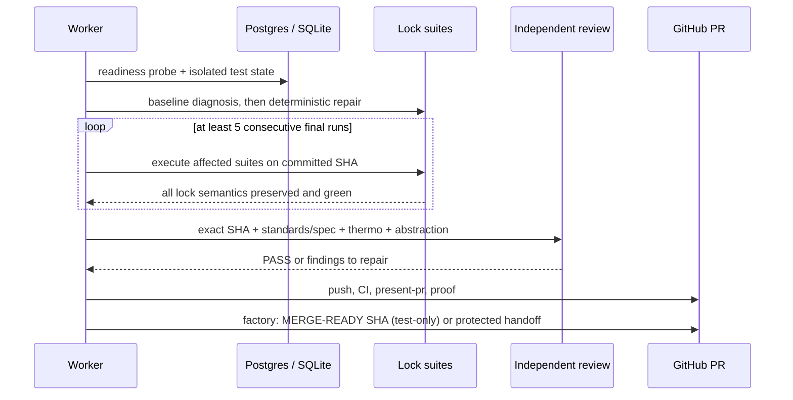

# [Postgres Lock Test Flake] Plan, visually

## Structure — what this lane may touch

```diff
 packages/agent/src/server/
 ├── credentials/vault/__tests__/
-│   └── postgresPersistence.test.ts   # real-time/environment-coupled lock tests
+│   └── postgresPersistence.test.ts   # ready + isolated + deterministic deadlines
 └── agent-host/__tests__/
-    └── requestLedger.test.ts          # inspect known SQLite contention flake
+    └── requestLedger.test.ts          # change only if the same cause is proven

 .handoff/
+└── pr-0-presentation.html             # exact-SHA proof and owner-facing walkthrough
```

No production credential file is in planned scope.

## Behavior — how proof reaches delivery



## Control-flow change — preserve semantics, remove environmental coupling

```diff
 beforeAll
-  issue schema/migration work immediately
+  wait until Postgres accepts a real query
+  create unique isolated schema
+  run migrations

 each lock test
   arrange real lock contention
-  rely on congested-host wall-clock scheduling
+  advance/control deadline-only time where driver-safe
+  reserve wall-clock bounds for genuine database I/O
   assert exact error code, retryability, mutation exclusion,
   serialization, unlock, and connection eviction

 final proof
+  run affected suites 5+ consecutive times
+  validate relevant package checks and current-main candidate
+  independent exact-SHA abstraction PASS
```

## Guardrails

| Must remain true | Forbidden shortcut |
|---|---|
| All existing cases execute | Skip, todo, allowed failure, deletion |
| Wrong lock behavior still fails | Weakened or broadened assertions |
| Real DB locking remains exercised | Mock that bypasses lock ownership |
| Green-head evidence stays revision-bound | Evidence-only commit after clean green head |
| Production credential changes get owner review | Quietly expanding from tests into runtime code |
