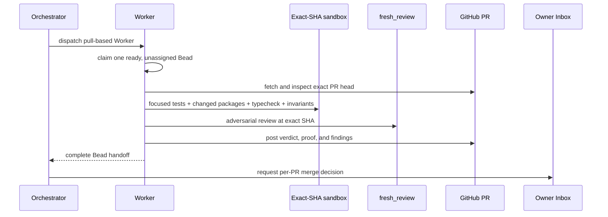

# [PR Review Batch] Plan, visually

This epic changes no product code. Eight independent Workers each inspect and prove one external PR; the Orchestrator turns each completed handoff into an owner merge-decision request.

## Structure — what the epic owns

```text
[PR Review Batch] Epic (wt-391-forward-clu5)
├── .1  PR #1542 — Handle Persistence
├── .2  PR #1543 — Plugin Exports
├── .3  PR #1544 — Chat Event Ownership
├── .4  PR #1547 — Invite Idempotency
├── .5  PR #1545 — Gateway Retry
├── .6  PR #1546 — Host Drain
├── .7  PR #1540 — Package Cleanup
└── .8  PR #1541 — Toast Delivery

No dependencies between review slices · maximum two Workers in flight
```

## Behavior — one identical review flow per PR



## Diff-shaped outcome — what is added around existing PRs

```diff
 External PR #n at exact SHA
+├── mergeability and CI receipt
+├── dedicated-sandbox proof receipt
+├── independent fresh_review receipt
+├── [PR Review Batch] GitHub review comment
+├── complete Bead handoff and merge recommendation
+└── owner Inbox merge-decision request

 Product source on epic/pr-review-batch
+└── no changes
```

## Gate 2 proof

- Eight non-epic Beads have complete handoff comments.
- Eight PR review comments exist.
- Eight per-PR Inbox decisions have been requested.
- Final Gate 2 summarizes verdicts and owner decisions received so far.
- Agents never merge or close any reviewed PR.
