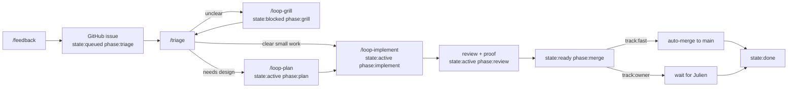

# Boring Loop

Boring Loop is the smallest useful maintainer system:

```text
/feedback -> enriched GitHub issue
/triage   -> route the issue through gates
```

Autonomy is not a mood. It is a label plus passed gates.

## One Screen

Every issue card should be understandable from these columns:

| Column | Meaning | Example |
| --- | --- | --- |
| State | Can work move? | `queued`, `blocked`, `active`, `ready`, `done` |
| Phase | What is next? | `triage`, `grill`, `plan`, `implement`, `review`, `merge` |
| Track | Who merges? | `fast` or `owner` |
| Gate | Why stopped? | `clarity`, `plan`, `proof`, `merge` |
| Flag | How is runtime exposure controlled? | `not-needed`, `flag:<name>` |
| Proof | Is it verified? | tests, CI, demo, screenshot, waiver |
| Sessions | Which Pi threads continue it? | `planSession`, `implementSession` |
| Next | One action | `/loop-grill`, `/loop-plan`, `/loop-implement` |

The UI should show this as chips plus one sentence, not a wall of text.

## Skills

- [`boring-feedback`](../../.agents/skills/boring-feedback/SKILL.md):
  create the enriched issue.
- [`boring-triage`](../../.agents/skills/boring-triage/SKILL.md):
  classify state, track, and next gate.
- [`boring-orchestration`](../../.agents/skills/boring-orchestration/SKILL.md):
  run `/triage`, workers, review, proof, and merge decisions.
- [`sources/theo_loop.md`](sources/theo_loop.md): source transcript.
- [`sources/steinberger_loop.md`](sources/steinberger_loop.md): source notes.

## Labels

Use labels for routing, not judgment essays.

| Kind | Rule | Values |
| --- | --- | --- |
| `state:*` | exactly one | `queued`, `blocked`, `active`, `ready`, `done` |
| `phase:*` | exactly one | `triage`, `grill`, `plan`, `implement`, `review`, `merge` |
| `track:*` | exactly one | `owner` by default, `fast` only after risk gate |
| source | optional | `source:feedback` |

Do not add labels for `bug`, `ui`, `accessibility`, `package:*`, `plugin:*`,
or `gate:*`. Structured fields carry the details: `area`, `kind`, `gate`,
`risk`, `flag`, `proofRequired`, `proofState`, `reviewState`, `reviewedSha`,
`mergeMode`, `nextAction`, plus session fields.

## Session Continuity

Pi/Codex session ids are continuity handles, not labels. Record them on the
issue, PR, Kanzen card, or review hook:

```text
feedbackSession:
grillSession:
planSession:
planReviewSession:
implementSession:
codeReviewSession:
proofSession:
visualReviewSession:
ownerAskSession:
```

Before a loop starts, reuse the matching session if it still belongs to the same
repo, issue/PR, and branch. Create a new session only when the old one is
missing, inaccessible, archived/stale, or wrong scope, then record the new id
and reason. If planning naturally becomes implementation in the same Pi thread,
carry the id forward, for example `implementSession: <same id as planSession>`.

## Gates

Evaluate gates top to bottom and stop at the first failing row.

| Gate | Passes When | If It Fails |
| --- | --- | --- |
| `intake` | issue has context, redaction note, first plan | fix issue body |
| `clarity` | issue is clear enough | `/loop-grill` |
| `risk` | `track:owner` is confirmed or upgraded to `track:fast` | keep owner track |
| `flag` | no flag needed, or safe flag/abstraction path exists | choose flag/abstraction |
| `plan` | inline plan is enough, or plan file passed thermo review | `/loop-plan` |
| `implementation` | PR exists and review loop is clean | `/loop-implement` |
| `proof` | tests, CI, demo, screenshots, or waiver are current | run proof |
| `merge` | fast-track merge or Julien review is allowed | merge or ask owner |



## Fast Track

New work starts `track:owner`. `track:fast` is an upgrade that means "merge
automatically once every gate passes."

Allowed only when all are true:

- author/agent is trusted by repo policy;
- small low-risk diff with reduced blast radius;
- no auth, billing, permissions, secrets, migrations, public API, release,
  deletion-heavy, or broad refactor work;
- acceptance criteria and proof path are obvious;
- review, thermo check, tests, CI, and demo proof are current for the head SHA.

Everything else is `track:owner`: agents may prepare the PR, but Julien reviews
before merge.

## Trunk And Flags

Use trunk-based work by default, but keep remote `main` protected.

Golden rule: the `boring-ui-v2` checkout stays on local `main` as Julien's live
review bench. The three Docker review surfaces stay running and easy to inspect:
`full-app`, `workspace-playground`, and `agent-playground`. Agents should keep
local main green/reloadable; if they cannot, they must stop, repair, or escalate
to a short-lived isolated branch/worktree.

| Case | Default |
| --- | --- |
| plan-only work | edit on local `main`; no branch or worktree |
| small single-lane code | local trunk plus feature flag, then tiny PR |
| not flaggable | branch-by-abstraction or keystone interface last |
| still risky | short-lived worktree/branch |
| transversal | plan first, stacked PRs, owner gate |

Feature flags are the isolation boundary for non-trivial runtime behavior:

```text
flag:
default:
owner:
blastRadius:
rollback:
removeBy:
```

Default flags off in production and on only in dev/demo when useful. If no flag
is needed, say why. If no safe flag exists, use abstraction, shadow mode,
expand/contract migration, or a short-lived worktree.

## Visual Review

Do not build a broad GitHub review plugin. The only boring-ui layer needed is a
thin `visual-review` pending surface, modeled on `ask-user`:

1. store one pending review item per session;
2. publish a lightweight UI-state hint;
3. add a `WorkspaceAttentionBlocker` with a review session badge;
4. best-effort open `openSurface { kind: "visual-review" }` with
   `openOnlyWhenSessionOpen: true`;
5. render the visual artifact and approval choices in that surface.

Use `visual-explainer` only as the renderer that creates the HTML artifact.

Install locally only from an owner-approved commit SHA. Do not auto-approve a
new mutable external source, branch, or tag from the loop itself:

```bash
pi install -l git:github.com/nicobailon/visual-explainer#<reviewed-commit-sha>
```

Use `--approve` only when Julien has already approved that exact commit.
Otherwise fall back to Markdown/HTML review material and record the missing
approved tool.

Use it for owner handoff when a plan, PR, stack, or proof story is non-trivial.
Record:

```text
visualReview:
visualReviewId:
visualReviewSession:
artifact:
visualReviewStatus:
```

The handoff stays blocked until Julien answers the session-scoped review item.
Owner comments can inform the item, but the pending review record is the merge
source of truth. The review surface must open with the visual artifact ready and
include the issue/PR, demo surface, flag state, proof, risk, and exact choices:
approve, request changes, defer, reject/remove.

Until that thin surface exists, use `ask-user` as a compatibility fallback with
the artifact link in the question context, and record `ownerAskSession` for that
fallback. Copy the ask-user answer into `visualReviewStatus` for the current
artifact so the merge gate stays the same. Do not replace the renderer or invent
a second review workflow.

## Plan Files

Plan files are workflow artifacts, so keep them under Kanzen and tie them to a
GitHub item before implementation starts:

```text
docs/kanzen/plans/
  queued/gh-123-short-slug.md
  blocked/gh-123-short-slug.md
  active/gh-123-short-slug.md
  ready/gh-123-short-slug.md
  done/gh-123-short-slug.md
```

Naming rule: `gh-<issue-or-pr-number>-<short-slug>.md`. If no GitHub item
exists yet, create one first. Temporary research may use
`queued/no-issue-YYYY-MM-DD-short-slug.md`, but it must become GitHub-linked
before code starts.

Move the file only when the Kanzen state meaningfully changes. Keep state in
frontmatter too so moved files remain searchable:

```yaml
github: https://github.com/hachej/boring-ui/issues/123
state: active
phase: plan
track: owner
flag: not-needed
planSession:
planReviewSession:
updated: 2026-06-25
```

Plan-only edits do not need a branch/worktree. Code starts only after the plan
states the flag/abstraction strategy, proof path, and owner gate.

Use this body shape:

```markdown
# gh-123 short title

## Decision
What should happen and why this is worth doing.

## Flag
`not-needed`, `flag:<name>`, or `not-flaggable` with the abstraction path.

## Acceptance
Small bullets that can be tested or reviewed.

## Slices
Tiny PRs or implementation steps; say when a stack is needed.

## Proof
Commands, CI, demo workspace, screenshots, or explicit waiver.

## Open Questions
Only questions that block safe implementation or merge.
```

## Loop Commands

`/feedback`: create a GitHub issue directly, enriched with safe context, lean
routing labels, `feedbackSession`, and a first plan. If the report is unclear,
create the issue as `state:blocked phase:grill`.

`/loop-grill`: use the grill-me skill and ask-user pane. This can run now or
wait asynchronously in the pending session list. Exit when the issue is clear.
Reuse or record `grillSession`.

`/loop-plan`: produce the smallest useful plan. Use an inline plan for small
work. Use a plan file plus thermo-nuclear review for important, risky, or
multi-PR work. Reuse or record `planSession` and `planReviewSession`.

`/loop-implement`: implement the plan, open/update the PR, run review/fix
rounds, run thermo-nuclear implementation review when non-trivial, and collect
proof. Reuse or record `implementSession`, `codeReviewSession`, and
`proofSession`.

`/triage`: orchestrate the queue. It should perform one next action per issue,
then record the new state/gate.

## Product Shape

- Feedback form creates GitHub issues with context and first plan.
- Triage board shows state, phase, track, gate, PR, proof, sessions, and next
  action.
- Ask-user pane holds blocked grill questions and fallback owner asks per
  session.
- Visual-review surface holds blocked review handoffs per session and opens the
  artifact ready to inspect.
- PR review pane focuses one PR: diff, findings, fixes, reviewed SHA, proof.
- Demo proof pane starts the app when useful and tells Julien exactly what to
  verify.

## Maintenance

- Add a gate row before adding a new phase.
- Add a structured field before adding a label.
- Add a session field before creating an unlinked follow-up thread.
- Keep each skill under one screen.
- Keep `/feedback` write-only: it creates the issue and stops.
- Keep `/triage` action-light: one issue gets one next action per sweep.
