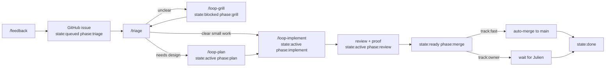

# Boring Loop

```text
/feedback -> enriched GitHub issue
/triage   -> route the issue through gates
```

Rule: autonomy = label + passed gates.

## One Screen

| Column | Meaning | Example |
| --- | --- | --- |
| State | Can work move? | `queued`, `blocked`, `active`, `ready`, `done` |
| Phase | What is next? | `triage`, `grill`, `plan`, `implement`, `review`, `merge` |
| Track | Who merges? | `fast` or `owner` |
| Gate | Why stopped? | `intake`, `clarity`, `risk`, `flag`, `plan`, `implementation`, `proof`, `merge` |
| Flag | How is runtime exposure controlled? | `not-needed`, `flag:<name>` |
| Proof | Is it verified? | tests, CI, proof comment, demo, screenshot, waiver |
| Session comments | Which Pi threads continue it? | id, purpose, scope, reason |
| Next | One action | `/loop-grill`, `/loop-plan`, `/loop-implement` |

- UI: chips plus one sentence.

## Skills

- [`boring-feedback`](../../.agents/skills/boring-feedback/SKILL.md): create issue.
- [`boring-triage`](../../.agents/skills/boring-triage/SKILL.md): classify gate.
- [`boring-orchestration`](../../.agents/skills/boring-orchestration/SKILL.md): run sweep.
- [`sources/theo_loop.md`](sources/theo_loop.md): source transcript.
- [`sources/steinberger_loop.md`](sources/steinberger_loop.md): source notes.

## Labels

| Kind | Rule | Values |
| --- | --- | --- |
| `state:*` | exactly one | `queued`, `blocked`, `active`, `ready`, `done` |
| `phase:*` | exactly one | `triage`, `grill`, `plan`, `implement`, `review`, `merge` |
| `track:*` | exactly one | `owner` by default, `fast` only after risk gate |
| source | optional | `source:feedback` |

- Labels route only.
- No taxonomy labels: `bug`, `ui`, `accessibility`, `package:*`, `plugin:*`,
  `gate:*`.
- Details go in fields: `area`, `kind`, `gate`, `risk`, `flag`,
  `proofRequired`, `proofState`, `reviewState`, `reviewedSha`, `mergeMode`,
  `nextAction`, session comments.

## Session Continuity

- Session ids are comments, not labels or fixed fields.
- Comment: id, purpose, scope, replacement reason.
- Reuse if repo, issue/PR, and branch still match.
- New session only when missing, inaccessible, stale, or wrong scope.

## Gates

- Evaluate top to bottom.
- Stop at first failing row.

| Gate | Passes When | If It Fails |
| --- | --- | --- |
| `intake` | issue has context, redaction note, first plan | fix issue body |
| `clarity` | issue is clear enough | `/loop-grill` |
| `risk` | `track:owner` is confirmed or upgraded to `track:fast` | keep owner track |
| `flag` | no flag needed, or safe flag/abstraction path exists | choose flag/abstraction |
| `plan` | inline plan is enough, or plan file passed thermo review | `/loop-plan` |
| `implementation` | PR exists and review loop is clean | `/loop-implement` |
| `proof` | tests, CI, GitHub proof comment, demo, screenshots, or waiver are current | run proof |
| `merge` | fast-track merge or Julien review is allowed | merge or ask owner |



## Fast Track

- Default: `track:owner`.
- `track:fast` requires trusted author, non-draft worker-owned PR, small
  low-risk diff, obvious acceptance, proof path, safe flag/default.
- `track:fast` forbids auth, billing, permissions, secrets, migrations, public
  API, release, deletion-heavy work, broad refactor.
- Merge requires current review, thermo, tests, CI, proof comment, demo proof.
- If visual review is required: approval must match the current artifact.
- Otherwise: `track:owner`; Julien reviews.

## Procedures

- [Trunk, flags, review budget](procedures/trunk-flags-review-budget.md)
- [Issue plans](procedures/issue-plans.md)
- [Visual review](procedures/visual-review.md)

## Loop Commands

- `/feedback`: create issue; stop. If unclear: `state:blocked phase:grill`.
- `/loop-grill`: grill-me plus ask-user; exit when clear.
- `/loop-plan`: smallest plan; plan file plus thermo for risky/multi-PR work.
- `/loop-implement`: code, PR, review/fix rounds, thermo, proof.
- `/triage`: one next action per issue; record state/gate.

## Product Shape

- Feedback form: GitHub issue, context, first plan.
- Triage board: state, phase, track, gate, PR, proof, sessions, next action.
- Ask-user: grill questions and fallback owner asks.
- Visual-review: artifact, choices, session blocker.
- PR review: diff, findings, fixes, reviewed SHA, proof.
- Demo proof: app ready plus exact checks.

## Maintenance

- Add a gate row before adding a new phase.
- Add a structured field before adding a label.
- Add a session comment before creating an unlinked follow-up thread.
- Keep each skill under one screen.
- Keep `/feedback` write-only: it creates the issue and stops.
- Keep `/triage` action-light: one issue gets one next action per sweep.
