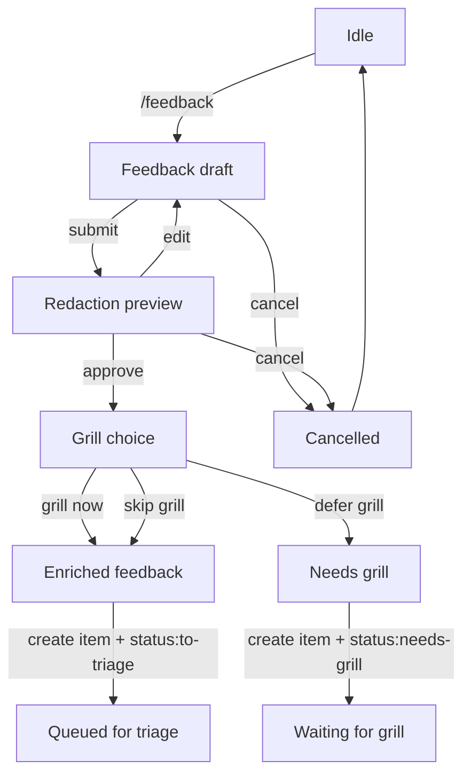
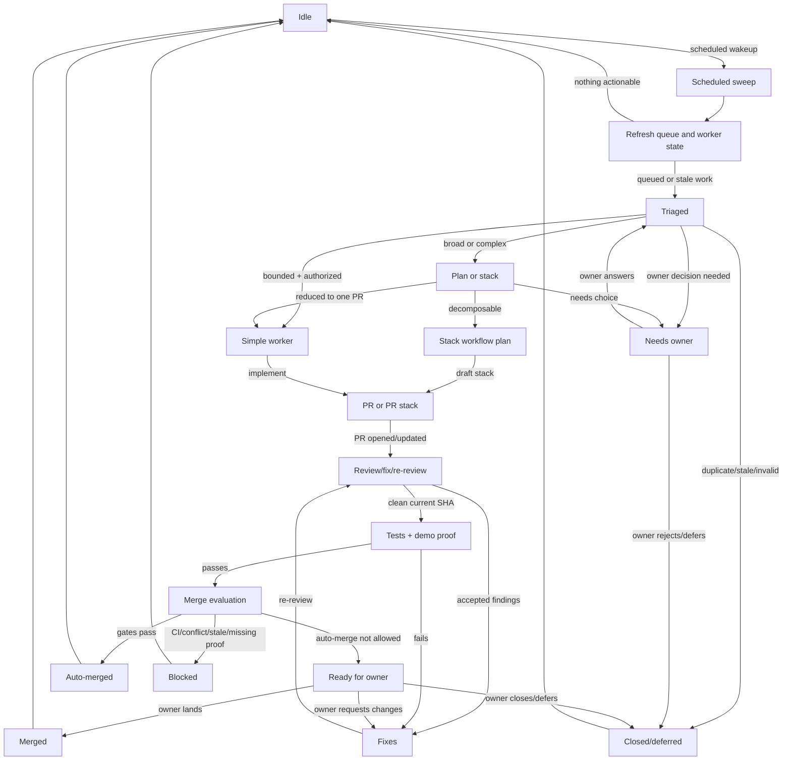

# Boring Loop

Boring Loop is a maintainer mode inside boring-ui. It turns product friction
into GitHub issues, routes safe work to agents, and keeps every step visible:
triage, implementation, review, proof, owner decisions, and narrow auto-merge.

The point is not "agents merge everything." The point is a boring, auditable
control plane where autonomy is earned one gate at a time.

## Documents

- [`boring-orchestration`](../../.agents/skills/boring-orchestration/SKILL.md)
  - skill for running the maintainer loop.
- [`boring-triage`](../../.agents/skills/boring-triage/SKILL.md) - skill for
  classifying issues, PRs, feedback, and stack candidates.
- [`boring-feedback`](../../.agents/skills/boring-feedback/SKILL.md)
  - skill for `/feedback` capture, enrichment, backlog/bug routing, and grill
  deferral.
- [`sources/theo_loop.md`](sources/theo_loop.md) - source transcript.
- [`sources/steinberger_loop.md`](sources/steinberger_loop.md) - source skill
  analysis.

## Loop

There are two linked workflows: capture creates queued work; orchestration wakes
on a schedule and decides what to do with that queue.

```text
/feedback
  -> draft + preview
  -> enrich
  -> create GitHub bug issue or Project backlog item
  -> optionally grill now or defer with status:needs-grill
  -> queue as source:feedback + status:to-triage when ready

scheduled wakeup
  -> refresh queue
  -> triage queued or stale work
  -> owner decision, simple worker, or stacked PR plan
  -> PR or PR stack
  -> review/fix/re-review loop
  -> tests + demo workspace proof
  -> owner decision or narrow auto-merge
```

### Feedback State Machine



### Orchestration State Machine



## Product Shape

- Feedback inbox: `/feedback` drafts, redaction preview, created issues,
  captured context, and queued status.
- GitHub board: issues, PRs, CI, labels, proof artifacts, merge state, and
  owner decisions.
- Decision inbox: owner briefs for product/security/access/proof/merge choices.
- Worker lanes: one GitHub item in one repository per Codex/Kanzen execution
  context, with run state and stop reason.
- Stack planner: dependency-aware PR stacks for complex work.
- Review lane: reviewer runs, accepted/rejected findings, and reviewed SHA.
- Proof ledger: commands, CI, demo workspace runs, screenshots, and known gaps.
- Permission panel: issue creation, implementation, push, CI repair, review,
  auto-merge, release, and publish.

## Principles

- Visible before autonomous.
- Triage earns autonomy.
- Labels route work; structured state carries judgment.
- Complex work becomes stacked PRs before code starts.
- Non-trivial PRs get a fresh review/fix/re-review loop.
- Workspace UI, plugin, agent-visible, and `/feedback` changes need demo proof.
- Auto-merge is narrow, permissioned, and per PR.
- Chat is not the database.

## First Cut

Build this first as three `.agents` skills plus narrow GitHub/project
integrations. A richer UI surface can come later only if it adds real value
such as context capture, preview UI, or screenshots.

1. `/feedback` intake skill with preview-before-submit issue creation.
2. Issue/PR board fields for status, proof, review, stack, and merge
   eligibility.
3. `Run triage`, `Create stack plan`, `Run autoreview`, and `Evaluate
   auto-merge` buttons.
4. Proof collector for commands, CI, demo workspace links, screenshots, gaps,
   and head SHA.
5. Dry-run merge evaluator before any real auto-merge.

## Manual Test

Start with a dry run. Open a fresh Codex session and ask:

```text
Use .agents/skills/boring-triage/SKILL.md to triage <issue-or-pr-url>.
Do not implement. Return the triage card, status label, structured fields, and
next action.
```

If triage returns `status:to-implement`, trigger implementation in a separate
worker lane/session:

```text
Use .agents/skills/boring-orchestration/SKILL.md worker lane rules.
Implement <issue-url> in <repo-path>.
Use branch codex/issue-<number>-<slug> and worktree
<repo-path>/.worktrees/kanzen-issue-<number>.
Stop before merge. Run proof and prepare a PR/owner brief.
```

If triage returns `status:to-plan`, ask for a stack workflow plan first. If it
returns `status:needs-owner`, do not start a worker; answer the decision brief.
