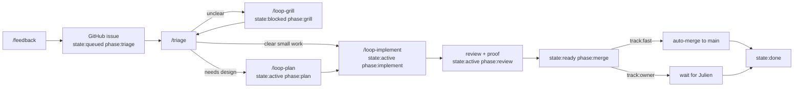

# Boring Loop

Boring Loop is the smallest useful maintainer system:

```text
/feedback -> enriched GitHub issue
/triage   -> route the issue through gates
```

Autonomy is not a mood. It is a label plus passed gates.

Boundary: Boring Loop decides what should happen next for GitHub work. Actual
coding work still follows the canonical workflow in
[`../AGENT_WORKFLOW.md`](../AGENT_WORKFLOW.md).

## One Screen

Every issue card should be understandable from these columns:

| Column | Meaning | Example |
| --- | --- | --- |
| State | Can work move? | `queued`, `blocked`, `active`, `ready`, `done` |
| Phase | What is next? | `triage`, `grill`, `plan`, `implement`, `review`, `merge` |
| Track | Who merges? | `fast` or `owner` |
| Gate | Why stopped? | `clarity`, `plan`, `proof`, `merge` |
| Proof | Is it verified? | tests, CI, demo, screenshot, waiver |
| Next | One action | `/loop-grill`, `/loop-plan`, `/loop-implement` |

The UI should show this as chips plus one sentence, not a wall of text.

## Skills

- [`boring-feedback`](../../.agents/skills/boring-feedback/SKILL.md):
  create the enriched issue.
- [`boring-triage`](../../.agents/skills/boring-triage/SKILL.md):
  classify state, track, and next gate.
- [`boring-orchestration`](../../.agents/skills/boring-orchestration/SKILL.md):
  run `/triage`, workers, review, proof, and merge decisions.
- [`loop-grill`](../../.agents/skills/loop-grill/SKILL.md):
  clarify blocked issues through grill-me and ask-user.
- [`loop-plan`](../../.agents/skills/loop-plan/SKILL.md):
  create the smallest useful plan and run thermo review when needed.
- [`loop-implement`](../../.agents/skills/loop-implement/SKILL.md):
  implement, review, prove, and prepare a PR.
- [`sources/theo_loop.md`](sources/theo_loop.md): source transcript.
- [`sources/steinberger_loop.md`](sources/steinberger_loop.md): source notes.

## Labels

Use labels for routing, not judgment essays.

| Kind | Rule | Values |
| --- | --- | --- |
| `state:*` | exactly one | `queued`, `blocked`, `active`, `ready`, `done` |
| `phase:*` | exactly one | `triage`, `grill`, `plan`, `implement`, `review`, `merge` |
| `track:*` | exactly one | `owner` by default, `fast` only after risk gate |
| taxonomy | optional | `source:feedback`, `bug`, `ux`, `docs`, `plugin:*`, `package:*` |

Structured fields carry the details: `gate`, `risk`, `proofRequired`,
`proofState`, `reviewState`, `reviewedSha`, `mergeMode`, `nextAction`.

## Gates

Evaluate gates top to bottom and stop at the first failing row.

| Gate | Passes When | If It Fails |
| --- | --- | --- |
| `intake` | issue has context, tags, redaction note, first plan | fix issue body |
| `clarity` | issue is clear enough | `/loop-grill` |
| `risk` | `track:owner` is confirmed or upgraded to `track:fast` | keep owner track |
| `plan` | inline plan is enough, or plan file passed thermo review | `/loop-plan` |
| `implementation` | PR exists and review loop is clean | `/loop-implement` |
| `proof` | tests, CI, demo, screenshots, or waiver are current | run proof |
| `merge` | fast-track merge or Julien review is allowed | merge or ask owner |



## Fast Track

New work starts `track:owner`. `track:fast` is an upgrade that means "merge
automatically once every gate passes."

Allowed only when all are true:

- author/agent is trusted by repo policy;
- small low-risk diff with reduced blast radius;
- no auth, billing, permissions, secrets, migrations, public API, release,
  deletion-heavy, or broad refactor work;
- acceptance criteria and proof path are obvious;
- review, thermo check, tests, CI, and demo proof are current for the head SHA.

Everything else is `track:owner`: agents may prepare the PR, but Julien reviews
before merge.

## Loop Commands

`/feedback`: create a GitHub issue directly, enriched with safe context,
correct labels, and a first plan. If the report is unclear, create the issue as
`state:blocked phase:grill`.

[`/loop-grill`](../../.agents/skills/loop-grill/SKILL.md): use the grill-me
skill and ask-user pane. This can run now or wait asynchronously in the pending
session list. Exit when the issue is clear.

[`/loop-plan`](../../.agents/skills/loop-plan/SKILL.md): produce the smallest
useful plan. Use an inline plan for small work. Use a plan file plus
thermo-nuclear review for important, risky, or multi-PR work.

[`/loop-implement`](../../.agents/skills/loop-implement/SKILL.md): implement
the plan, open/update the PR, run review/fix rounds, run thermo-nuclear
implementation review when non-trivial, and collect proof.

`/triage`: orchestrate the queue. It should perform one next action per issue,
then record the new state/gate.

## Product Shape

- Feedback form creates GitHub issues with context and first plan.
- Triage board shows state, phase, track, gate, PR, proof, and next action.
- Ask-user pane holds blocked grill/owner questions per session.
- PR review pane focuses one PR: diff, findings, fixes, reviewed SHA, proof.
- Demo proof pane starts the app when useful and tells Julien exactly what to
  verify.

## Maintenance

- Add a gate row before adding a new phase.
- Add a structured field before adding a label.
- Keep each skill under one screen.
- Keep `/feedback` write-only: it creates the issue and stops.
- Keep `/triage` action-light: one issue gets one next action per sweep.
