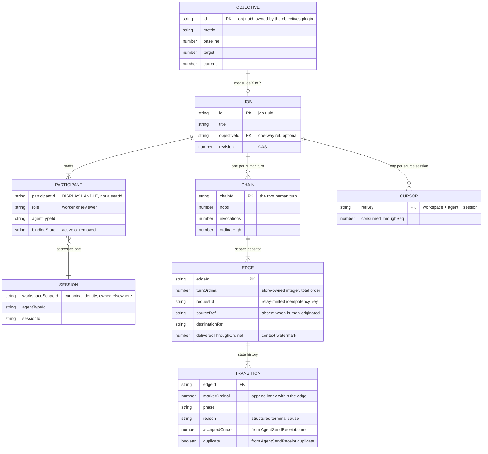
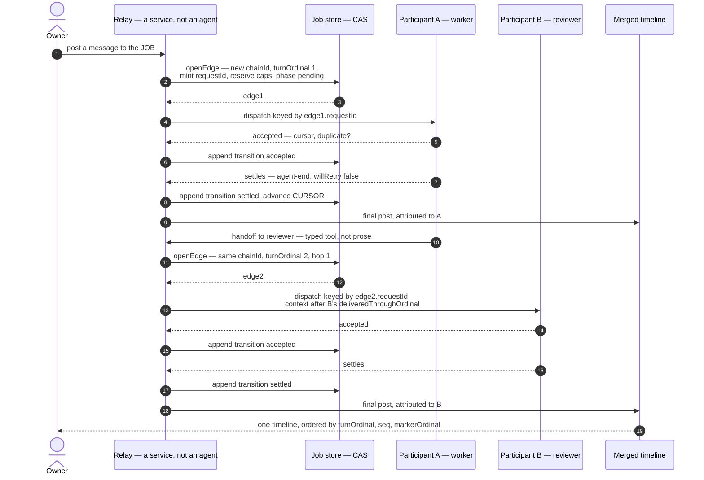
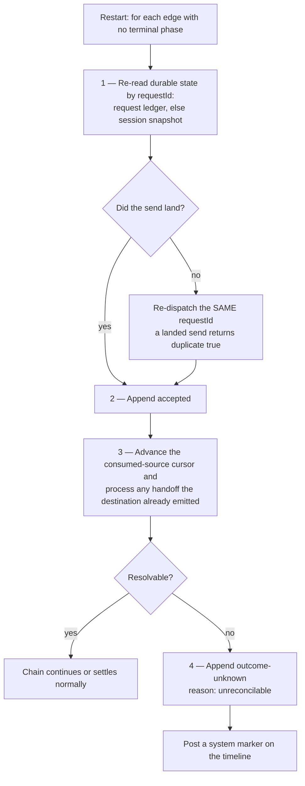
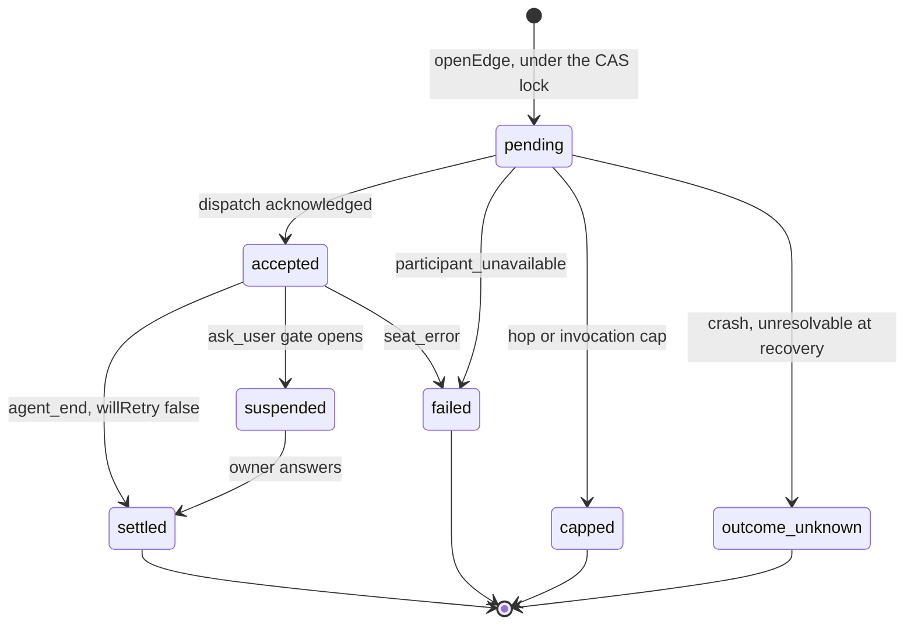
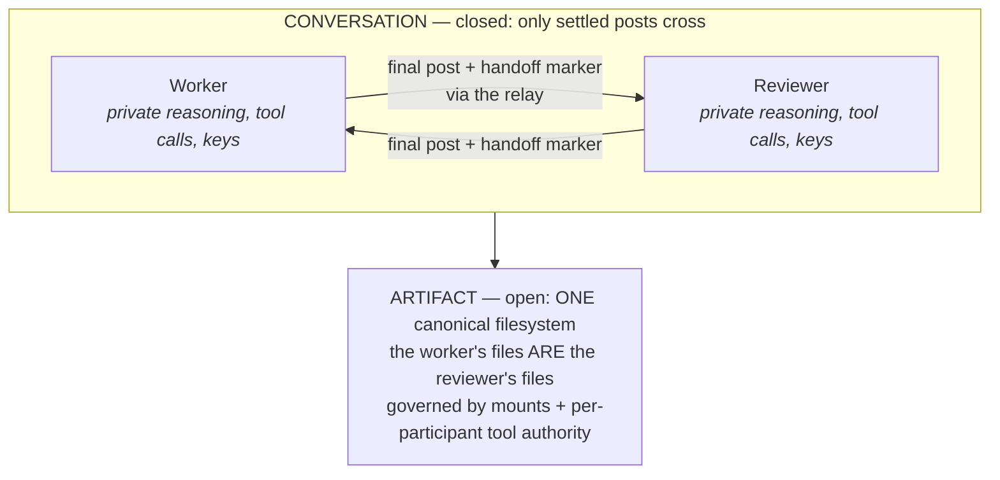

# Job Thread v0 — multi-seat Thread projection, K7 demo

**Concept** (owner, [#1399](https://github.com/hachej/boring-ui/issues/1399)): the Thread is the unit
of WORK, not of agent. The human talks to the job; staffing collapses behind one merged timeline, and
per-agent sessions demote to drill-down provenance — CI logs behind a PR check. Convergence:
**1 Thread = 1 job = 1 Objective**.

**Naming is ratified, not free**: the product concept is a *multi-seat Thread* / *Job Thread*, never
"channel" (`channel` is reserved for transport/ingress: C5 "channel-answerable", Track C, Slack/CLI).
PR [#1401](https://github.com/hachej/boring-ui/pull/1401) (open) appends to `RECONCILIATION.md` §7 and
`VISION.md` R-c: *"A Thread may span multiple Seats, projected as one timeline; one Thread per job."*

**What v0 builds** is a *projection* over several per-agent Sessions, driven by a **relay** — a
non-Seat, non-agent service. §1 asks the owner to rule on the noun before anything is built.
Ordering and dependencies live only in §7; §§1–6 describe shape.

> **Correction carried from review.** Round 1 claimed "no A2A loopback; agents never call agents" as
> a ratified constraint. That misread the record. Decision 24 (`docs/DECISIONS.md:364`) ratifies **a
> native in-process binding for internal agent-to-agent consumption** ("no MCP loopback, no
> serialization; two-way chat via `input-required`") and states *"Adopting A2A internally is rejected
> as unnecessary."* Decision 25 (`:413`) defers **A2A** — the external protocol binding — not
> in-process collaboration. So relay-vs-native-binding is a **live product choice for v0, not a
> compliance requirement**, and it is owner question Q2. v0 proposes the relay because it needs no
> agent-facing capability and is deletable; it is not the only compliant shape.

## What this plan builds

Twelve artifacts, nothing else. Product words first, code noun in `code`. "Built by" points at §7,
which remains the only place ordering lives.

| Artifact | What it is | Built by | Lives in |
| --- | --- | --- | --- |
| The saved job — `JobProjectionV0` | Title, its Objective, its staffed participants. A description of how to project several Sessions as one job. **Not a Thread.** | S1 | `src/shared/types.ts` |
| One staffed participant — `JobParticipantV0` | Role (worker/reviewer), which agent, which session, and whether it is still active. | S1 | `src/shared/types.ts` |
| One turn hop — `JobRelayEdgeV0` | One attempted cross-post: who sent, to whom, under which idempotency key, carrying context up to where. Immutable. | S1 | `src/shared/types.ts` |
| What happened to a hop — `JobRelayTransitionV0` | Appended state history: pending → accepted → settled / failed / capped / unknown, with a structured reason. | S1 | `src/shared/types.ts` |
| The cap ledger — `JobChainStateV0` | Per-human-turn counters (hops, invocations) so a restart cannot reset them and a new message cannot inherit them. | S1 | `src/shared/types.ts` |
| How far we have read — `JobCursorV0` | Per source session, the last event the relay has interpreted. Survives across turns. | S1 | `src/shared/types.ts` |
| The reservation write — `openEdge()` | The single locked write that reserves a turn *before* anything is sent: allocates the ordinal, mints the request id, reserves caps. The crash-safety keystone. | S1 | `src/server/edgeLog.ts` |
| Sending one turn — relay turn function | Hands one message to one participant through the host's existing per-invocation seam. Holds no capability afterwards. | S2 | `src/server/relayTurn.ts` |
| "Pass this to the reviewer" — handoff tool | The typed tool a participant calls to hand off. Typed target, explicit payload — never parsed from prose. | S2 | `src/server/handoffTool.ts` |
| Deciding who goes next — relay chain | Advances on settled turns, enforces caps, applies every failure rule, bounds injected context. | S3 | `src/server/relayChain.ts` |
| Picking up after a crash — recovery routine | The 4-step reconciliation that consults durable state before ever declaring an outcome unknown. | S3 | `src/server/recovery.ts` |
| The one view the owner reads — merged timeline | Interleaved posts with participant attribution, ask-user gates inline, drill-down to the private session. | S4 | `src/front/` |
| Proof it works — K7 demo fixture | Scripted-adapter acceptance asserting the whole path deterministically. | S5 | `src/server/__tests__/k7Demo.test.ts` |

All paths are under `plugins/job-threads/`.

### The data model



### One handoff turn, end to end



Only the two **final posts** cross between participants. Everything else — reasoning, tool calls,
intermediate messages — stays in the private session and is reachable only by drill-down.

### Picking up after a crash



Step 3 is the one round 2 was missing: a destination that settled and handed off *before* the crash
is processed, not skipped.

### The life of one turn hop



The edge itself never changes. Each arrow is an **appended transition record**; the phase shown is
the latest one. System markers on the timeline are *derived* from these transitions — there is no
second event system.

## 1. The noun — decide this first

### Today

`Thread` is frozen as one object with Session: *"a Thread is not a Pi session, transcript, or tab —
it owns one record and many Runs"* (`VISION.md:112-115`), and the V2 spec's `Thread
{ threadId; workspaceId; title; participants; workingSet }` (`V2-IMPLEMENTATION-SPEC.md:121`)
**already carries a `participants` field**. `Seat { seatId; workspaceId; agentId; role?; budget?;
permissions?; bindingState }` (`:119`) binds an *Agent* to a Workspace and "grants participation, not
identity". No Thread, Seat, or participant noun exists in code (`ThreadRef|threadId|ConsoleCollection`
→ 0 hits across `packages/ plugins/ apps/`); `seatId` and `trajectory` → 0 hits.

### Delta — recommendation, and the cost of the alternative

Round 1 minted `JobThreadV0` holding several session refs. That silently created a *second* Thread
object against the frozen ruling, and called the relay an "orchestrator seat" against the frozen Seat
definition. Both are withdrawn.

**Recommended default (Q1-A): a projection descriptor with a distinct noun.**

```ts
/** NOT a Thread. A saved description of how to project several Threads(=Sessions) as one job. */
interface JobProjectionV0 {
  id: string                        // `job-<uuid>`
  title: string
  objectiveId?: string              // one-way ref into the objectives plugin (§5)
  participants: JobParticipantV0[]
  createdAt: string; updatedAt: string; revision: number
}
interface JobParticipantV0 {
  participantId: string             // TEMPORARY DISPLAY HANDLE — not a seatId, not audit identity
  role: "worker" | "reviewer"
  agentTypeId: string
  conversation: { workspaceScopeId: string; agentTypeId: string; sessionId: string }
  bindingState: "active" | "removed" // agent removal preserves history (cf. Seat.bindingState)
}
```

Why `JobProjectionV0` rather than the reviewed suggestions `JobThreadProjectionV0` /
`ThreadDescriptor`: both still lead with a Thread-noun and will be read as canonical Thread machinery
in a year. The record's subject is the **job**; "Job Thread" stays the product concept per #1401,
while the durable record never claims Thread-ness. The relay is named **relay** — a service, never a
Seat — because a Seat contains `agentId` and binds an Agent, which the relay is not.

This keeps frozen R-c intact and matches #1401's "no new machinery": nothing here is canonical
identity, and deleting the record destroys no Runs, transcripts, or authority.

**Alternative (Q1-B): JobProjection *is* the canonical Thread.** Cheaper than review assumed —
frozen `Thread` already has `participants`, so the ontology has room. But the cost is real and must
be paid up front: (i) an explicit R-c amendment, since Thread=Session becomes Thread⊇Sessions;
(ii) C7/`SessionCatalog` becomes the owner of Thread identity, pulling ratified P0 "seatId in C7"
(`RECONCILIATION.md:150-155`) into scope; (iii) #1355's `ConsoleThreadRefV1` and its
`(appId, principalId, workspaceScopeId, agentTypeId, sessionId)` unique key
(`docs/issues/1355/plan.md:74-78, 102-104`) must be reworked before #1355 implements, not after;
(iv) a migration for any Thread ref already written. Q1-B is the better end state and the wrong v0.

## 2. Mechanism — the relay

### Today

- **Correction from review, verified.** Round 1 claimed the existing drivers are bound to one
  `agentTypeId`. False for the one that matters: `runWithWorkspaceAgent(input, run)` takes
  `agentTypeId` **per invocation** (`WorkspaceAgentDirectRunInput { agentTypeId, context, requestId }`,
  `packages/agent/src/shared/workspaceAgentDispatcher.ts:57-71`). Only the long-lived
  `WorkspaceAgentGatewayBinding {gateway, scope, agentTypeId}` (`:67-71`) is single-agent.
- The trusted composition root already issues **per-request** scope and guards workspace selectors
  (`createWorkspaceAgentServer.ts:2088-2101`): `scopeIssuer.issue({claim:{workspaceScopeId,
  authSubjectId}})` then `agentHost.runWithWorkspaceAgent({...input, authorizedScope}, run)`.
  Unbounded access was deliberately removed (`:2103-2104`).
- The capability handed to the callback is **callback-scoped and non-retainable**:
  `LeaseBoundWorkspaceAgent` is documented "lease guarded by the Host and must not be retained after
  the callback" (`shared/workspaceAgentDispatcher.ts:40-42`). Its `dispatch(input, onEvent,
  onAccepted)` returns `{ ref, receipt }` (`:44-56`).
- **Acceptance precedes any callback.** The lease awaits `dispatcher.dispatch(...)` and only then
  runs `onAccepted` (`agent-host/workspaceAgentLease.ts:237-238`). So *any* persist-after-dispatch
  design leaves a crash window in which a send has landed with nothing recorded — this is why §3
  writes a pending edge **before** dispatching.
- `EmbeddedAgentGateway` is exported at `packages/agent/src/server/index.ts:185`.
- Turn events carry the anchors the relay needs: `agent-end { seq, turnId, status, willRetry? }` and
  `message-end { seq, messageId, final: BoringChatMessage }` (`shared/chat/piChatEvent.ts:6-25`).
  **`willRetry=true` marks a NON-terminal end** — the comment warns once-per-settle consumers to
  ignore those.

### Delta

**Drop the gateway-holding plugin class from round 1.** It would have retained a lease-guarded
capability across turns, which the contract forbids, and hard-coded the embedded tier. Instead the
relay is a stateless function invoked once per seat turn, using the existing actor-aware callback
seam — no new authority-bearing host seam, no long-lived scope, no D28 second composer:

```
relayTurn(jobId, targetParticipant, payload):
  # 1. ONE locked CAS mutation, BEFORE any dispatch (§3): allocate turnOrdinal,
  #    mint the caller-owned requestId, reserve hop/invocation counts,
  #    append edge{phase:"pending"}.
  edge = store.openEdge(jobId, chainId, targetParticipant, payload)
  # 2. dispatch keyed by the id we already own — a retry cannot mint a new one
  runWithWorkspaceAgent({ agentTypeId: p.agentTypeId, context, requestId: edge.requestId },
    async (bound) => {
      await bound.dispatch({ ...payload, requestId: edge.requestId }, onEvent, async (accepted) => {
        store.appendTransition(edge.edgeId, "accepted", { cursor: accepted.receipt.cursor,
                                                          duplicate: accepted.receipt.duplicate })
      })
    })
```

**The `requestId` is ours, not the receipt's.** Round 1 said the idempotency key comes back "from the
dispatch receipt". Wrong, and the correction is what makes the pre-dispatch edge work:
`WorkspaceAgentDispatcherDispatchInput.requestId` is a **"durable caller-owned idempotency key"**
(`shared/workspaceAgentDispatcher.ts:23`) and `AgentSendReceipt extends CommandReceipt
{ accepted, cursor, disposition, clientNonce, duplicate?, clientSeq? }` (`shared/gateway/types.ts:168-177`)
carries **no `requestId`**. Because the relay mints the key, a re-dispatch after a crash is safe by
construction and returns `duplicate: true` rather than double-sending — that flag is the
reconciliation primitive, and `receipt.cursor` is the durable accepted-position anchor.

**Structured handoff, not free-text parsing.** Round 1 parsed `@reviewer` out of prose. Withdrawn:
quoted or incidental mentions branch the run and make acceptance untestable. v0 registers a
**handoff tool** on each participant agent — `handoff({ to: <role enum>, message: string })` — so the
target is typed, the payload is explicit, and the transition is a `tool-call` event the relay matches
exactly. This is a workspace plugin tool the relay owns; it is *not* an agent-to-agent call (the tool
returns immediately, the relay decides what happens next).

**Two boundaries — and only one of them is restrictive.** This is the single most misread part of
the design, so state it plainly: *participants share the work, not each other's minds and keys.*

- **The artifact boundary is OPEN.** Participants on a job **share one workspace and one canonical
  filesystem**. Ratified, not invented: agents in a workspace "intentionally share
  filesystem/process/runtime authority while retaining distinct route, prompt, tool, session,
  readiness, receipt, log, and provenance identity" (D25, `docs/DECISIONS.md:410`), and same-workspace
  agents share workspace data through the canonical Environment API, with narrower grants getting
  "separately enforced execution views **without copying the authoritative filesystem**" (D28,
  `:463`) — one API for tools, bash, UI and CLI precisely to prevent "filesystem split brain"
  (`:462`). So the worker's files *are* the reviewer's files. The reviewer reads the branch the
  worker wrote; nothing is copied, synced, or handed over as an attachment. Per-participant reach is
  governed by mounts and tool authority, not by partition. This is the half of the shared-VM feel
  people actually like, delivered natively and governed.
- **The conversation boundary is CLOSED.** Posts-only governs one thing only: what enters a
  participant's *prompt* from another participant's transcript. A seat's private reasoning, tool
  calls, intermediate messages, and any credentials in them never cross. Exactly two things do:
  (a) the **final assistant message** of a settled turn (`message-end.final`, gated on an `agent-end`
  with `willRetry !== true`), and (b) **relay-authored system handoff markers**. Everything else stays
  in the originating session, reachable only by drill-down.

The pairing is the point. Sharing context windows is what makes multi-agent setups leak secrets and
drown in each other's tool spew; sharing a filesystem is what makes them able to collaborate at all.
v0 takes the second and refuses the first.



**Turn policy — addressing-gated, with prior art.** [Buzz](https://block.xyz/) (Block, July 2026) is
an @-mention-gated agent group chat and the closest shipped prior art. Adopted: a participant acts
only when explicitly addressed (here, by typed handoff or by the human), one shared timeline, human
as approver rather than per-turn participant (our Inbox Human Intentions). Fixed: Buzz leaves
stopping conditions to agent authors and mention loops are a known failure mode — v0 enforces caps
centrally in the relay (§3), and replaces mention-parsing with the typed tool. Deferred: Buzz's
parallel same-brief mode (v1; its mechanism is already named — #1355's `AutomationGroup` fan-out,
`plan.md:253-279`). D24 already anticipated the caps as "consumption cycle/depth guards (A→B→A)"
(`docs/DECISIONS.md:365`).

### Failure semantics

Every abnormal end writes a terminal system event onto the projection; the relay never fails silent.

| Case | Rule |
| --- | --- |
| Non-terminal end | `agent-end` with `willRetry === true` is ignored; the chain does not advance (`piChatEvent.ts:9-11`). |
| Seat error run | `agent-end.status === 'error' \| 'aborted'` appends `phase:"failed"`, `reason:"seat-error"` with the source `turnId`, and posts a system event. No automatic retry in v0. |
| Handoff to a removed participant | `bindingState === "removed"` → `phase:"failed"`, `reason:"participant-unavailable"`; history is preserved, never rewritten. |
| Crash between dispatch and persistence | Closed by the pre-dispatch pending edge (§2/§3). Acceptance happens inside `dispatch` *before* `onAccepted` runs (`workspaceAgentLease.ts:237-238`), so persistence-after-dispatch always leaves a window. Recovery re-dispatches the **same** `edge.requestId`; a send that already landed returns `duplicate: true` instead of a second post. |
| Restart mid-chain | Recovery order below — the chain only resolves `outcome-unknown` after durable state has been consulted, never on the mere absence of a completion record. |
| Cap exceeded | `phase:"capped"` naming the cap and the last `turnId`; no truncation, no silent stop. Counts were reserved pre-dispatch, so a crash cannot undercount them. |
| Blocked on `ask_user` | Not a terminal Run — the chain suspends, does not advance, and does not count against the hop cap until answered (§4). |

## 3. Relay state — the durable receipt

### Today

Round 1's record explicitly owned no transcript or runtime, yet the relay needed "history since last
turn", processed handoffs, per-turn depth, and terminal system events. Nothing owned that state.
`AgentSessionEvent { ref, seq, event }` documents **"`seq` is the only replay cursor"**
(`shared/gateway/events.ts:4-8`) — there is no wallclock, no thread id, no cross-stream correlation.
Round 1's `(wallclock, seq)` merge key **is not implementable** and is withdrawn. The request ledger's
target carries only the session ref, not a job or participant (`agent-host/types.ts:47-57`).

The ratified home for this already has a name: **`Activity` — "what happened: runs, delegations,
approvals, interventions (envelope projection — no second event system)"**
(`V2-IMPLEMENTATION-SPEC.md:122-123`).

### Delta

Beside the projection record in the same plugin store, under the same `revision` CAS: **two
append-only logs** (edges, transitions) plus **two CAS-updated counters** (chain state, cursors). The
split matters — history is immutable, bookkeeping is not. Together they are an **envelope
projection**, not a competing event system: every field is either relay-authored control state or
copied from an existing receipt. **No edge or transition is ever mutated** — round 1 declared receipts
append-only while requiring `chainState` to change in place. Edges now have identity, and their state
moves only by appended transition records.

```ts
/** One attempted cross-post. Immutable once written. */
interface JobRelayEdgeV0 {
  edgeId: string                    // `edge-<uuid>`
  jobId: string
  chainId: string                   // the root human turn — cap scope (see Caps)
  turnOrdinal: number               // store-owned monotonic INTEGER, allocated under the CAS lock
  sourceRef?: AgentSessionRef       // whose settled turn triggered this
  sourceTurnId?: string             // from `agent-end.turnId`
  destinationRef: AgentSessionRef
  requestId: string                 // relay-minted caller-owned idempotency key (§2)
  handoff?: { fromRole: string; toRole: string }
  deliveredThroughOrdinal: number   // context watermark: what this send carried
  createdAt: string
}

/** Append-only state history for one edge. */
interface JobRelayTransitionV0 {
  edgeId: string
  phase: "pending" | "accepted" | "settled" | "suspended" | "failed" | "capped" | "outcome-unknown"
  reason?: "seat-error" | "participant-unavailable" | "hop-cap" | "invocation-cap"
           | "ask-user" | "unreconcilable"
  acceptedCursor?: number           // from `AgentSendReceipt.cursor`
  duplicate?: boolean               // from `AgentSendReceipt.duplicate`
  at: string
}

/** Per-chain counters, reserved pre-dispatch so a crash cannot undercount. */
interface JobChainStateV0 { chainId: string; hops: number; invocations: number; ordinalHigh: number }

/** How far the relay has interpreted one source session. Per job, not per chain. */
interface JobCursorV0 { jobId: string; refKey: string; consumedThroughSeq: number }
```

- **Ordering.** `turnOrdinal` is a store-owned monotonic **integer** allocated inside the same locked
  CAS mutation that writes the pending edge — not an unconstrained string, so `1, 2, 10` cannot sort
  as `1, 10, 2`. Within a destination, posts order by event `seq`; relay-authored system markers get a
  durable `markerOrdinal` — **the transition's append index within its edge** (the post itself is 0) —
  as a deterministic tie-breaker, so markers never float. System markers are *derived from
  transitions*, not stored as a separate kind of event, which is what keeps "no second event system"
  true. Merged rendering sorts `(turnOrdinal, seq, markerOrdinal)`. No wallclock.
- **Snapshot fallback, stated honestly.** `PiChatSnapshot` carries one session-level `seq` watermark
  and `messages: BoringChatMessage[]` with **no per-message `seq`** (`shared/chat/piChatSnapshot.ts:16-23`).
  So a turn rendered from a snapshot cannot reconstruct the original per-event tuple. Degraded rule:
  such messages order by **array position** within their ref, anchored at the snapshot's `seq`
  watermark, and the timeline marks the block as snapshot-derived. Cross-seat order is unaffected,
  because that comes from `turnOrdinal`, which is relay-owned and durable.
- **Split cursors.** Round 1's single `processedCursors` high-water map conflated two different
  things and created a skip hole. v0 keeps both in separate records: a **consumed-source cursor** per
  source ref, held in `JobCursorV0` (how far the relay has interpreted that seat's events) and a **delivered-context watermark** per destination
  (`deliveredThroughOrdinal` — what a given send actually carried). A destination that completed and
  emitted a handoff before a crash is therefore still discoverable after restart.
- **Recovery order** (on boot, per job, for each edge lacking a terminal phase):
  1. Re-read the destination session's durable state — the request ledger and, failing that, the
     session snapshot — keyed by `requestId`.
  2. If the send is found landed, append `accepted` (with `duplicate` if re-dispatched) and continue.
  3. Advance the consumed-source cursor and process any handoff the destination emitted **before**
     considering termination — this is the skip hole round 1 left open.
  4. Only if steps 1–3 cannot resolve the edge, append `outcome-unknown` with
     `reason:"unreconcilable"` and post a system event.
- **Chains start with the human.** A human message posted to the job mints a new `chainId` and is
  itself that chain's first edge, with `sourceRef` absent — which is why the field is optional. Every
  later hop in the chain reuses the `chainId`.
- **Caps.** `maxHopDepth` (default 3) and `maxInvocationsPerChain` are counted on `JobChainStateV0`,
  scoped to `chainId` = the **root human turn**. A new human message opens a new chain with fresh
  counters; an interleaved message therefore neither inherits nor resets another chain's counts.
  Counters are reserved in the pre-dispatch mutation, so an escaped invocation is impossible.
- **Context bound.** `deliveredThroughOrdinal` is what "history since last turn" means concretely — a
  participant receives posts (§2) after its own watermark, capped at `maxInjectedPosts` /
  `maxInjectedBytes`; overflow drops **oldest-first** and inserts a relay-authored truncation marker.
  No summarization in v0 (a summarizer would be an unreviewed model call inside the relay).

**Per-Thread budget is dropped from v0 claims.** Round 1 promised a per-Thread budget hook. It cannot
be built: `MeteringRunScope { workspaceId?, userId?, userEmail?, userEmailVerified?, sessionId,
runId, source }` (`pi-chat/metering.ts:45-53`) has **no job, thread, or participant field**, and
reservations key on `runId = pi-run:${sessionId}:prompt:${clientNonce}` (`:197-202`). v0 ships only
the relay-enforced hop/invocation caps above, which bound *hops*, not spend. The named prerequisite
for a real budget — a v1 slice, not a v0 claim — is adding a job dimension to `MeteringRunScope` and
threading it through the reservation path.

### Staffing workflow — designed now, UI deferred

**Today**: no add/remove flow exists anywhere in this plan — `participants` (§1) has been treated as
set once at job creation, and §2–§3's mechanism never revisits membership.

**Delta**: v0 decides staffing *mechanics* now, so S3's CAS/transition machinery does not need a
later reshape, while the add/remove **UI** itself is pushed to a deferred slice (S6, §7).

- **Entry points — both human-initiated.** A `+` on the thread-header participant chips opens a
  picker sourced from the Agents directory; an `@mention` of an agent not yet in `participants`,
  typed into the composer, surfaces an inline add-confirm rather than resolving to nothing. Staffing
  is an explicit **human** act in v0 — no agent tool stages a new participant; agent-initiated
  staffing is out of scope and would need a riskTier'd human approval gate before it could ship, not a
  bare tool call.
- **Mechanics.** Adding a seat is one CAS-append to `participants: JobParticipantV0[]` under the
  projection's `revision` (§1), paired with creating that seat's session in the job's shared
  `workspaceScopeId` (§6, "all participants share one `workspaceScopeId`") — the same
  session-creation path S2 already uses, no new session machinery. The relay then posts a **`joined`
  system marker**: transition-derived like every other marker, keeping §3's "no second event system"
  true for staffing as well.
- **Onboarding context is bounded by construction.** A newly-added seat starts with
  `deliveredThroughOrdinal = 0` (§3) — nothing delivered yet — so its first turn reads job history
  back to `turnOrdinal` 1. That is exactly the case §3's context bound already handles:
  `maxInjectedPosts`/`maxInjectedBytes` cap it, oldest-first drop, truncation marker inserted. No new
  cap and no new code path; a long-lived job's new-seat catch-up runs through the same door as
  ordinary per-turn delivery.
- **Departure preserves history, never rewrites it.** Removing a participant appends no deletions:
  `bindingState` (§1) doubles as v0's "left" state — the existing `"removed"` value is what a
  departure sets — and every edge/transition the seat produced stays exactly as written, consistent
  with §2's rule for handoff to a removed participant (`phase:"failed",
  reason:"participant-unavailable"`). The relay posts a **`left` system marker**, transition-derived
  the same way `joined` is.

## 4. Projection — the merged timeline

### Today

- The left-pane row model `AppLeftPaneSession { id, agentTypeId?, title?, updatedAt?, turnCount?,
  nativeSessionId?, hasAssistantReply?, ephemeral?, status? }`
  (`packages/workspace/src/front/layout/plugin-tabs/AppLeftPane.tsx:17-27`) is session-shaped with no
  `kind` discriminator, and PR [#1393](https://github.com/hachej/boring-ui/pull/1393) (OPEN) leaves it
  unchanged. Correcting the brief: the "conversation-kind-agnostic row model" is **not yet built**.
  #1393 adds `AppLeftPaneConsoleSpike`, `AppLeftPaneConsoleSpikeView = "recent" | "project" | "agent"`,
  `ConsoleSpikeRowSlots { leadingBadge?, metaTag? }` and `AppSessionRowAffordances` — the seams.
- Events stream as NDJSON at `GET /api/v1/agents/:agentTypeId/sessions/:sessionId/events`
  (`agent-host/httpProjection.ts:402`), cursor = `seq`. `AgentSessionConnection` is a **server-side**
  object (`shared/gateway/types.ts:196-204`) — round 1 wrongly implied a front-end client existed.
- `AskUserQuestion` is keyed by `sessionId` alone (`plugins/ask-user/src/shared/types.ts:113-127`),
  pending state published as `AskUserPendingState { hint, hintsBySession }`
  (`askUserStatePublisher.ts:6-21`).

### Delta

- **Merged timeline** = posts (§2) ordered by `(turnOrdinal, seq, markerOrdinal)` from §3, each tagged with its
  participant's role and `agentTypeId`. Drill-down links each block to its origin session.
- **ask-user join uses the full triple, not bare `sessionId`.** Round 1 joined on `sessionId` alone;
  gateway session identity is scoped by `agentTypeId`, so equal ids under two agents could answer the
  wrong participant's question. v0 matches
  `(workspaceScopeId, agentTypeId, sessionId)` against `participants[].conversation` and ignores any
  hint it cannot resolve to exactly one participant. **No ask-user change** is still required — the
  answer routes through the existing `ask-user.v1.answer` bridge op and its `answerToken`
  (`askUserRuntime.ts:160-177`).

### Level D honesty

Round 1 called enabling `BORING_CHAT_DURABLE_STREAM` "Level D activation". Withdrawn — **the flag is
not conformance**. It installs a SQLite event store (`buildAgentComposition.ts:30-43`), while every
Level D conformance test is `it.skip` and owner-annotated to the streaming lane
(`agent-host/testing/gatewayConformance.ts:624-628`).

What Level B *can* do: bounded in-process replay plus snapshot rehydrate; a cursor older than the
window or from before a restart yields `REPLAY_GAP`/`CURSOR_AHEAD` and the client refetches — *"never
a silent gap"* (`AGENT_GATEWAY_V0.md:116-124`). **v0 ships against Level B**, and that is sufficient
because §3's receipts — not the event stream — own cross-seat causality and ordering; a refetch
rebuilds seat content while `turnOrdinal` preserves the merge.

The one property Level B cannot reconstruct is **per-seat intra-turn event history across a host
restart**: after a restart the timeline can show settled posts (from receipts + snapshot) but cannot
replay the streaming detail of a turn that was in flight. v0 accepts that and renders such a turn
from its snapshot. Whether to complete Level D is owner question Q7, not a claim this plan makes.

## 5. K7 demo — "grow audience X→Y"

### Today

`Objective { id, title, objective, metric, baseline, target, current, status, constraints,
evidenceRefs, outcome, ... }` (PR [#1382](https://github.com/hachej/boring-ui/pull/1382), **OPEN**;
`plugins/objectives/src/shared/types.ts:10-27`) already has the exact K7 shape, persisted to
`.boring/objectives.json` by `FileObjectiveStore` (`objectiveStore.ts:58`) with versioned state, a
lock sidecar, and atomic tmp-rename — the template §1's store clones. It has **no** session, thread,
or run ref; the only outbound seam is the free-string `evidenceRefs: string[]`.

### Delta — fixture-driven, with a labelled live smoke

**Acceptance is fixture-driven.** Round 1 called a live-model run "deterministic". It is not: nothing
guarantees the worker emits the handoff, the reviewer replies, or `update_objective` is ever called.
v0 acceptance runs a **scripted model adapter** emitting a fixed event script, asserting exact
`turnOrdinal` sequence, handoff edges, cap outcomes, and final Objective state. A **live-model
walkthrough** is kept as an explicitly **non-deterministic smoke check**, never as a gate.

Scripted path (two fleet agents, `creator-growth-worker` / `creator-growth-reviewer`, plus the relay):

1. Owner creates the job *"Grow audience 1,200 → 5,000"* → `create_objective` (metric `followers`,
   baseline 1200, target 5000), then one session per `agentTypeId`.
2. Owner posts one message to the job. Unaddressed → the worker participant.
3. Worker drafts, calls `handoff({to:"reviewer"})`. Relay cross-posts the final assistant message.
   Hop 1.
4. Reviewer critiques, calls `handoff({to:"worker"})`. Hop 2.
5. Worker revises, calls `ask_user` to approve the terminal action. The gate renders on the job with
   participant attribution and in the Inbox; the chain suspends.
6. Owner approves → worker calls `update_objective` → final edge appends `phase:"settled"`. Cap (3) never hit.

**Objective coupling is one-way and compensated.** The job points at `objectiveId`; `Objective` gains
no `threadId`, so PR #1382 is untouched. Creation is two writes (Objective, then projection record),
so it uses `clientRequestId` for the Objective (`types.ts:40`, "a retried create with the same key
returns the original objective") and, if the projection write fails, retries against the same key
rather than orphaning a second Objective. Whether an Objective is **mandatory** is owner question Q5.

**What the owner sees**: one job row with participant chips; one merged timeline where every block
names its participant; one inline approval; one Objective whose `current` moved. Sessions appear only
on drill-down.

## 6. Non-goals for v0 (explicit)

1. **No shared runtime transcript.** Participants keep private Pi sessions; the timeline is a
   projection. No "room" object.
2. **No native in-process agent-to-agent binding** — available and ratified (D24, `:364`), chosen
   against for v0 (Q2), not forbidden. No external A2A either (D25, `:413`).
3. **No canonical Thread or Seat identity minted.** `participantId` is a display handle (§8).
4. **More than 2 working participants**; parallel same-brief mode; cross-Workspace jobs (all
   participants share one `workspaceScopeId`, per `plan.md:211-213`).
5. **"Channels" in the transport sense.** No Slack/CLI ingress binds to a job.
6. **No Console collection integration** and no `AutomationGroup` (§7 gate note).
7. **No per-Thread budget** (§3) and **no context summarization** — oldest-first truncation only.
8. **No Level D claim** (§4).

## 7. Slices

Ordering lives here and nowhere else. **The real critical path is open PRs**, not the #1355 gate:
#1401 (naming ratification) and #1382 (objectives) block v0 content; #1393 blocks only the deferred
Console item. **Gate G** = #1355 Gate 1 architecture approval (`docs/issues/1355/plan.md:372-376`,
*"No implementation bead is ready before it"*), still unanswered — it binds **only** the deferred
follow-on, because v0 touches no Console store. Each slice is one session and follows the #1355 bead
idiom (`plan.md:378-417`).

**S1 — projection contract + store + edge allocator.** `JobProjectionV0`, `JobParticipantV0`,
`JobRelayEdgeV0`, `JobRelayTransitionV0`, `JobChainStateV0`, `JobCursorV0` schemas; file store with revision CAS,
lock, atomic rename, load diagnostics; and the **`openEdge()` allocator** — one locked mutation that
allocates `turnOrdinal`, mints `requestId`, reserves chain counters, and appends the pending edge. Append-only enforced. No relay, no UI, no agent tool.
- *Blocked by:* owner ruling on Q1 (noun); PR #1401 merged.
- *Scope:* `plugins/job-threads/src/shared/{types,schema}.ts`, `src/server/{jobProjectionStore,edgeLog}.ts` + tests.
- *Proof:* `pnpm --filter @hachej/boring-job-threads test -- src/server/__tests__/jobProjectionStore.test.ts src/server/__tests__/edgeLog.test.ts src/shared/__tests__/schema.test.ts`; `pnpm --filter @hachej/boring-job-threads typecheck`.
- *Negative proof:* concurrent `openEdge()` calls never allocate same `turnOrdinal` and never
  double-reserve a cap; ordinals sort numerically (`1,2,10`, not `1,10,2`); any attempt to mutate a
  written edge or transition is rejected; `grep -r "seatId\|threadId" plugins/job-threads/src` returns nothing.

**S2 — actor-scoped dispatch + handoff tool.** Relay turn function over `runWithWorkspaceAgent`
(per-invocation `agentTypeId`); `handoff({to, message})` tool registration; dispatch keyed by the
pre-allocated `edge.requestId`, with `onAccepted` appending the `accepted` transition. No chain logic yet.
- *Blocked by:* S1.
- *Scope:* `plugins/job-threads/src/server/{relayTurn,handoffTool}.ts` + tests.
- *Proof:* `pnpm --filter @hachej/boring-job-threads test -- src/server/__tests__/relayTurn.test.ts`; `pnpm lint:invariants`.
- *Negative proof:* the lease-bound capability is not retained past the callback (test asserts use
  after return throws); no `new EmbeddedAgentGateway` anywhere in the plugin; a dispatch is never
  issued without a pending edge already durable.

**S3 — relay state machine + recovery.** Chain advance on settled turns, `willRetry` filtering,
posts-only crossing, split cursors (consumed-source vs delivered-context), caps scoped to `chainId`,
context bound with truncation marker, every row of §2's failure table, and the **4-step recovery
order** from §3 (ledger/snapshot reconciliation before `outcome-unknown`).
- *Blocked by:* S2.
- *Scope:* `plugins/job-threads/src/server/{relayChain,recovery}.ts` + tests (scripted adapter).
- *Proof:* `pnpm --filter @hachej/boring-job-threads test -- src/server/__tests__/relayChain.test.ts src/server/__tests__/recovery.test.ts`.
- *Negative proof:* crash-after-accept re-dispatches the same `requestId` and yields `duplicate:true`
  rather than a second post; a destination that settled and emitted a handoff before the crash is
  **processed, not skipped**; `outcome-unknown` is never appended without steps 1-3 having run; a new
  human turn opens a fresh `chainId` without inheriting or resetting the prior chain's counters.

**S4 — front projection.** Merged timeline by `(turnOrdinal, seq, markerOrdinal)` with participant attribution,
ask-user join on the full triple, drill-down links. Plugin panel only — no Console pane changes.
- *Blocked by:* S3.
- *Scope:* `plugins/job-threads/src/front/` + tests.
- *Proof:* `pnpm --filter @hachej/boring-job-threads test -- src/front/__tests__/`.
- *Negative proof:* an ask-user hint whose triple matches no participant renders nowhere and answers
  nothing.

**S5 — K7 demo fixture.** Two-agent fleet, scripted adapter acceptance asserting the §5 sequence,
Objective compensation path, plus a separately-labelled live smoke.
- *Blocked by:* S4; PR #1382 merged.
- *Scope:* demo fleet config + `src/server/__tests__/k7Demo.test.ts`.
- *Proof:* `pnpm --filter @hachej/boring-job-threads test -- src/server/__tests__/k7Demo.test.ts`.
- *Negative proof:* the acceptance run performs zero live model calls; a failed projection write
  after `create_objective` leaves exactly one Objective on retry.

**S6 — staffing UI (add/remove participants) — deferred, post-v0, small.** `+` picker on the
thread-header participant chips sourced from the Agents directory; inline add-confirm on an unstaffed
`@mention` in the composer; a remove affordance setting `bindingState:"removed"`. The mechanics this
UI drives — CAS-append, seat session creation, `joined`/`left` markers (§3) — already ship in S3; this
slice is UI only.
- *Blocked by:* S3, S4.
- *Scope:* `plugins/job-threads/src/front/{ParticipantPicker,AddParticipantConfirm}.tsx` + tests.
- *Proof:* `pnpm --filter @hachej/boring-job-threads test -- src/front/__tests__/participantStaffing.test.tsx`.
- *Negative proof:* removing a participant deletes or mutates no prior edge/transition of theirs; an
  add for an agent already `active` in `participants` is a no-op, not a duplicate append.

**Deferred follow-on (not v0) — Console nav reframe.** Jobs primary, Agents as a directory,
participant chips in `ConsoleSpikeRowSlots.metaTag`, by-agent lens = "jobs this agent participates
in". **Gate G blocked**, depends on #1393, and needs the `ConsoleThreadRefV1` repair below. It does
not depend on S4.

**Filed separately, not a v0 slice:** #1355's `ConsoleThreadRefV1` and its session-tuple unique key
are single-seat by construction and cannot hold a multi-participant job as one row. Per #1401 this
must be repaired **before #1355 implements**, independent of whether v0 ships.

## 8. Audit honesty

`participantId` values minted in this plugin are **temporary display handles**. They are not `seatId`,
not envelope identity, and carry no audit weight: they live in a mutable record, and membership edits
or deletion can change or destroy them retroactively. Round 1's claim that per-Run `seatId` gives
"the same audit story from the envelope" is **withdrawn** — no seat attribution exists in the envelope
(`agent-host/types.ts:47-57`), and ratified P0 puts `seatId` in C7 (`RECONCILIATION.md:150-155`).

Two principals must not be conflated. The **authorization principal** for every relay send is the
owner's `authSubjectId` — correct, and enforced: the lease rejects a mismatch between the verified
claim and the request context (`workspaceAgentLease.ts:97-102`). The **causal initiator** may be the
human (a posted message) or the relay (a handoff). v0 records the distinction in
`JobRelayEdgeV0.sourceRef`/`handoff` and renders it, matching D24's ratified audit model:
*"the principal is the originating user/workspace, with the acting agent recorded as actor in
provenance"* (`docs/DECISIONS.md:365`). Envelope-grade attribution arrives with C7, not with v0.

## 9. Owner questions

1. **The noun.** Q1-A projection descriptor with a distinct noun (`JobProjectionV0`, recommended,
   R-c untouched) or Q1-B canonical multi-seat Thread (better end state; costs an R-c amendment, C7
   Thread ownership, seatId-in-C7 pulled forward, and a #1355 ref rework)?
2. **Relay vs native binding.** D24 (`:364`) ratifies a native in-process agent-to-agent binding with
   `input-required`. v0 proposes the relay (no agent-facing capability, deletable, caps centrally
   enforced). Confirm the relay for v0, or build the ratified binding instead?
3. **Attribution grade.** Accept explicitly display-grade `participantId` for v0, or pull ratified
   C7 `seatId` forward now so the demo's audit story is envelope-grade?
4. **The two boundaries.** Confirm the pairing: the **artifact** boundary stays **open** — one shared
   workspace and one canonical filesystem for all participants, per D25 (`:410`) / D28 (`:462-463`),
   with reach governed by mounts and tool authority — while the **conversation** boundary stays
   **closed**: only settled final assistant posts and relay system markers enter another
   participant's prompt, never private reasoning, tool calls, or credentials. Agents share the work,
   not each other's minds and keys.
5. **Objective coupling.** Is an Objective **mandatory** for a job? Confirm one-way ref with
   `clientRequestId` compensation, or should `Objective` gain a `threadId`?
6. **Context and budget.** Confirm oldest-first truncation with no summarization, and confirm that
   per-Thread *spend* is out of v0 (it needs a job dimension on `MeteringRunScope`, §3)?
7. **Level D.** v0 ships against Level B with the §4 limitation accepted. Complete Level D
   conformance (streaming lane #1009) now, or defer?
8. **Acceptance bar.** Confirm fixture-driven acceptance as the gate, with the live-model walkthrough
   labelled a non-deterministic smoke check?
