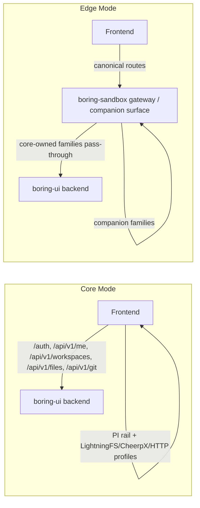

# Modes and Profiles

This document is the canonical deployment/runtime contract for `boring-ui`.

## Deployment Modes

Two deployment modes exist:

1. `core`
2. `edge`

## Architecture Diagram



### `core` mode

- Request path: `frontend -> boring-ui`
- Ownership: `boring-ui` directly owns auth/session, workspace/user/collaboration, and files/git APIs.
- Typical use: frontend-only workspace deployments.

### `edge` mode

- Request path: `frontend -> boring-sandbox -> boring-ui`
- Ownership: `boring-sandbox` is edge-only (proxy/routing/provisioning/token injection).
- Workspace/user/collaboration business logic remains in `boring-ui`.

### Edge Mode Request Flow (Detailed)

In edge mode, routing is split by API family:

| Route family | Owner | Typical handler |
| --- | --- | --- |
| `/auth/*` | `boring-ui` | core backend auth/session |
| `/api/v1/me*` | `boring-ui` | core backend user identity/settings |
| `/api/v1/workspaces*` | `boring-ui` | core backend workspace/membership/invites/settings |
| `/api/v1/files/*` | `boring-ui` | core backend file service |
| `/api/v1/git/*` | `boring-ui` | core backend git service |
| `/ws/agent/companion/*`, `/api/v1/agent/companion/*` | companion runtime surface | sandbox/gateway companion service boundary |

Practical meaning:

1. Files/git/workspace APIs are still core-owned.
2. Sandbox/gateway does transport/provisioning/token-injection; it does not duplicate workspace logic.
3. Frontend talks to canonical paths; edge routing decides where each family lands.

## UI Runtime Profiles

Profiles define the chat rail + filesystem backend pairing.

| Profile | Agent rail | Data backend | Typical usage |
| --- | --- | --- | --- |
| `pi-lightningfs` | `pi` | `lightningfs` | Default core mode profile |
| `pi-cheerpx` | `pi` | `cheerpx` | Browser VM/sandbox runtime |
| `pi-httpfs` | `pi` | `http` | Dev/debug against backend workspace |
| `companion-httpfs` | `companion` | `http` | Default edge mode profile |

### `pi-lightningfs` behavior

In `core` + `pi-lightningfs`:

1. The file tree is browser-local LightningFS, not the backend server checkout.
2. Git sync state must be derived from that same browser repo state.
3. If the workspace has a selected GitHub repo and the browser workspace is empty, boring-ui bootstraps the repo into LightningFS on workspace load.

Important implications:

- Browser repo storage is scoped by origin, user, and workspace.
- Refreshing the same workspace on the same origin should reopen the same LightningFS repo.
- Opening the app on a different host or port starts from a different LightningFS namespace.
- `pi-httpfs` is the debug profile when you explicitly want the file tree to mirror backend filesystem APIs instead.

## Recommended Defaults

| Deploy mode | Default profile |
| --- | --- |
| `core` | `pi-lightningfs` |
| `edge` | `companion-httpfs` |

## Environment Variables

Primary mode/profile variables:

- `VITE_DEPLOY_MODE=core|edge`
- `VITE_UI_PROFILE=pi-lightningfs|pi-cheerpx|pi-httpfs|companion-httpfs`

Optional explicit overrides (usually not needed if profile is set):

- `VITE_AGENT_RAIL_MODE=pi|companion|native|all`
- `VITE_DATA_BACKEND=lightningfs|cheerpx|http`

Profile-specific tuning:

- `VITE_LIGHTNINGFS_NAME` (for `lightningfs`)
- `VITE_CHEERPX_WORKSPACE_ROOT`
- `VITE_CHEERPX_PRIMARY_DISK_URL`
- `VITE_CHEERPX_OVERLAY_NAME`
- `VITE_CHEERPX_ESM_URL`

## Copy/Paste Profile Presets

Core + PI + LightningFS:

```bash
VITE_DEPLOY_MODE=core
VITE_UI_PROFILE=pi-lightningfs
```

Use this when you want local dev to behave like the deployed core app:
- browser file tree
- browser Git repo
- GitHub-selected workspace repo cloned into LightningFS

Core + PI + CheerpX:

```bash
VITE_DEPLOY_MODE=core
VITE_UI_PROFILE=pi-cheerpx
VITE_CHEERPX_WORKSPACE_ROOT=/workspace
```

Core + PI + HTTP FS (dev/debug):

```bash
VITE_DEPLOY_MODE=core
VITE_UI_PROFILE=pi-httpfs
```

Edge + Companion + HTTP FS:

```bash
VITE_DEPLOY_MODE=edge
VITE_UI_PROFILE=companion-httpfs
```

## Compose Entry Points

Core mode:

```bash
docker compose -f deploy/core/docker-compose.yml up --build backend frontend

# with template env file
cp deploy/core/.env.example .env.core
docker compose --env-file .env.core -f deploy/core/docker-compose.yml up --build backend frontend
```

Edge mode:

```bash
docker compose -f deploy/edge/docker-compose.yml up --build sandbox frontend

# with template env file
cp deploy/edge/.env.example .env.edge
docker compose --env-file .env.edge -f deploy/edge/docker-compose.yml up --build sandbox frontend
```

`backend` is started automatically via `depends_on` in `deploy/edge/docker-compose.yml`.

Notes:

1. `deploy/core/docker-compose.yml` and `deploy/edge/docker-compose.yml` are the canonical files.
2. `deploy/shared/docker-compose.legacy.yml` is a legacy convenience wrapper and not the recommended downstream contract.

In the local edge compose harness:

1. `frontend` proxies core API families to `backend`.
2. `frontend` proxies companion API/WS families to `sandbox`.
3. This mirrors production ownership while keeping local startup simple.

## `run_full_app.py` Entry Point

Core mode:

```bash
python3 scripts/run_full_app.py --deploy-mode core --ui-profile pi-lightningfs
```

Edge mode:

```bash
python3 scripts/run_full_app.py \
  --deploy-mode edge \
  --edge-proxy-url http://127.0.0.1:8080 \
  --ui-profile companion-httpfs
```

In edge mode, `run_full_app.py` expects an edge proxy to already be running at `--edge-proxy-url`; it does not start `boring-sandbox` itself.

## Vertical App Reuse Pattern

For downstream apps (for example `boring-macro`), treat this as the contract:

1. Pick deploy mode (`core` or `edge`).
2. Pick exactly one UI profile.
3. Keep workspace contract on `boring-ui` (`/auth/*`, `/api/v1/me*`, `/api/v1/workspaces*`, `/api/v1/files*`, `/api/v1/git*`).
4. Add domain APIs under your own namespace (for example `/api/v1/macro/*`).
