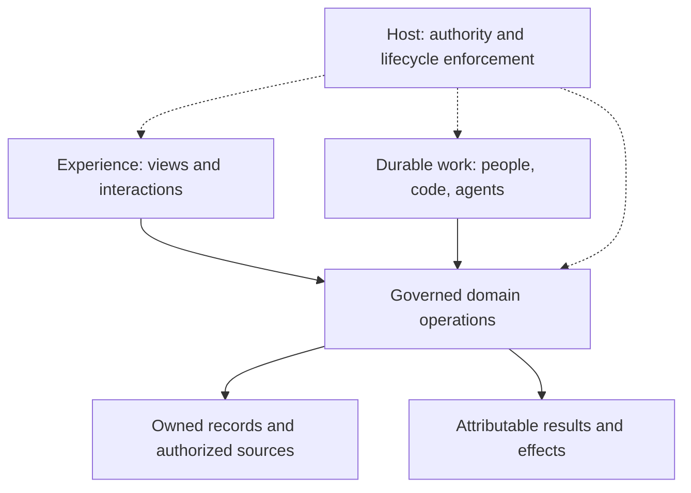

> **HISTORICAL — superseded 2026-09-07** by the consolidated edition at [`../README.md`](../README.md). Kept for the record; do not cite as current. This was the software model (2026-09-06).

# [Workspace Evolution] One software model, many Experiences

2026-09-06 owner-requested clarification, folded into the native-creation
ruling on 2026-09-07. [RECONCILIATION §12](../plans/long-term/ratified/RECONCILIATION.md#12-owner-requested-amendment--2026-09-06-software-model-and-cross-domain-proof)
owns this model; §13 updates its first consumer and timing. The [DIRECTION
amendment of 2026-09-07](../direction/DIRECTION.md#amendment-2026-09-07--native-creation-is-the-first-complete-product-journey)
alone owns current dispatch. This is a product model over existing contracts,
not a new kernel ontology, package reorganization, or universal application
language.

## The thesis

**Boring lets people compose and maintain software around their work: connect
their records and knowledge, expose trustworthy operations, choose useful
interfaces, and delegate bounded work to agents.** The same foundation can
serve a document-led clinic, a knowledge expert, or an analytical workbench.
Each should feel like its own product, while sharing the machinery that makes
change dependable.

“System of record + UI + agent workflows” is a useful shorthand, with two
necessary corrections. A knowledge product need not own a transactional
system of record. And domain operations cannot live only in prompts or UI:
deterministic validation, calculations, transitions, and effects remain
software with explicit owners. Agent reasoning is one way to use that
software; ordinary human and deterministic paths remain first-class.

The working model is **state and knowledge + domain operations + Experiences
+ durable work**, under **authority, evidence, and lifecycle control**.
These are four responsibilities, not new services or required database tables.

The solid arrows show use and effects; the dotted arrows show control. A
change in the interface cannot change the meaning or authority of an operation.

## What the platform must make explicit

| Responsibility | What it contains | Existing semantic home |
|---|---|---|
| State and knowledge | Domain-owned records, files, read-only corpora, external systems, drafts, and derived artifacts; stable identity, ownership, version, freshness, and provenance | Existing resource/artifact seams, governed filesystem mounts and semantic query adapters; domain storage remains domain-owned |
| Domain operations | Queries, deterministic transforms, validation, state transitions, and external effects; inputs/outputs, preconditions, effect class, and idempotency | Capability and trusted operation contracts; current WorkspaceBridge and data/BSL seams where applicable |
| Experience | Navigation, collections, documents, tables, charts, forms, review controls, and optional conversation; supported mounts and explicit context | AppComposition and the ratified View contract; renderer components remain implementations |
| Durable work | A bounded job with inputs, participants, status, results, decisions, failure and recovery; may mix human, deterministic, and agent steps | Thread for the job, Session for an optional conversation, RunId := RequestKey for admitted agent execution; existing activity/decision projections |

Authority, evidence, and lifecycle cut across all four responsibilities. The
trusted host enforces identity, grants, disclosure policy, runtime admission,
and lifecycle controls through existing authority/envelope contracts and the
proposed scoped release lifecycle. Evidence consists of attributable records
and checks preserved across the four responsibilities; its domain meaning
and record/envelope ownership remain with their existing owners.

This mapping does not assert that every target contract ships today. In
particular, saved semantic Views, general Thread integration, personal revision
activation, and reconciliation retain their named implementation gates.

### State may be owned or connected

Boring need not replace a client's source systems or copy every record into
one database. A domain adapter declares which source is authoritative for a
fact, which operations are allowed, how versions/freshness are represented,
and where writes are committed. A remote identifier is meaningful only with
its source and authorized scope. Read access to a source is not write access.

Keep four meanings distinct: source evidence, derived calculation/synthesis,
a proposed change, and an accepted domain record. A saved answer is not
automatically domain truth. Source revisions and deletions can invalidate
derived results; an adapter that cannot provide freshness or write-version
guarantees must expose that limitation rather than imply them. This does not
introduce a universal DataSource or Schema object; promote existing seams only
when the actual consumers justify it.

### Operations are the domain boundary

Define a governed operation once and project it to permitted entry points:
a button, an agent tool, an API call, or an admitted event. Every call retains
the caller, explicit subject/resource binding, input versions, current grants,
and effect semantics. A screen and an agent must not implement divergent
versions of the same approval, calculation, or write rule.

Domain code owns hard invariants and reproducible calculations. Agents can
select supported actions, interpret evidence, propose artifacts, and explain
results. They cannot silently choose a new metric definition, override a
validation rule, widen grants, or turn a draft into an approved record.
Not every deterministic query or edit creates an agent Run, Thread, or
optimization Objective; those contracts apply when their capabilities are used.

### Work is larger than conversation

A domain entity can exist without a job. A job can exist without a
conversation. A Thread can bind zero or more Sessions; neither replaces a
patient, source article, portfolio, or artifact identifier. A model invocation
is a participant in work, not the owner of the application's state machine.

Admitted server work exposes status, decisions, results and supported recovery
without requiring chat to remain mounted. Browser-local inputs retain their
own explicit live lifecycle. A stopped browser cannot continue microphone
capture. UI mounts never create schedules, admit duplicate effects, or silently
retarget work. Full workflow/scheduler DSLs remain deferred.

## Three adaptations test different dimensions

The evidence levels below are deliberately different. They are not three
production conformance proofs and do not, by themselves, satisfy Rule of Three.

| Dimension | Clinic | Charlotte Ledoux / Seneca | ESG portfolio-impact analysis |
|---|---|---|---|
| Evidence | Existing source audit and owner-requested document-first target | Public creator package and Seneca integration inspected at pinned revisions below | Owner-described use case; no client repository or methodology inspected |
| Information model | Patient/encounter/document records and proposed clinical artifacts | Attributed source corpus, compiled wiki, evaluations, and user-owned drafts | Proposed test: portfolio snapshot, source dataset, method version, scenario inputs, derived result |
| Domain work | Find, prepare, review and accept document changes | Retrieve evidence, distinguish source position from synthesis/application, prepare an original draft | Proposed test: run a reproducible impact calculation, compare scenarios, inspect evidence and coverage |
| Useful Experience | Document/dashboard-led, ambient assistance, optional chat | Expert conversation plus inspectable knowledge and draft surfaces; an existing scoped appointment panel | Proposed test: tables/charts and scenario controls, background analysis, contextual explanation |
| Distinct constraint | Patient isolation, concurrent clinical edits, explicit review and capture | Read-only corpus vs writable user work; attribution, addressed-agent scope and author identity | Proposed test: as-of dates, units/currency where relevant, coverage, uncertainty, deterministic method and stale inputs |
| Shared mechanisms pulled | Resource/detail/review units; subject/version binding; admitted-work status | Knowledge/artifact units; source provenance; scoped plugins; exact package identity | Evidence-aware table/chart bindings; versioned operations; result comparison and reproducible artifacts |

The ESG column is an **architecture stress case**, not a description of the
client's current schema, integrations, financial policy, or reporting standard.
Resolve its real inputs, method, reviewer and acceptance baseline before
implementation. Do not infer portfolio trades, regulatory compliance, or
autonomous investment authority from a request for analysis.

**Charlotte changes the abstraction.** This is a public-corpus governance
knowledge package, not evidence about the person or their endorsement.
Its package declares instructions,
knowledge, a prompt skill, evaluations, and a frontend extension. Source
material is read-only while user work is writable. It uses the shared
workspace, and agent selection must not replace that workspace. That is a
real adaptation without inventing a healthcare-like record schema. Its
instructions describe possible output artifacts; they do not prove dedicated
governance screens or a durable governance-object database.

**ESG changes the quality bar.** For the proposed analytical case, an attractive
answer is insufficient. A result must identify the selected input snapshot,
method version, assumptions and relevant units; declared deterministic
calculations must be reproducible. Unknown, estimated and zero must remain
distinguishable. A new data snapshot or method can make a prior result stale.
Agent explanation is distinct from the calculation and its evidence.

## What varies, what stays shared

| Variation belongs to | Examples | Boundary |
|---|---|---|
| Domain package / owning application | Record schema, sources, calculations, validation, review meaning, integrations, domain evals | Trusted, versioned domain releases; an ordinary UI customization cannot rewrite these contracts |
| Workspace / organization | Installed trusted capabilities, workflows, shared navigation and policy | Authorized shared changes; host and organization grants still bound them |
| Individual | Arrangement, default surfaces, density, language, permitted instruction preferences | Personal state does not rewrite shared records, another user's choices, or the shared expert identity |
| Shared platform | Composition, operation admission, context isolation, accepted work, release and compatibility machinery | Domain-independent contracts proved by materially different consumers |
| Deployment / commercial host | Auth, residency/topology, subscription and branding policy | Tenant-owned commercial choices; transport/topology does not create a parallel semantic model |

Component-based must mean more than reusable React fragments. A supported unit
declares identity/version, mounts/slots, data and action bindings, emitted
intents, provider lifetime, state namespace, accessibility, compatibility and
fixtures. A resource inspector or review-list mechanism can be shared; medical
acceptance, corpus attribution, and an ESG calculation retain different rules.
Prefer the smallest common contract to a kitchen-sink domain component.

## Two loops, three kinds of change

**The operating loop:** input/event → governed work → record/artifact/effect
→ human decision or observed outcome. It can be entirely deterministic,
agent-assisted, or mixed. An explicit optimization Objective/Evaluation loop
attaches only where its objective and outcome signal exist; “evidence-ready”
does not mean every ordinary task must become an experiment.

**The software loop:** request → immutable candidate → independent checks
→ scoped preview → host activation → observation/undo → compatible upgrade.
This loop changes the software used for work. It must not roll back business
records, completed effects, or already disclosed content. Accepted work keeps
its code/behavior and input identity subject to current revocation.

Inside software evolution, keep **private adaptation**, **downstream
maintenance**, and **approved shared reuse** separate. A private “keep” is not
publication; a package release is not adoption by every customer. Reuse minimal
approved portable material and synthetic fixtures. At every access, the
release contract requires current authorization for candidate source,
evidence, preview rendering, and broker calls; a digest or URL is never
authorization. This is a required contract, not a claim of shipped coverage.

Use the smallest sufficient change class: preference → registered composition
→ permitted behavior revision → isolated new module → trusted domain release.
Behavior personalization earns lineage, per-Run identity and affected evals.
New code earns build and serving confinement. Arbitrary self-modification and
conflict-free upgrades of arbitrary code remain unrealistic promises.

## A proof strategy that cannot hide inside one vertical

1. **Prepare across domains (E0).** Map the owner-described Clinic request and
   a source-backed proposed Charlotte/Seneca fixture request. Record each
   request's provenance and obtain the intended requester's confirmation
   before calling it an actual customer request. Reuse one registered
   resource/evidence unit across two
   supported mounts and both synthetic domain fixtures. Add the ESG calculation
   stress case as a labeled hypothesis. Record missing domain capabilities;
   do not invent them in the UI. Fixtures prove composition only.
2. **Earn the loop in one bounded consumer (E1a/E1b).** Choose and record the
   smallest useful live workflow and its domain owner. E1a proves durable
   configuration; E1b proves the selected live domain work and a bounded
   Job Thread with results/decisions outside chat. The same Thread/attribution
   gates apply whichever consumer is selected. Clinic's Session-keyed migration
   is mandatory when Clinic is selected, not a platform-wide migration.
3. **Prove ownership and maintenance (E2/E5).** Two users and two subjects;
   then a real shared upgrade plus a genuine conflict. Before claiming a
   cross-domain platform contract, repeat the supported capability in a second
   structurally different live consumer. Two skins over one data path do not
   count. A synthetic ESG fixture does not count as a live consumer.
4. **Broaden only the earned class (E3/E4/E6).** Add behavior personalization
   when promised, isolated code when needed, and approved reuse after
   maintenance proof. Local adaptation must not wait for Product extraction,
   a marketplace, every interaction mode, or all three client deployments.

This explicitly replaces “Clinic first; Seneca only hosts identity” as the
program's universal framing. It preserves Clinic's own acceptance obligations,
the live E1b done-bar, the premise order, and tenant-owned commercial sequencing.
Full dispatch conditions and milestone evidence live in the linked plan.

## Refutation tests and measures

| Challenge | Evidence that the model holds |
|---|---|
| Remove chat and disable inference | Ordinary permitted browsing, deterministic calculations and manual operations still work; existing jobs remain inspectable |
| Bind a corpus instead of a transactional database | Read-only evidence and writable drafts coexist without a fake CRUD schema |
| Change the primary surface | Operations, source identity, current grants and admitted work retain meaning |
| Switch subject or open two workspaces | Late results, caches and actions cannot cross their bound scope |
| Change data, method or human content during work | A result/proposal is pinned or explicitly stale; acceptance cannot silently overwrite newer truth |
| Upgrade a shared unit | Two different domain adapters keep their intended bindings, or get a precise pre-activation conflict |
| Export an improvement | Approved portable code/contracts/fixtures leave; private source material and credentials do not |

Measure useful work, retained changes, founder relay and repair minutes,
time/cost per accepted retained change, and upgrade conflict burden. Domain
success differs: document review, grounded useful drafts, or reproducible
analysis. Keep preference, offline/replay correctness, and live outcome
evidence separate. Generated code volume, chat engagement, and a single model
judge are insufficient platform success measures.

## Source scope

- Charlotte public-corpus governance knowledge package, not evidence about
  the person or their endorsement, inspected at
  [`3381cc0b651ee19aeb7c1af43fa03359785b994f`](https://github.com/hachej/seneca-charlotteledoux/tree/3381cc0b651ee19aeb7c1af43fa03359785b994f):
  [instructions](https://github.com/hachej/seneca-charlotteledoux/blob/3381cc0b651ee19aeb7c1af43fa03359785b994f/instructions.md),
  [package manifest](https://github.com/hachej/seneca-charlotteledoux/blob/3381cc0b651ee19aeb7c1af43fa03359785b994f/package.json),
  [playground contract](https://github.com/hachej/seneca-charlotteledoux/blob/3381cc0b651ee19aeb7c1af43fa03359785b994f/docs/BORING-UI-PLAYGROUND.md),
  [deployment contract](https://github.com/hachej/seneca-charlotteledoux/blob/3381cc0b651ee19aeb7c1af43fa03359785b994f/DEPLOYMENT.md).
- Seneca integration inspected at `eb35927e185ea03ed39df5dc7e772b15fd9c624d`.
  Creator publication and trusted host activation are separate in source.
  Existing exact-package activation is a reuse seam; it does not prove generic
  personal Experience activation. The public package is v1.2.3 while the
  inspected bundled host fixture is v1.2.2; no production active-version claim.
- Clinic source baseline: `6840a3d8376d4b6c4fa838b4ad8f6b45dbbf18e1`.
  The Session-keyed consultation store and navigation are observed; the
  independent domain model and ambient dashboard are target work.
- Boring source seam audit: `2274f0eca2c9f5127b73f215bdd2c61ceb87a854`;
  this documentation branch integrates `c28bd0a7f` before amendment. No runtime
  conformance or production behavior was exercised by this docs change.
- ESG: owner's description in this session, 2026-09-06; source repository,
  inputs, method and deployment remain unverified.
