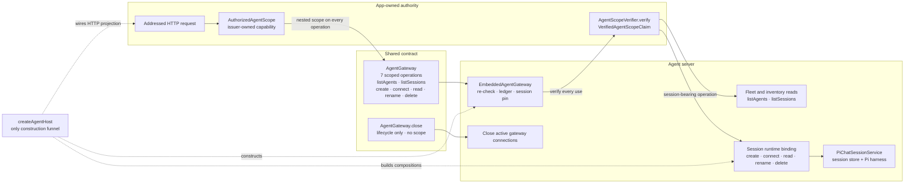

# AgentGateway session flow

The seven addressed operations carry branded scope and re-verify it; fleet and inventory reads stay on host state, while session-bearing calls resolve an Agent runtime binding and Pi service. `AgentGateway.close()` is lifecycle-only, and `createAgentHost()` is the sole construction funnel for the embedded gateway, addressed routes, and Agent-owned composition.

## Depicted files

- `packages/agent/docs/AGENT_GATEWAY_V0.md`
- `packages/agent/src/shared/gateway/types.ts`
- `packages/agent/src/server/agent-host/createAgentHost.ts`
- `packages/agent/src/server/agent-host/embeddedGateway.ts`
- `packages/agent/src/server/agent-host/httpProjection.ts`
- `packages/agent/src/server/agent-host/buildAgentComposition.ts`
- `packages/agent/src/core/piChatSessionService.ts`
