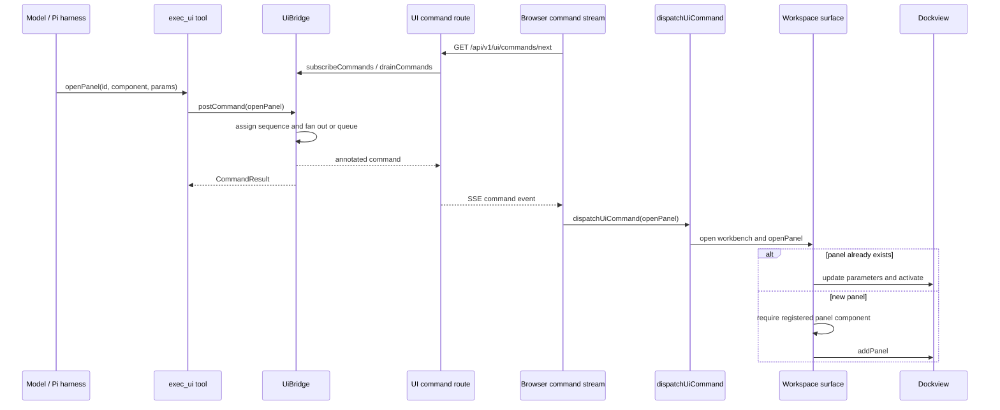

# Agent-initiated pane

An agent-created pane has one server dispatch path: `exec_ui` posts a typed command to `UiBridge`, and the browser stream hands it to the shared dispatcher. Dockview focuses an existing panel by ID; for a new panel, the surface first requires its component in the `WorkspaceProvider` registry.

## Depicted files

- `packages/workspace/src/server/ui-control/tools/uiTools.ts`
- `packages/workspace/src/shared/ui-bridge.ts`
- `packages/workspace/src/server/bridge/createInMemoryBridge.ts`
- `packages/workspace/src/server/ui-control/http/uiRoutes.ts`
- `packages/workspace/src/front/bridge/uiCommandStream.ts`
- `packages/workspace/src/front/bridge/uiCommandDispatcher.ts`
- `packages/workspace/src/app/front/WorkspaceAgentFront.tsx`
- `packages/workspace/src/front/provider/WorkspaceProvider.tsx`
- `packages/workspace/src/front/chrome/artifact-surface/SurfaceShell.tsx`
