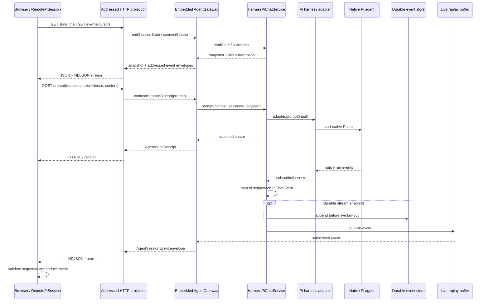

# Chat-turn sequence

The browser hydrates once and keeps an addressed NDJSON subscription while prompt acceptance returns independently of the Pi run. Native Pi events become sequenced `PiChatEvent`s, append durably first when enabled, then fan out through the live buffer to the browser reducer.

## Depicted files

- `packages/agent/src/front/chat/pi/remotePiSession.ts`
- `packages/agent/src/front/chat/pi/piChatStream.ts`
- `packages/agent/src/front/chat/pi/piChatReducer.ts`
- `packages/agent/src/server/agent-host/httpProjection.ts`
- `packages/agent/src/server/agent-host/embeddedGateway.ts`
- `packages/agent/src/server/agent-host/buildAgentComposition.ts`
- `packages/agent/src/core/piChatSessionService.ts`
- `packages/agent/src/server/pi-chat/harnessPiChatService.ts`
- `packages/agent/src/server/pi-chat/piChatEvents.ts`
- `packages/agent/src/server/harness/pi-coding-agent/createHarness.ts`
- `packages/agent/src/server/events/eventStreamStore.ts`
