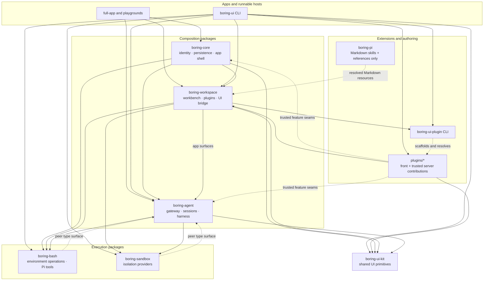

# Package map

Solid arrows show current host composition or declared package consumption;
dashed arrows are optional, tooling, knowledge, or peer-type edges.
`boring-pi` contains no runtime code.

## Depicted files

- `pnpm-workspace.yaml`
- `packages/core/package.json`
- `packages/agent/package.json`
- `packages/workspace/package.json`
- `packages/cli/package.json`
- `packages/ui/package.json`
- `packages/pi/package.json`
- `packages/plugin-cli/package.json`
- `packages/boring-bash/package.json`
- `packages/boring-sandbox/package.json`
- `packages/core/src/app/server/createCoreWorkspaceAgentServer.ts`
- `packages/workspace/src/app/server/createWorkspaceAgentServer.ts`
- `packages/cli/src/server/modeApps.ts`
- `packages/cli/src/front/App.tsx`
- `apps/full-app/src/server/main.ts`
- `plugins/ask-user/src/server/index.ts`
- `plugins/boring-automation/src/front/AutomationCard.tsx`
- `plugins/boring-governance/src/server/index.ts`
