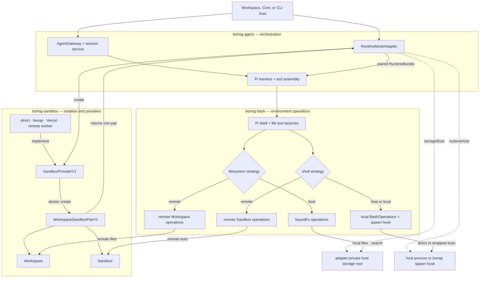

# Three-stack runtime

Agent owns gateway and harness composition, boring-bash owns consumer-visible
shell/file operations, and boring-sandbox owns provider confinement. The mode
adapter wraps one atomic Workspace/Sandbox pair in the runtime bundle.

## Depicted files

- `docs/DECISIONS.md` (Decisions 28 and 29)
- `docs/procedures/coding-invariants.md`
- `packages/agent/src/server/runtime/mode.ts`
- `packages/agent/src/server/runtime/modes/providerAdapter.ts`
- `packages/agent/src/server/agent-host/buildAgentComposition.ts`
- `packages/agent/src/server/harness/pi-coding-agent/createHarness.ts`
- `packages/boring-bash/src/agent/tools/harness/index.ts`
- `packages/boring-bash/src/agent/tools/harness/bashToolOptions.ts`
- `packages/boring-bash/src/agent/tools/filesystem/index.ts`
- `packages/boring-bash/src/agent/tools/operations/bound.ts`
- `packages/boring-bash/src/agent/tools/operations/remoteWorkspace.ts`
- `packages/boring-bash/src/agent/tools/operations/remoteSandbox.ts`
- `packages/boring-sandbox/src/shared/providerV1.ts`
- `packages/boring-sandbox/src/providers/direct/createDirectProvider.ts`
- `packages/boring-sandbox/src/providers/bwrap/createBwrapProvider.ts`
- `packages/boring-sandbox/src/providers/vercel-sandbox/createVercelSandboxProvider.ts`
- `packages/boring-sandbox/src/providers/remote-worker/createRemoteWorkerProvider.ts`
