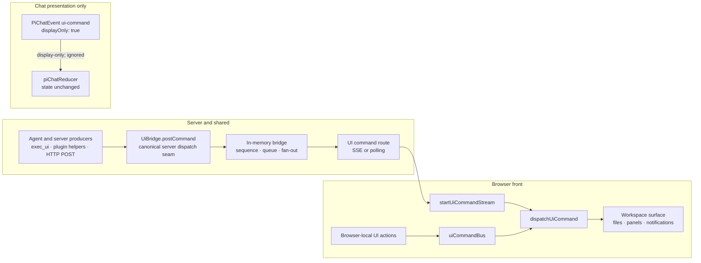

# UiBridge dispatch

Agent and server producers converge on `UiBridge.postCommand`; the bridge transport and browser-local bus share the final dispatcher. Pi chat `ui-command` events are display-only, so the chat reducer leaves state unchanged and never redispatches them.

## Depicted files

- `docs/procedures/coding-invariants.md`
- `packages/workspace/src/shared/ui-bridge.ts`
- `packages/workspace/src/shared/plugins/uiBridgeRegistry.ts`
- `packages/workspace/src/server/bridge/createInMemoryBridge.ts`
- `packages/workspace/src/server/ui-control/http/uiRoutes.ts`
- `packages/workspace/src/server/ui-control/tools/uiTools.ts`
- `packages/workspace/src/front/bridge/uiCommandStream.ts`
- `packages/workspace/src/front/bridge/uiCommandBus.ts`
- `packages/workspace/src/front/bridge/uiCommandDispatcher.ts`
- `packages/agent/src/server/pi-chat/piChatEvents.ts`
- `packages/agent/src/front/chat/pi/piChatReducer.ts`
